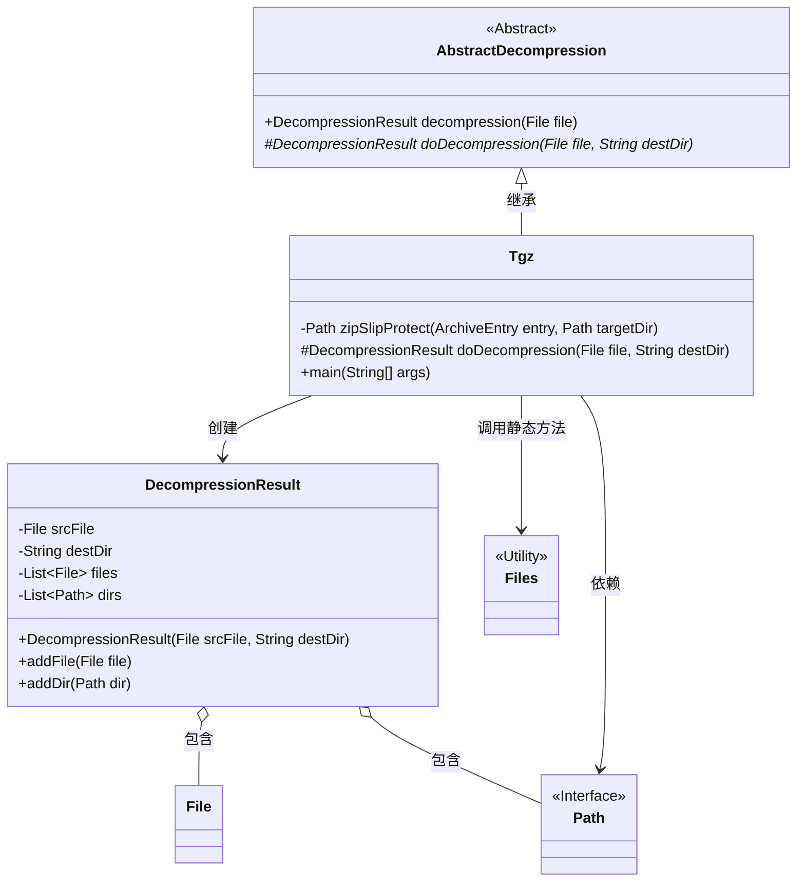
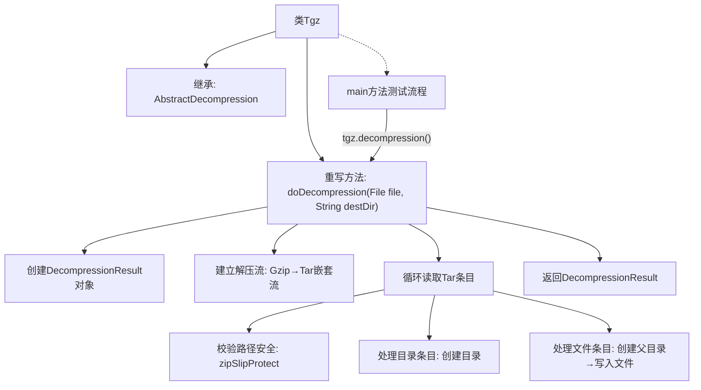

# 基础信息

|      |      |
|------|------|
| 名称 | Tgz |
| 编码语言 | .java |
| 代码路径 | WeFe/common/java/common-lang/src/main/java/com/welab/wefe/common/file/decompression/impl/Tgz.java |
| 包名 | com.welab.wefe.common.file.decompression.impl |
| 依赖项 | ['com.welab.wefe.common.file.decompression.AbstractDecompression', 'com.welab.wefe.common.file.decompression.dto.DecompressionResult', 'org.apache.commons.compress.archivers.ArchiveEntry', 'org.apache.commons.compress.archivers.tar.TarArchiveInputStream', 'org.apache.commons.compress.compressors.gzip.GzipCompressorInputStream', 'java.io.BufferedInputStream', 'java.io.File', 'java.io.IOException', 'java.io.InputStream', 'java.nio.file.Files', 'java.nio.file.Path', 'java.nio.file.Paths', 'java.nio.file.StandardCopyOption'] |
| 概述说明 | Tgz类实现解压TGZ文件功能，包含防路径遍历校验，支持目录和文件解压，返回解压结果。 |

# 说明

Tgz类继承AbstractDecompression，实现文件解压功能。主要方法doDecompression处理tgz文件解压流程：通过Gzip和Tar流读取压缩内容，校验文件完整性后解压到目标目录。zipSlipProtect方法检测压缩文件是否损坏，防止路径遍历攻击。解压过程会创建目录结构，处理文件替换，并记录解压结果。main方法演示了如何使用该类解压指定tgz文件。

# 类列表 Class Summary

| 名称   | 类型  | 说明 |
|-------|------|-------------|
| Tgz | class | Tgz类实现解压功能，通过Gzip和Tar处理文件流，校验目录安全性并解压到目标路径，返回解压结果。包含防损坏检查和异常处理。 |

## 类 Tgz

|      |      |
|------|------|
| 访问范围 | public |
| 类型 | class |
| 名称 | Tgz |
| 说明 | Tgz类实现解压功能，通过Gzip和Tar处理文件流，校验目录安全性并解压到目标路径，返回解压结果。包含防损坏检查和异常处理。 |

### UML类图

这段代码展示了一个`.tgz`文件解压处理的类结构。`Tgz`继承自抽象类`AbstractDecompression`，实现了核心解压逻辑，包括防止ZipSlip攻击的路径校验、目录创建和文件复制功能。`DecompressionResult`类用于存储解压结果，包含源文件、目标目录以及解压出的文件和目录列表。通过组合`Files`和`Path`工具类完成文件系统操作，整体设计符合单一职责原则，解压过程具有安全防护机制。

### 内部方法调用关系图

流程图描述：该流程图展示了Tgz解压类的核心处理流程。从继承关系开始，重点描述了doDecompression方法的执行过程：先初始化结果对象，建立Gzip和Tar双层解压流，循环处理每个压缩条目时进行路径安全校验，分别处理目录创建和文件写入操作，最后返回解压结果。main方法演示了实际调用过程，体现了完整的解压控制流和异常防护机制。

### 字段列表 Field List

| 名称  | 类型  | 说明 |
|-------|-------|------|

### 方法列表

| 名称  | 类型  | 说明 |
|-------|-------|------|
| doDecompression | DecompressionResult | 该方法解压Gzip压缩的Tar文件到目标目录，处理目录和文件，校验路径安全，返回解压结果。 |
| zipSlipProtect | Path | 防止zip解压路径穿越攻击，检查目标路径是否在指定目录内，否则抛出异常。 |
| main | void | Java代码示例：使用Tgz类解压指定路径的.tgz文件，并打印解压结果。 |

