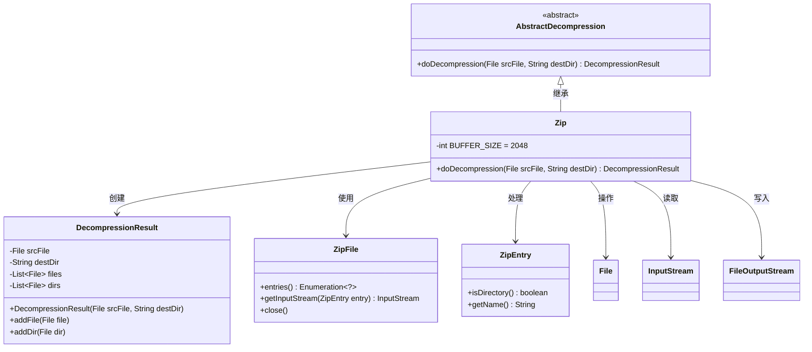
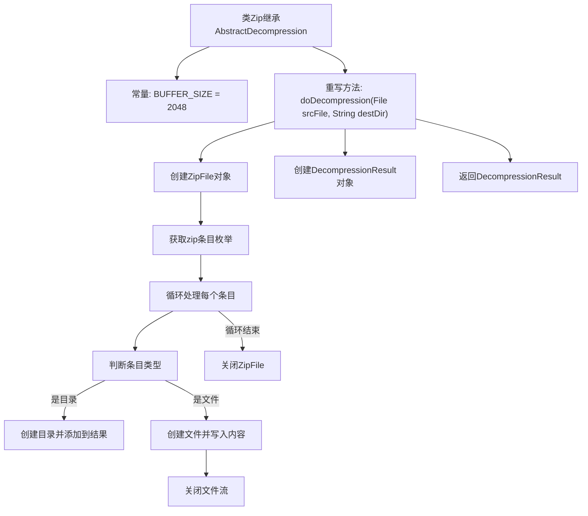

# 基础信息

|      |      |
|------|------|
| 名称 | Zip |
| 编码语言 | .java |
| 代码路径 | WeFe/common/java/common-lang/src/main/java/com/welab/wefe/common/file/decompression/impl/Zip.java |
| 包名 | com.welab.wefe.common.file.decompression.impl |
| 依赖项 | ['com.welab.wefe.common.file.decompression.AbstractDecompression', 'com.welab.wefe.common.file.decompression.dto.DecompressionResult', 'java.io.File', 'java.io.FileOutputStream', 'java.io.IOException', 'java.io.InputStream', 'java.util.Enumeration', 'java.util.zip.ZipEntry', 'java.util.zip.ZipFile'] |
| 概述说明 | Zip解压类，继承AbstractDecompression，实现doDecompression方法，处理文件夹和文件解压，使用缓冲区提高效率，确保资源关闭。 |

# 说明

该代码定义了一个Zip类，继承自AbstractDecompression，用于实现ZIP文件的解压功能。类中定义了一个常量BUFFER_SIZE为2048字节。主要方法doDecompression接收源文件和目标目录参数，返回解压结果。方法首先创建ZipFile对象，遍历压缩包内所有条目，针对目录和文件分别处理：目录则创建对应文件夹，文件则创建目标文件并写入内容。使用缓冲区进行文件内容复制，最后关闭所有流并返回包含解压文件和目录的结果对象。整个过程包含异常处理和资源释放。

# 类列表 Class Summary

| 名称   | 类型  | 说明 |
|-------|------|-------------|
| Zip | class | Zip解压类继承抽象解压类，处理ZIP文件解压，包含创建目录、文件及内容写入，使用缓冲区提高效率，确保资源关闭。 |

## 类 Zip

|      |      |
|------|------|
| 访问范围 | public |
| 类型 | class |
| 名称 | Zip |
| 说明 | Zip解压类继承抽象解压类，处理ZIP文件解压，包含创建目录、文件及内容写入，使用缓冲区提高效率，确保资源关闭。 |

### UML类图

这段代码展示了一个ZIP文件解压的实现类Zip，它继承自抽象类AbstractDecompression。Zip类通过ZipFile和ZipEntry处理压缩文件内容，使用IO流将文件写入目标目录，并记录解压结果到DecompressionResult对象中。整个过程包含文件目录创建、流式读写和资源清理，体现了完整的解压流程和异常处理机制。

### 内部方法调用关系图

这段代码流程图展示了Zip解压类的完整处理流程。从初始化常量开始，到重写父类的解压方法，详细描述了处理ZIP文件的全过程：包括创建结果对象、遍历ZIP条目、区分目录和文件处理、文件内容复制、资源释放等关键步骤。流程特别强调了异常安全处理，确保所有打开的流都会被正确关闭，最后返回包含所有解压结果的对象。

### 字段列表 Field List

| 名称  | 类型  | 说明 |
|-------|-------|------|
| BUFFER_SIZE = 2 * 1024 | int | 定义静态常量BUFFER_SIZE，值为2048字节。 |

### 方法列表

| 名称  | 类型  | 说明 |
|-------|-------|------|
| doDecompression | DecompressionResult | 该方法实现ZIP文件解压功能，遍历压缩包内条目，自动创建目录或文件，并通过流复制内容，最终返回解压结果。异常时确保资源关闭。 |

