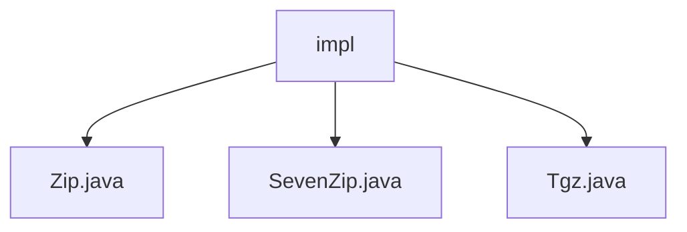

# 基础信息

|      |      |
|------|------|
| 名称 | impl |
| 编码语言 | .java |
| 代码路径 | WeFe/common/java/common-lang/src/main/java/com/welab/wefe/common/file/decompression/impl |
| 包名 | docs.common.java.common-lang.src.main.java.com.welab.wefe.common.file.decompression.impl |
| 概述说明 | Zip类实现ZIP解压，处理目录和文件，含异常处理。SevenZip类处理7z文件解压，遍历条目并记录结果。Tgz类解压tgz文件，检测路径遍历，处理目录和文件替换。均继承AbstractDecompression，含资源释放。 |

# 说明

## 概述  
该模块实现多格式压缩文件解压功能，核心职责为通过统一接口处理ZIP/7z/tgz等格式的解压任务。接口规范遵循AbstractDecompression基类约束，要求子类实现doDecompression方法，接收源文件和目标目录参数，返回包含解压结果的对象。关键数据结构包括解压结果对象、文件条目迭代器（如ZipEntry/TarEntry）和2048字节缓冲区。外部依赖涉及Java原生ZipFile、第三方SevenZFile及Apache Commons Compress库。例如Zip类处理ZIP时创建目录树，SevenZip类通过条目流处理7z压缩块。

## 主要业务场景  
模块支持批量解压场景，类似流水线作业模式：校验压缩包完整性→遍历内部条目→按类型创建目录/文件→防路径遍历攻击→资源释放。交互模式统一为"文件输入-目录输出"，例如Tgz类组合使用Gzip和Tar流实现双层解压。典型应用包括日志解压分析、分布式文件预处理等，API类型均为同步阻塞式。集成案例可见各实现类的main方法，如SevenZip演示从7z提取文件到指定路径。

### 包内部结构视图

该流程图展示了`impl`目录下的三个Java文件：`Zip.java`、`SevenZip.java`和`Tgz.java`，它们都属于文件解压缩功能的实现类。这些文件位于同一层级，没有更深层次的嵌套结构，清晰地呈现了实现类的并列关系。

# 文件列表

| 名称   | 类型  | 说明 |
|-------|------|-------------|
| [Zip.java](Zip.md) | file | Zip解压类，继承AbstractDecompression，实现doDecompression方法，处理文件夹和文件解压，使用缓冲区提高效率，确保资源关闭。 |
| [SevenZip.java](SevenZip.md) | file | SevenZip类继承AbstractDecompression，实现7z文件解压功能，支持目录创建和文件写入，返回解压结果。 |
| [Tgz.java](Tgz.md) | file | Tgz类实现解压TGZ文件功能，包含防路径遍历校验，支持目录和文件解压，返回解压结果。 |

