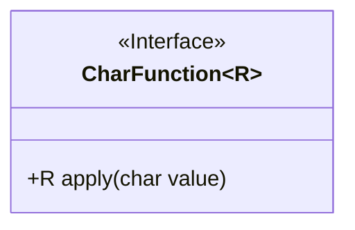
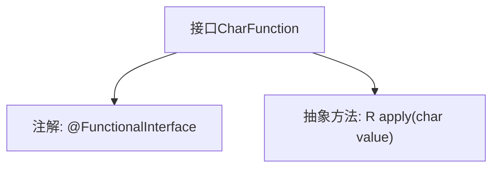

# 基础信息

|      |      |
|------|------|
| 名称 | CharFunction |
| 编码语言 | .java |
| 代码路径 | WeFe/common/java/common-lang/src/main/java/com/welab/wefe/common/function/CharFunction.java |
| 包名 | com.welab.wefe.common.function |
| 依赖项 | [] |
| 概述说明 | CharFunction是一个函数式接口，接收char参数并返回泛型R结果，核心方法是apply。 |

# 说明

这是一个名为CharFunction的函数式接口，使用@FunctionalInterface注解标记。该接口定义了一个抽象方法apply，接收一个char类型的参数value，并返回一个泛型类型R的结果。由于是函数式接口，它只能包含一个抽象方法，适用于Lambda表达式或方法引用场景。该接口主要用于处理字符类型输入并返回指定类型结果的函数操作。

# 类列表 Class Summary

| 名称   | 类型  | 说明 |
|-------|------|-------------|
| CharFunction | interface | CharFunction是一个函数式接口，接收char参数并返回泛型R结果，仅包含apply方法。 |

## 类 CharFunction

|      |      |
|------|------|
| 访问范围 | @FunctionalInterface;public |
| 类型 | interface |
| 名称 | CharFunction |
| 说明 | CharFunction是一个函数式接口，接收char参数并返回泛型R结果，仅包含apply方法。 |

### UML类图

该类图展示了一个泛型函数式接口`CharFunction<R>`，使用`<<Interface>>`标记表明这是一个接口。接口中定义了一个抽象方法`apply`，该方法接收一个`char`类型参数并返回泛型类型`R`的结果。由于使用了`@FunctionalInterface`注解，说明该接口是函数式接口，只能包含一个抽象方法，适用于Lambda表达式和方法引用。整个设计简洁明了，符合函数式编程的核心思想，即通过单一抽象方法来定义行为契约。

### 内部方法调用关系图

该流程图展示了Java函数式接口`CharFunction<R>`的结构，它是一个带有泛型参数R的接口，标注了`@FunctionalInterface`注解表示只能包含一个抽象方法。核心方法是`apply(char value)`，接收char类型参数并返回泛型类型R的结果。这种设计常用于Lambda表达式和方法引用，为字符处理操作提供统一的函数式契约。

### 字段列表 Field List

| 名称  | 类型  | 说明 |
|-------|-------|------|

### 方法列表

| 名称  | 类型  | 说明 |
|-------|-------|------|
| apply | R | 函数R apply(char value)接受字符参数value并返回类型R的结果。 |

