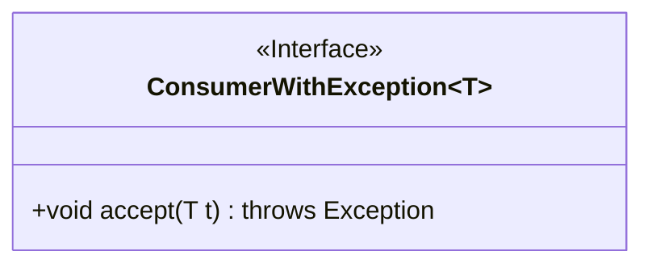
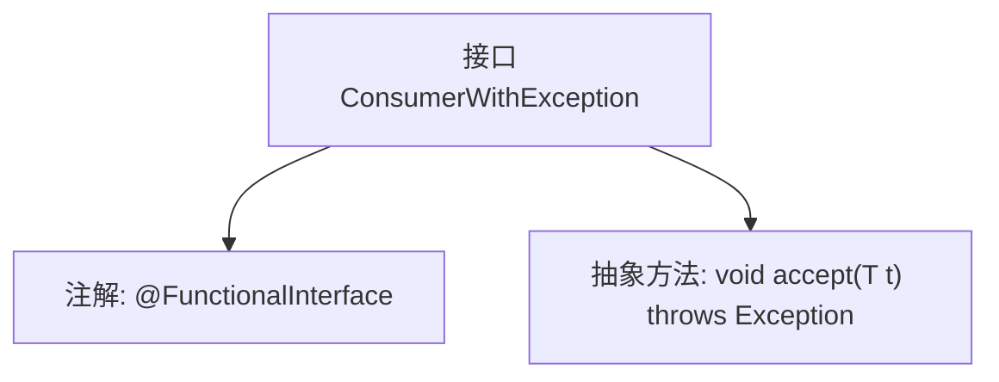

# 基础信息

|      |      |
|------|------|
| 名称 | ConsumerWithException |
| 编码语言 | .java |
| 代码路径 | WeFe/common/java/common-lang/src/main/java/com/welab/wefe/common/function/ConsumerWithException.java |
| 包名 | com.welab.wefe.common.function |
| 依赖项 | [] |
| 概述说明 | Java函数式接口，带异常的消费者接口，接受泛型参数T，执行可能抛出异常的操作。 |

# 说明

这是一个名为ConsumerWithException的泛型函数式接口，定义了一个可能抛出异常的accept方法。该接口使用@FunctionalInterface注解标记，表示它是一个函数式接口，只能包含一个抽象方法。accept方法接收一个泛型参数T，返回void，并声明可能抛出Exception异常。该接口适用于需要处理带异常的消费者行为的场景。

# 类列表 Class Summary

| 名称   | 类型  | 说明 |
|-------|------|-------------|
| ConsumerWithException | interface | 定义带异常的功能接口，泛型T参数，accept方法可抛出异常。 |

## 类 ConsumerWithException

|      |      |
|------|------|
| 访问范围 | @FunctionalInterface;public |
| 类型 | interface |
| 名称 | ConsumerWithException |
| 说明 | 定义带异常的功能接口，泛型T参数，accept方法可抛出异常。 |

### UML类图

这段类图展示了一个泛型函数式接口`ConsumerWithException<T>`，该接口定义了单个抽象方法`accept`，该方法接收泛型类型T的参数并可能抛出异常。作为函数式接口，它主要用于实现Lambda表达式或方法引用，特别适用于需要处理受检异常(checked exception)的消费型操作场景。接口通过`<<Interface>>`标记明确其类型，泛型参数T用波浪线表示，方法声明完整展示了参数类型和异常声明。

### 内部方法调用关系图

这段流程图展示了一个带泛型的函数式接口定义。核心元素包括：1) 使用@FunctionalInterface注解标记为函数式接口；2) 定义单个抽象方法accept()，该方法接收泛型参数T并可能抛出Exception。该接口符合Java函数式编程规范，允许在Lambda表达式和方法引用中使用，同时支持受检异常处理。

### 字段列表 Field List

| 名称  | 类型  | 说明 |
|-------|-------|------|

### 方法列表

| 名称  | 类型  | 说明 |
|-------|-------|------|
| accept | void | 接受类型T参数，可能抛出异常。 |

