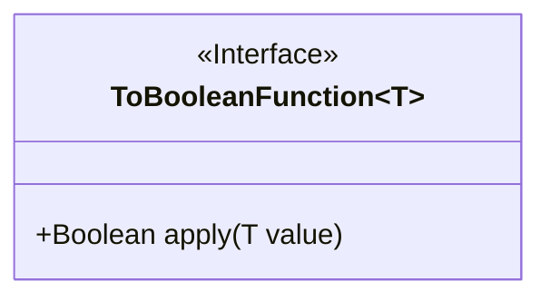
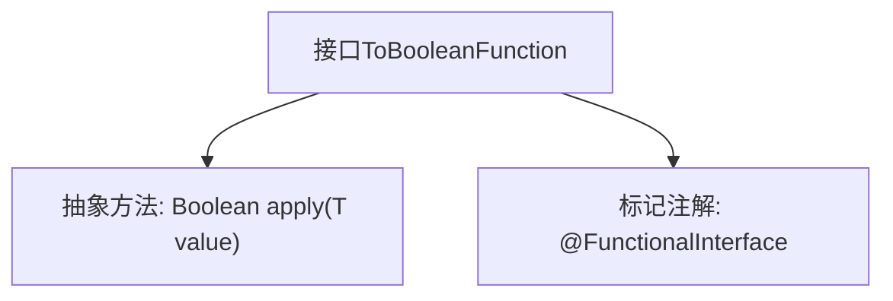

# 基础信息

|      |      |
|------|------|
| 名称 | ToBooleanFunction |
| 编码语言 | .java |
| 代码路径 | WeFe/common/java/common-lang/src/main/java/com/welab/wefe/common/function/ToBooleanFunction.java |
| 包名 | com.welab.wefe.common.function |
| 依赖项 | [] |
| 概述说明 | 这是一个函数式接口ToBooleanFunction<T>，定义了一个抽象方法apply，接收类型T参数并返回Boolean值。 |

# 说明

这是一个名为ToBooleanFunction的Java函数式接口，使用@FunctionalInterface注解标记。该接口定义了一个泛型方法apply，接受一个泛型类型T的参数value，并返回一个Boolean类型的值。作为函数式接口，它只能包含一个抽象方法，适用于Lambda表达式和方法引用。该接口主要用于将任意类型T的值转换为布尔值，常见于条件判断和布尔转换场景。

# 类列表 Class Summary

| 名称   | 类型  | 说明 |
|-------|------|-------------|
| ToBooleanFunction | interface | 这是一个函数式接口，定义了一个接受泛型参数T并返回布尔值的方法apply。 |

## 类 ToBooleanFunction

|      |      |
|------|------|
| 访问范围 | @FunctionalInterface;public |
| 类型 | interface |
| 名称 | ToBooleanFunction |
| 说明 | 这是一个函数式接口，定义了一个接受泛型参数T并返回布尔值的方法apply。 |

### UML类图

这段代码定义了一个泛型函数式接口`ToBooleanFunction<T>`，使用`@FunctionalInterface`注解标记。该接口包含单个抽象方法`apply`，接收泛型类型T的参数并返回Boolean结果。作为函数式接口，它主要用于Lambda表达式和方法引用，实现将任意类型T的值转换为布尔值的逻辑。接口设计简洁明确，符合Java函数式编程规范，适用于需要条件判断或布尔转换的场景。

### 内部方法调用关系图

这段代码定义了一个泛型函数式接口`ToBooleanFunction<T>`，使用`@FunctionalInterface`注解标记，表明该接口只能包含一个抽象方法。核心功能是通过`apply`方法将输入类型`T`转换为布尔值返回。流程图展示了接口的结构关系，强调其作为函数式接口的特性，适用于需要将任意类型转换为布尔值的场景。

### 字段列表 Field List

| 名称  | 类型  | 说明 |
|-------|-------|------|

### 方法列表

| 名称  | 类型  | 说明 |
|-------|-------|------|
| apply | Boolean | 布尔型方法，接受泛型参数T，返回布尔值。 |

