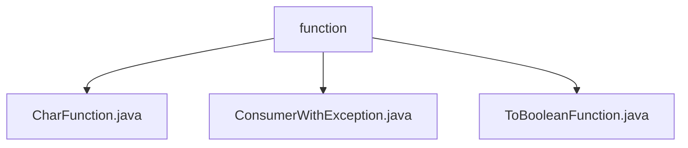

# 基础信息

|      |      |
|------|------|
| 名称 | function |
| 编码语言 | .java |
| 代码路径 | WeFe/common/java/common-lang/src/main/java/com/welab/wefe/common/function |
| 包名 | docs.common.java.common-lang.src.main.java.com.welab.wefe.common.function |
| 概述说明 | CharFunction接口处理字符输入返回泛型结果。ConsumerWithException接口处理带异常的消费者行为。ToBooleanFunction接口将任意类型转换为布尔值。 |

# 说明

## 概述  
该模块是一组Java函数式接口，核心职责是提供类型安全的函数式操作，支持字符处理、异常消费和布尔转换等场景。接口规范统一采用`@FunctionalInterface`注解，确保单一抽象方法约束，适用于Lambda表达式和方法引用。关键数据结构包括泛型参数T/R和基础类型char/Boolean。外部依赖仅为Java标准库。例如`CharFunction`处理字符转换，`ConsumerWithException`支持异常处理，`ToBooleanFunction`实现类型到布尔值的映射。

## 主要业务场景  
模块适用于函数式编程中的值转换和条件判断，类似Stream API的中间操作。典型场景包括：字符处理流水线（如`CharFunction`）、带异常的资源消费（如`ConsumerWithException`）、动态条件过滤（如`ToBooleanFunction`）。交互模式统一通过方法引用实现，例如将`ToBooleanFunction`用于集合过滤，或组合`CharFunction`与Stream.map()。所有接口均支持函数式链式调用。

### 包内部结构视图

该流程图展示了WeFe项目中common-lang模块下的function包结构。function作为父节点包含三个子文件：CharFunction.java、ConsumerWithException.java和ToBooleanFunction.java，这些文件都属于函数式编程工具类。整个结构简洁明了，体现了Java项目中典型的工具包组织方式，所有文件都直接隶属于function目录下，没有更深层次的嵌套关系。

# 文件列表

| 名称   | 类型  | 说明 |
|-------|------|-------------|
| [CharFunction.java](CharFunction.md) | file | CharFunction是一个函数式接口，接收char参数并返回泛型R结果，核心方法是apply。 |
| [ConsumerWithException.java](ConsumerWithException.md) | file | Java函数式接口，带异常的消费者接口，接受泛型参数T，执行可能抛出异常的操作。 |
| [ToBooleanFunction.java](ToBooleanFunction.md) | file | 这是一个函数式接口ToBooleanFunction<T>，定义了一个抽象方法apply，接收类型T参数并返回Boolean值。 |

