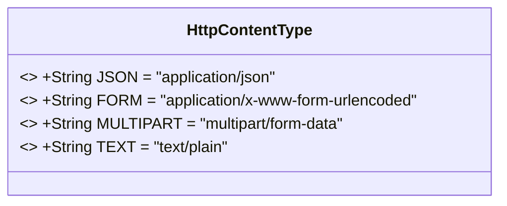
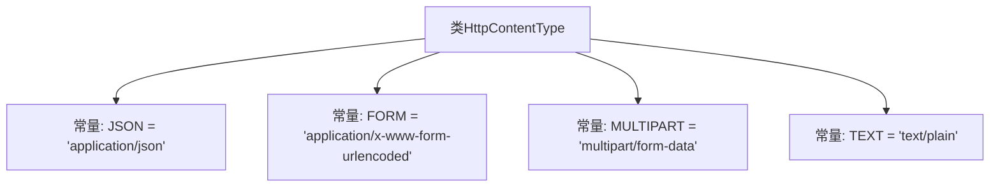

# 基础信息

|      |      |
|------|------|
| 名称 | HttpContentType |
| 编码语言 | .java |
| 代码路径 | WeFe/common/java/common-lang/src/main/java/com/welab/wefe/common/http/HttpContentType.java |
| 包名 | com.welab.wefe.common.http |
| 依赖项 | [] |
| 概述说明 | HttpContentType类定义了四种HTTP内容类型常量：JSON、FORM、MULTIPART和TEXT。 |

# 说明

HttpContentType类定义了四种常用的HTTP内容类型常量：JSON表示JSON格式数据，FORM表示表单编码数据，MULTIPART表示多部分表单数据，TEXT表示纯文本数据。这些常量用于标识HTTP请求或响应的内容类型。

# 类列表 Class Summary

| 名称   | 类型  | 说明 |
|-------|------|-------------|
| HttpContentType | class | HttpContentType类定义了四种HTTP内容类型常量：JSON、FORM、MULTIPART和TEXT。 |

## 类 HttpContentType

|      |      |
|------|------|
| 访问范围 | public |
| 类型 | class |
| 名称 | HttpContentType |
| 说明 | HttpContentType类定义了四种HTTP内容类型常量：JSON、FORM、MULTIPART和TEXT。 |

### UML类图

这段类图描述了一个名为HttpContentType的工具类，该类仅包含四个公开静态常量字段，分别表示四种常见的HTTP内容类型：JSON格式、表单格式、多部分表单格式和纯文本格式。所有字段都被声明为final，表明这些常量值在运行时不可修改。该类没有定义任何方法，主要用于集中管理HTTP请求/响应中Content-Type头的标准值，避免在代码中硬写字符串常量。这种设计模式常用于网络编程中的内容类型标准化管理。

### 内部方法调用关系图

该流程图展示了HttpContentType类的结构，它是一个包含四个公共静态常量的工具类，分别定义了常见的HTTP内容类型（JSON、表单、多部分表单和纯文本）。每个常量存储对应的MIME类型字符串，用于标识网络请求或响应的数据格式。此类不包含方法，仅作为内容类型的集中定义容器。

### 字段列表 Field List

| 名称  | 类型  | 说明 |
|-------|-------|------|
| TEXT = "text/plain" | String | 定义静态常量TEXT，值为"text/plain"，表示纯文本类型。 |
| FORM = "application/x-www-form-urlencoded" | String | 定义常量FORM，值为表单URL编码类型"application/x-www-form-urlencoded"。 |
| JSON = "application/json" | String | 定义静态常量JSON，值为"application/json"，表示JSON格式的MIME类型。 |
| MULTIPART = "multipart/form-data" | String | 定义了一个公共静态常量字符串MULTIPART，值为"multipart/form-data"。 |

### 方法列表

| 名称  | 类型  | 说明 |
|-------|-------|------|

