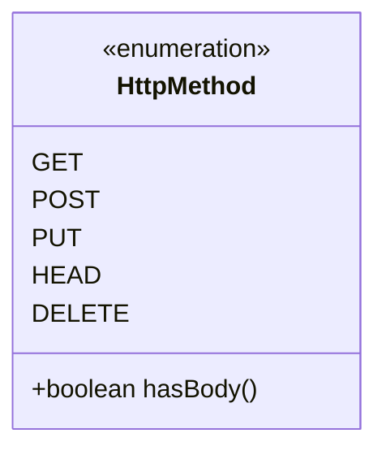
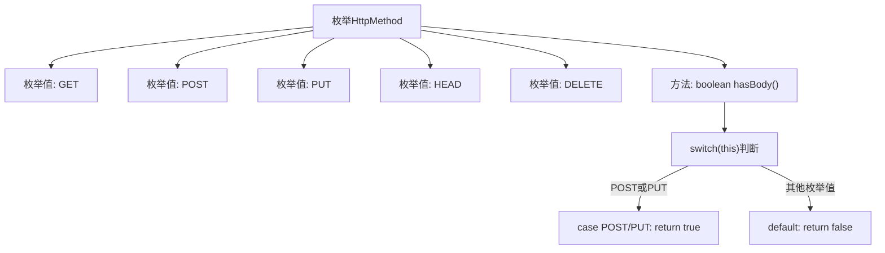

# 基础信息

|      |      |
|------|------|
| 名称 | HttpMethod |
| 编码语言 | .java |
| 代码路径 | WeFe/common/java/common-lang/src/main/java/com/welab/wefe/common/http/HttpMethod.java |
| 包名 | com.welab.wefe.common.http |
| 依赖项 | [] |
| 概述说明 | 定义HTTP方法枚举，包含GET、POST、PUT、HEAD、DELETE，其中POST和PUT允许包含请求体。 |

# 说明

该内容定义了一个名为HttpMethod的枚举类型，包含五种HTTP请求方法：GET、POST、PUT、HEAD和DELETE。每种方法都有对应的注释说明。枚举还提供了一个hasBody方法，用于判断请求方法是否允许包含请求体。根据实现逻辑，只有POST和PUT方法会返回true，表示允许包含请求体，其他方法均返回false。该枚举简洁地封装了HTTP方法及其相关特性。

# 类列表 Class Summary

| 名称   | 类型  | 说明 |
|-------|------|-------------|
| HttpMethod | enum | HTTP方法枚举类，包含GET、POST、PUT、HEAD、DELETE，其中POST和PUT允许包含请求体。 |

## 类 HttpMethod

|      |      |
|------|------|
| 访问范围 | public |
| 类型 | enum |
| 名称 | HttpMethod |
| 说明 | HTTP方法枚举类，包含GET、POST、PUT、HEAD、DELETE，其中POST和PUT允许包含请求体。 |

### UML类图

这段代码定义了一个HttpMethod枚举类，包含GET、POST、PUT、HEAD和DELETE五种HTTP方法。其中hasBody()方法用于判断当前HTTP方法是否允许包含请求体，POST和PUT方法返回true，其他方法返回false。枚举类通过<<enumeration>>标记明确其类型，简洁地表示了HTTP方法的有限集合及其核心功能。

### 内部方法调用关系图

该流程图展示了HttpMethod枚举的结构和逻辑流程。枚举定义了5个标准HTTP方法(GET/POST/PUT/HEAD/DELETE)，并通过hasBody()方法判断哪些方法允许包含请求体。流程从枚举定义开始，分支展示各个枚举值，重点描述了hasBody()方法的内部判断逻辑：当枚举值为POST或PUT时返回true，其他情况返回false。整个结构清晰呈现了枚举定义和方法调用的关系。

### 字段列表 Field List

| 名称  | 类型  | 说明 |
|-------|-------|------|

### 方法列表

| 名称  | 类型  | 说明 |
|-------|-------|------|

