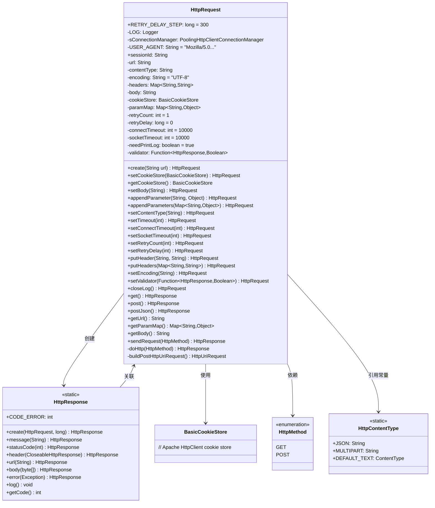
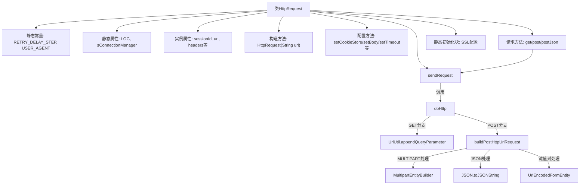
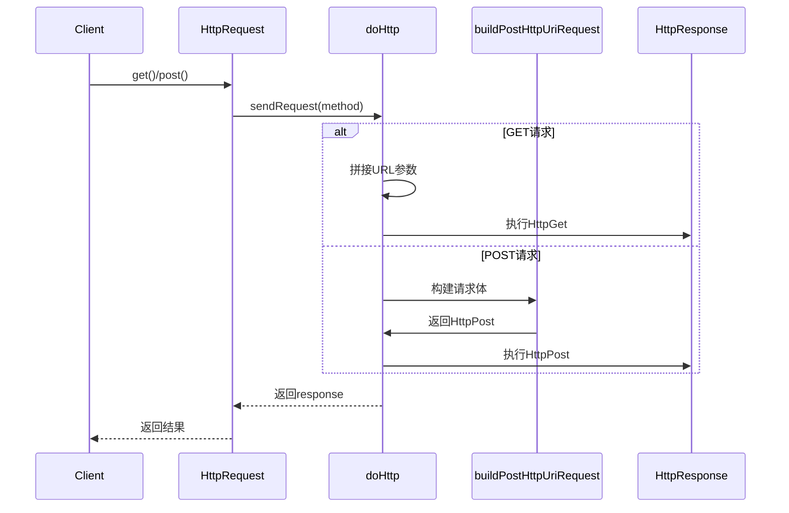

# 基础信息

|      |      |
|------|------|
| 名称 | HttpRequest |
| 编码语言 | .java |
| 代码路径 | WeFe/common/java/common-lang/src/main/java/com/welab/wefe/common/http/HttpRequest.java |
| 包名 | com.welab.wefe.common.http |
| 依赖项 | ['com.alibaba.fastjson.JSON', 'com.welab.wefe.common.util.UrlUtil', 'org.apache.commons.collections4.CollectionUtils', 'org.apache.commons.lang3.StringUtils', 'org.apache.http.HttpEntity', 'org.apache.http.NameValuePair', 'org.apache.http.client.config.RequestConfig', 'org.apache.http.client.entity.UrlEncodedFormEntity', 'org.apache.http.client.methods.CloseableHttpResponse', 'org.apache.http.client.methods.HttpGet', 'org.apache.http.client.methods.HttpPost', 'org.apache.http.client.methods.HttpUriRequest', 'org.apache.http.config.Registry', 'org.apache.http.config.RegistryBuilder', 'org.apache.http.conn.socket.ConnectionSocketFactory', 'org.apache.http.conn.socket.PlainConnectionSocketFactory', 'org.apache.http.conn.ssl.NoopHostnameVerifier', 'org.apache.http.conn.ssl.SSLConnectionSocketFactory', 'org.apache.http.entity.ContentType', 'org.apache.http.entity.StringEntity', 'org.apache.http.entity.mime.MultipartEntityBuilder', 'org.apache.http.entity.mime.content.InputStreamBody', 'org.apache.http.impl.client.BasicCookieStore', 'org.apache.http.impl.client.CloseableHttpClient', 'org.apache.http.impl.client.HttpClients', 'org.apache.http.impl.conn.PoolingHttpClientConnectionManager', 'org.apache.http.message.BasicNameValuePair', 'org.apache.http.ssl.SSLContextBuilder', 'org.apache.http.util.EntityUtils', 'org.slf4j.Logger', 'org.slf4j.LoggerFactory', 'javax.net.ssl.SSLContext', 'java.io.File', 'java.io.InputStream', 'java.io.UnsupportedEncodingException', 'java.nio.charset.Charset', 'java.nio.charset.StandardCharsets', 'java.security.KeyManagementException', 'java.security.KeyStoreException', 'java.security.NoSuchAlgorithmException', 'java.util', 'java.util.function.Function'] |
| 概述说明 | HttpRequest类封装HTTP请求功能，支持GET/POST方法，可设置超时、重试、头信息、参数、Cookie等，默认UTF-8编码，含SSL支持。 |

# 说明

HttpRequest类是一个用于发送HTTP请求的工具类，支持GET和POST方法，具有请求参数设置、请求头管理、超时配置、重试机制和响应验证功能。默认使用UTF-8编码，支持JSON和表单数据提交，可设置连接和读取超时时间，支持多线程连接池管理。类中包含请求URL、参数、请求体、Cookie存储等属性，并提供链式调用方法进行配置。请求发送后返回HttpResponse对象，包含响应状态码、消息头和响应体等信息。类初始化时配置了SSL上下文以支持HTTPS请求，并设置了连接池参数。

# 类列表 Class Summary

| 名称   | 类型  | 说明 |
|-------|------|-------------|
| HttpRequest | class | HttpRequest类封装HTTP请求功能，支持GET/POST方法，可设置超时、重试、编码、请求头、参数等，内置连接池和SSL验证，提供日志和验证器功能。 |

## 类 HttpRequest

|      |      |
|------|------|
| 访问范围 | public |
| 类型 | class |
| 名称 | HttpRequest |
| 说明 | HttpRequest类封装HTTP请求功能，支持GET/POST方法，可设置超时、重试、编码、请求头、参数等，内置连接池和SSL验证，提供日志和验证器功能。 |

### UML类图

这段代码实现了一个可配置的HTTP请求工具类，支持GET/POST请求、参数设置、重试机制和响应验证。类图展示了HttpRequest作为核心类，通过链式调用配置请求参数，依赖HttpResponse处理响应，使用BasicCookieStore管理会话状态，并引用HttpMethod和HttpContentType枚举/常量类。静态连接池sConnectionManager实现了SSL安全连接和连接复用功能。

### 内部方法调用关系图

该流程图展示了HttpRequest类的核心结构和调用关系。类包含静态配置、实例属性、构造方法和三类核心方法：配置方法用于设置请求参数，请求方法提供GET/POST接口，核心方法处理实际HTTP通信。时序图重点描述了GET/POST请求的分支处理流程，包括URL参数拼接、多类型POST请求体构建等关键步骤。静态初始化块负责SSL连接池的初始化，确保所有请求共享连接管理。

### 字段列表 Field List

| 名称  | 类型  | 说明 |
|-------|-------|------|
| contentType | String | 定义字符串变量contentType，用于存储内容类型信息。 |
| socketTimeout = 10 * 1000 | int | 私有整型变量socketTimeout，默认值为10秒（10000毫秒）。 |
| body | String | 私有字符串类型变量body。 |
| sessionId = UUID.randomUUID().toString().replace("-", "") | String | 生成随机无连字符的UUID字符串作为会话ID。 |
| retryDelay = 0 | long | 私有长整型变量retryDelay初始值为0，用于控制重试延迟时间。 |
| encoding = StandardCharsets.UTF_8.name() | String | 定义字符串变量encoding，值为UTF-8字符集名称。 |
| headers | Map<String, String> | 定义了一个私有Map变量headers，键值对类型均为String。 |
| url | String | 声明一个私有字符串变量url。 |
| sConnectionManager = null | PoolingHttpClientConnectionManager | 声明一个静态私有连接管理器变量sConnectionManager，初始值为null。 |
| USER_AGENT = "Mozilla/5.0 (Macintosh; Intel Mac OS X 10_12_5) AppleWebKit/537.36 (KHTML, like Gecko) Chrome/63.0.3239.132 Safari/537.36" | String | 定义用户代理字符串，模拟Chrome浏览器在Mac OS X 10.12.5上的请求头。 |
| paramMap = new HashMap<>() | Map<String, Object> | 定义了一个私有Map变量paramMap，键为String，值为Object，初始化为HashMap实例。 |
| connectTimeout = 10 * 1000 | int | 私有整型变量connectTimeout，默认值为10秒（10000毫秒）。 |
| needPrintLog = true | boolean | 变量needPrintLog用于控制是否打印日志，默认值为true。 |
| validator | Function<HttpResponse, Boolean> | 定义了一个私有函数validator，用于验证HttpResponse并返回布尔值。 |
| retryCount = 1 | int | 私有整型变量retryCount初始值为1，用于记录重试次数。 |
| LOG = LoggerFactory.getLogger(HttpRequest.class) | Logger | 声明一个私有静态不可变日志对象LOG，用于HttpRequest类的日志记录。 |
| cookieStore = new BasicCookieStore() | BasicCookieStore | 创建私有BasicCookieStore对象cookieStore用于存储HTTP cookie。 |
| RETRY_DELAY_STEP = 300 | long | 静态常量RETRY_DELAY_STEP值为300，表示重试延迟步长。 |

### 方法列表

| 名称  | 类型  | 说明 |
|-------|-------|------|
| setRetryCount | HttpRequest | 设置HTTP请求重试次数，若输入值非负则更新，否则保持原值。返回当前对象以支持链式调用。 |
| doHttp | HttpResponse | 该方法执行HTTP请求，支持GET/POST方法，设置超时、重定向策略和请求头，记录请求日志，处理响应并验证结果，返回包含状态码、消息、头部和响应体的HttpResponse对象。 |
| setEncoding | HttpRequest | 设置HTTP请求的字符编码并返回当前对象实例。 |
| create | HttpRequest | 静态方法create接收url参数，返回HttpRequest对象实例。 |
| postJson | HttpResponse | 该方法发送POST请求，设置内容类型为JSON，并返回HTTP响应。 |
| appendParameter | HttpRequest | 向HTTP请求添加参数键值对，返回当前对象以支持链式调用。 |
| setBody | HttpRequest | 设置HTTP请求体并返回当前对象实例。 |
| appendParameters | HttpRequest | 这是一个Java方法，向HttpRequest对象添加参数映射，返回当前对象以支持链式调用。 |
| setValidator | HttpRequest | 该方法为HttpRequest设置验证器，接收一个函数参数，函数校验HttpResponse并返回布尔值，最后返回当前HttpRequest实例以便链式调用。 |
| post | HttpResponse | 这是一个Java方法，用于发送POST请求并返回HTTP响应。方法内部调用了sendRequest函数，传入POST方法参数。 |
| getUrl | String | 获取URL地址的方法。 |
| setSocketTimeout | HttpRequest | 设置HTTP请求的套接字超时时间并返回当前对象。 |
| setContentType | HttpRequest | 这是一个Java方法，用于设置HTTP请求的内容类型。方法接收字符串参数contentType，将其赋值给成员变量，并添加到请求头中，最后返回当前对象以支持链式调用。 |
| getCookieStore | BasicCookieStore | 获取当前Cookie存储实例。 |
| setRetryDelay | HttpRequest | 设置HTTP请求重试延迟时间，若输入值非负则更新，否则保持原值。返回当前对象以支持链式调用。 |
| putHeaders | HttpRequest | 该方法接收一个键值对映射，将所有键转为大写后存入当前对象的headers属性，并返回当前对象实例。 |
| putHeader | HttpRequest | 该方法将请求头的键转为大写后存入headers，并返回当前对象以支持链式调用。 |
| buildPostHttpUriRequest | HttpUriRequest | 构建HTTP POST请求方法，支持multipart、键值对和JSON格式参数，根据contentType处理不同参数类型并设置请求实体和头信息。 |
| sendRequest | HttpResponse | 该方法通过循环重试机制发送HTTP请求，失败时延迟重试，成功或重试次数耗尽后返回结果，可选日志记录。 |
| setCookieStore | HttpRequest | 设置HTTP请求的Cookie存储并返回当前请求对象。 |
| getBody | String | 获取body字符串的方法。 |
| getParamMap | Map<String, Object> | 获取参数映射表的方法，返回键值对集合。 |
| setTimeout | HttpRequest | 设置HTTP请求超时时间，包括连接和套接字超时，并返回当前对象。 |
| closeLog | HttpRequest | 关闭日志功能并返回当前HttpRequest对象。 |
| get | HttpResponse | 这是一个Java方法，用于发送HTTP GET请求并返回响应。方法名为get，返回类型为HttpResponse，内部调用sendRequest方法并传入GET参数。 |
| setConnectTimeout | HttpRequest | 设置HTTP请求的连接超时时间并返回当前对象实例。 |

