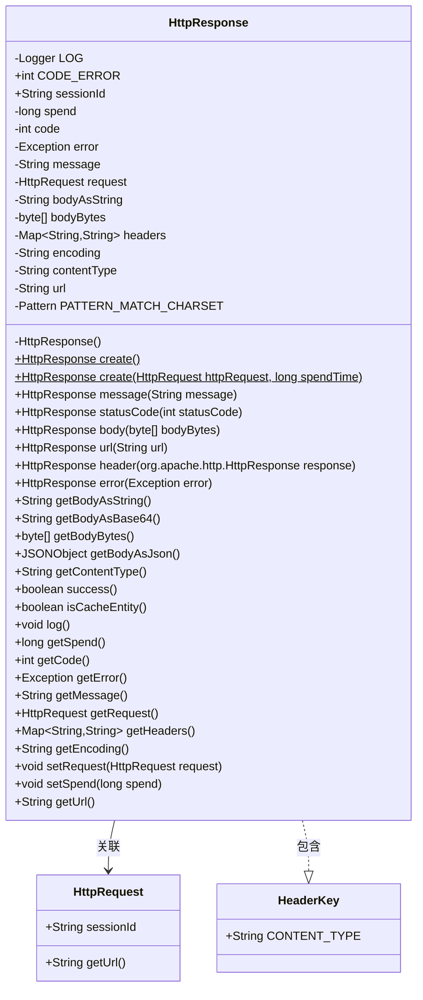

# 基础信息

|      |      |
|------|------|
| 名称 | HttpResponse |
| 编码语言 | .java |
| 代码路径 | WeFe/common/java/common-lang/src/main/java/com/welab/wefe/common/http/HttpResponse.java |
| 包名 | com.welab.wefe.common.http |
| 依赖项 | ['com.alibaba.fastjson.JSON', 'com.alibaba.fastjson.JSONObject', 'com.welab.wefe.common.fastjson.LoggerValueFilter', 'com.welab.wefe.common.util.StringUtil', 'org.apache.commons.codec.binary.Base64', 'org.apache.commons.lang3.StringUtils', 'org.apache.http.Header', 'org.slf4j.Logger', 'org.slf4j.LoggerFactory', 'java.io.UnsupportedEncodingException', 'java.nio.charset.StandardCharsets', 'java.util.HashMap', 'java.util.Map', 'java.util.regex.Matcher', 'java.util.regex.Pattern'] |
| 概述说明 | HttpResponse类封装HTTP响应数据，包含状态码、耗时、错误信息、请求头、响应体等字段，提供日志记录、JSON解析及编码处理功能。 |

# 说明

HttpResponse类封装了HTTP响应数据，包含状态码、耗时、错误信息、请求体、响应头和内容类型等属性。提供了创建响应对象的方法，支持设置状态码、消息体、URL和头部信息。包含解析响应体为字符串、Base64或JSON的方法，以及判断请求成功与否的功能。还提供了日志记录方法，用于输出响应详情。类中定义了常量如错误码和内容类型头，并支持字符集编码自动检测。

# 类列表 Class Summary

| 名称   | 类型  | 说明 |
|-------|------|-------------|
| HttpResponse | class | HttpResponse类封装HTTP响应数据，包含状态码、耗时、错误信息、请求头、响应体及编码处理，支持日志记录和多种格式转换。 |

## 类 HttpResponse

|      |      |
|------|------|
| 访问范围 | public |
| 类型 | class |
| 名称 | HttpResponse |
| 说明 | HttpResponse类封装HTTP响应数据，包含状态码、耗时、错误信息、请求头、响应体及编码处理，支持日志记录和多种格式转换。 |

### UML类图

这段代码定义了一个`HttpResponse`类，用于封装HTTP响应数据。该类包含响应状态码、耗时、错误信息、请求体、响应头等属性，并提供了多种方法来处理和转换响应数据。`HttpResponse`与`HttpRequest`关联，表示响应对应的请求；同时包含一个静态内部类`HeaderKey`，用于定义常用的HTTP头字段。该类支持链式调用，提供了丰富的工具方法来处理响应内容，如获取JSON格式的响应体、Base64编码的响应体等，还包含日志记录功能。

### 内部方法调用关系图

```mermaid
graph TD
    A["类HttpResponse"]
    B["静态常量: CODE_ERROR = -1"]
    C["属性: String sessionId"]
    D["属性: long spend"]
    E["属性: int code"]
    F["属性: Exception error"]
    G["属性: String message"]
    H["属性: HttpRequest request"]
    I["属性: String bodyAsString"]
    J["属性: byte[] bodyBytes"]
    K["属性: Map<String,String> headers"]
    L["属性: String encoding"]
    M["属性: String contentType"]
    N["属性: String url"]
    O["私有构造方法: HttpResponse()"]
    P["静态工厂方法: create()"]
    Q["静态工厂方法: create(HttpRequest,long)"]
    R["链式方法: message()/statusCode()/body()/url()/header()/error()"]
    S["核心方法: getBodyAsString()"]
    T["辅助方法: getBodyAsBase64()/getBodyAsJson()"]
    U["状态检查: success()/isCacheEntity()"]
    V["日志输出: log()"]
    W["Getter/Setter方法组"]

    A --> B
    A --> C
    A --> D
    A --> E
    A --> F
    A --> G
    A --> H
    A --> I
    A --> J
    A --> K
    A --> L
    A --> M
    A --> N
    A --> O
    A --> P
    P --> Q
    A --> R
    A --> S
    S --> T
    A --> U
    A --> V
    A --> W
    Q -->|设置| H
    Q -->|设置| D
    Q -->|传递| C
    R -->|更新| G
    R -->|更新| E
    R -->|更新| J
    R -->|更新| N
    R -->|解析| M
    R -->|解析| L
    R -->|记录| F
    S -->|依赖| J
    S -->|依赖| L
    S -->|缓存| I
    V -->|调用| S
    V -->|调用| U
```

流程图描述了HttpResponse类的完整结构，包含23个关键元素和它们的关系。核心是工厂方法创建对象、链式方法配置属性、响应体处理方法（特别是字符编码处理逻辑）以及带格式控制的日志输出功能。类设计采用建造者模式思想，通过方法链实现流畅接口，同时严格处理HTTP响应中的字符编码和内容类型解析。日志系统会智能处理JSON内容并过滤敏感信息，所有属性都通过规范的Getter/Setter暴露。

### 字段列表 Field List

| 名称  | 类型  | 说明 |
|-------|-------|------|
| headers = new HashMap<>() | Map<String, String> | 定义了一个私有Map变量headers，键值对类型均为String，初始化为HashMap实例。 |
| spend | long | 私有长整型变量spend，用于存储时间或金额等数值。 |
| sessionId | String | 声明一个公共字符串变量sessionId。 |
| contentType | String | 声明一个私有字符串变量contentType。 |
| encoding | String | 私有字符串变量encoding。 |
| PATTERN_MATCH_CHARSET = Pattern.compile("(?<=charset=)[a-z0-9\\-]+", Pattern.CASE_INSENSITIVE) | Pattern | 定义正则表达式模式，匹配charset=后的字母数字及连字符，不区分大小写。 |
| error | Exception | 私有异常变量error。 |
| CODE_ERROR = -1 | int | 定义静态常量CODE_ERROR，值为-1，表示错误代码。 |
| bodyBytes | byte[] | 私有字节数组bodyBytes，用于存储字节数据。 |
| message | String | 私有字符串变量message。 |
| request | HttpRequest | 私有HTTP请求对象。 |
| LOG = LoggerFactory.getLogger(HttpResponse.class) | Logger | 声明一个私有静态不可变日志对象LOG，用于HttpResponse类的日志记录。 |
| code | int | 私有整型变量code。 |
| url | String | 声明一个私有字符串变量url。 |
| bodyAsString | String | 私有字符串变量，存储请求体内容。 |

### 方法列表

| 名称  | 类型  | 说明 |
|-------|-------|------|
| header | HttpResponse | 该方法处理HTTP响应头，提取内容类型和编码信息。遍历所有响应头，存储键值对。若头名为CONTENT_TYPE，解析内容类型和字符集编码。返回处理后的对象。 |
| getError | Exception | 获取异常对象的方法，返回存储的error变量。 |
| getBodyBytes | byte[] | 获取字节数组形式的请求体内容。 |
| getBodyAsString | String | 方法getBodyAsString将字节数组bodyBytes转为字符串。若bodyBytes为空返回null；若已缓存bodyAsString则直接返回；否则按指定编码或默认UTF-8转换，异常时记录错误日志。 |
| getBodyAsJson | JSONObject | 方法getBodyAsJson检查请求成功时解析bodyAsString为JSONObject，失败返回空对象。成功但bodyAsString为空则返回null。 |
| create | HttpResponse | 静态方法create接收HttpRequest和耗时参数，创建并返回包含请求、耗时和会话ID的HttpResponse对象。 |
| error | HttpResponse | HttpResponse错误处理方法，设置错误码、异常对象和异常信息后返回自身。 |
| url | HttpResponse | 设置HTTP响应URL并返回当前对象。 |
| create | HttpResponse | 静态方法create返回HttpResponse对象，默认参数为null和0。 |
| getContentType | String | 获取内容类型的方法，返回字符串类型的contentType变量值。 |
| getBodyAsBase64 | String | 该方法将字节数组bodyBytes转换为Base64编码字符串并返回。 |
| message | HttpResponse | 这是一个Java方法，用于设置响应消息并返回当前对象实例。方法名为message，参数为字符串message，返回HttpResponse类型。 |
| getMessage | String | 这是一个Java方法，返回字符串类型的message变量值。 |
| success | boolean | 方法success检查error是否为null，返回布尔值。 |
| body | HttpResponse | 设置HTTP响应体字节数组并返回当前对象实例。 |
| statusCode | HttpResponse | 该方法设置HTTP响应的状态码并返回当前对象，支持链式调用。 |
| isCacheEntity | boolean | 方法isCacheEntity检查请求是否为null，返回布尔值。 |
| log | void | 该方法用于记录HTTP请求日志。若内容类型为JSON，则格式化输出；移除换行符后，根据请求成功与否分别记录信息或错误日志，包含会话ID、耗时、URL、状态码、消息和内容。 |
| getSpend | long | 这是一个公共方法，返回长整型变量spend的值。 |
| getRequest | HttpRequest | 获取HTTP请求对象的方法。 |
| getHeaders | Map<String, String> | 返回headers映射。 |
| getEncoding | String | 获取当前编码字符串的方法。 |
| setRequest | void | 设置HTTP请求对象。 |
| setSpend | void | 设置花费金额的方法，将参数值赋给类的spend属性。 |
| getUrl | String | 获取URL字符串的方法。 |
| getCode | int | 方法getCode返回整型变量code的值。 |

