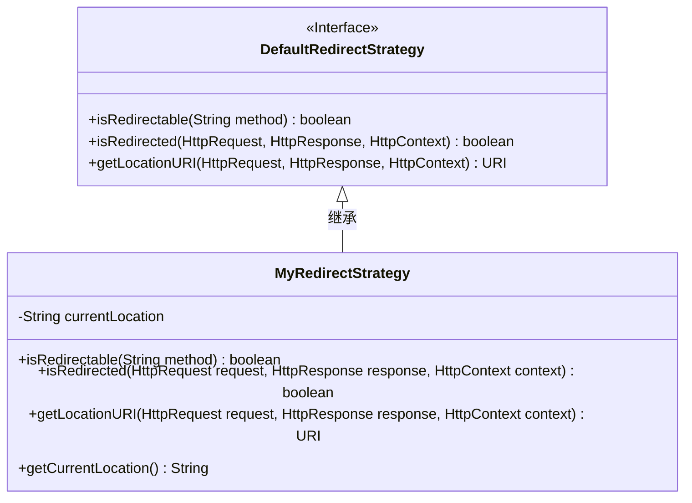
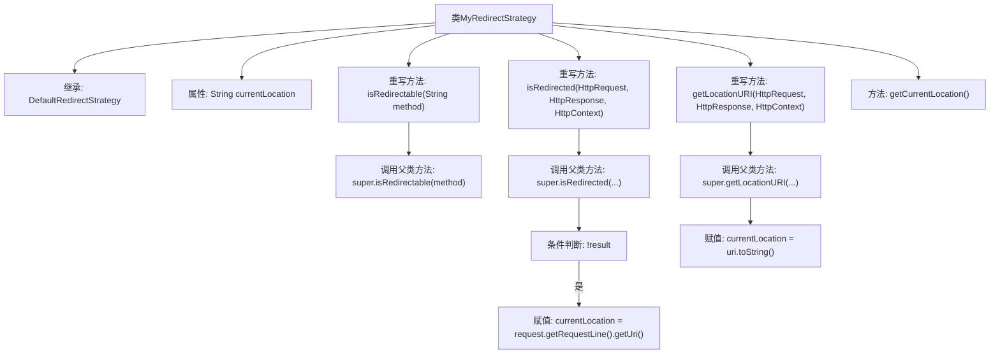

# 基础信息

|      |      |
|------|------|
| 名称 | MyRedirectStrategy |
| 编码语言 | .java |
| 代码路径 | WeFe/common/java/common-lang/src/main/java/com/welab/wefe/common/http/MyRedirectStrategy.java |
| 包名 | com.welab.wefe.common.http |
| 依赖项 | ['org.apache.http.HttpRequest', 'org.apache.http.HttpResponse', 'org.apache.http.ProtocolException', 'org.apache.http.impl.client.DefaultRedirectStrategy', 'org.apache.http.protocol.HttpContext', 'java.net.URI'] |
| 概述说明 | 自定义重定向策略类MyRedirectStrategy继承DefaultRedirectStrategy，通过覆盖isRedirected和getLocationURI方法跟踪当前请求或重定向URL，并提供getCurrentLocation获取当前地址。 |

# 说明

该代码定义了一个名为MyRedirectStrategy的类，继承自DefaultRedirectStrategy，用于处理HTTP重定向逻辑。类中包含一个currentLocation字段存储当前URL地址。重写了三个方法：isRedirectable判断请求是否可重定向，isRedirected检查是否需要重定向并在不重定向时更新currentLocation为请求地址，getLocationURI在重定向时更新currentLocation为重定向目标地址。最后提供了getCurrentLocation方法获取当前URL。

# 类列表 Class Summary

| 名称   | 类型  | 说明 |
|-------|------|-------------|
| MyRedirectStrategy | class | 自定义重定向策略类MyRedirectStrategy，继承DefaultRedirectStrategy，通过重写方法跟踪当前请求地址，提供获取当前地址的方法。 |

## 类 MyRedirectStrategy

|      |      |
|------|------|
| 访问范围 | public |
| 类型 | class |
| 名称 | MyRedirectStrategy |
| 说明 | 自定义重定向策略类MyRedirectStrategy，继承DefaultRedirectStrategy，通过重写方法跟踪当前请求地址，提供获取当前地址的方法。 |

### UML类图

这段代码展示了一个自定义重定向策略类`MyRedirectStrategy`，它继承自`DefaultRedirectStrategy`接口。主要功能是跟踪HTTP请求的当前地址：当发生重定向时通过`getLocationURI`更新位置；未重定向时通过`isRedirected`捕获请求URI。类中维护`currentLocation`私有字段，并通过公有方法`getCurrentLocation`暴露该值。该设计扩展了基础重定向功能，添加了位置追踪能力，适用于需要监控HTTP请求链路的场景。

### 内部方法调用关系图

这段代码展示了一个HTTP重定向策略类MyRedirectStrategy，它继承自DefaultRedirectStrategy。主要功能包括：通过isRedirected方法判断是否需要重定向并记录当前URL；通过getLocationURI方法获取重定向URI并更新当前位置；提供getCurrentLocation方法获取存储的位置信息。流程图清晰展示了方法调用链和关键逻辑分支，特别是对父类方法的调用和currentLocation属性的更新过程。

### 字段列表 Field List

| 名称  | 类型  | 说明 |
|-------|-------|------|
| currentLocation | String | 当前存储位置的字符串变量。 |

### 方法列表

| 名称  | 类型  | 说明 |
|-------|-------|------|
| getCurrentLocation | String | 获取当前位置的字符串值。 |
| getLocationURI | URI | 重写方法获取请求的URI，保存当前地址并返回URI。 |
| isRedirected | boolean | 该方法检查HTTP请求是否被重定向。若未被重定向，则将当前URL设为请求地址。最终返回重定向判断结果。 |
| isRedirectable | boolean | 重写方法isRedirectable，直接调用父类实现判断方法是否可重定向。 |

