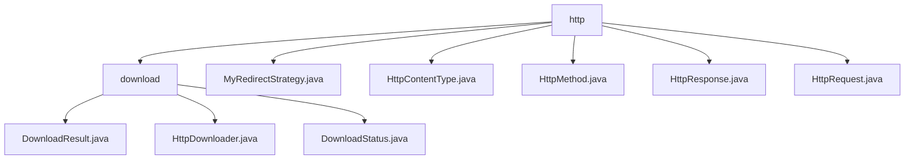

# 基础信息

|      |      |
|------|------|
| 名称 | http |
| 编码语言 | .java |
| 代码路径 | WeFe/common/java/common-lang/src/main/java/com/welab/wefe/common/http |
| 包名 | docs.common.java.common-lang.src.main.java.com.welab.wefe.common.http |
| 概述说明 | HTTP下载模块支持多线程分块下载，含状态管理和断点续传。包含HttpDownloader、DownloadResult等核心类，依赖Apache HttpClient。配套工具含重定向策略、HTTP方法枚举、内容类型常量及请求响应封装类，支持HTTPS和连接池。 |

# 说明

## 概述  
该模块核心职责是实现HTTP通信全流程管理，包括文件下载、请求处理和响应解析。接口规范涵盖DownloadResult状态封装、HttpRequest/HttpResponse请求响应交互、以及HttpMethod/HttpContentType协议控制。关键数据结构包括DownloadResult（进度跟踪）、HttpResponse（状态码/响应体）和MyRedirectStrategy（URL重定向），类似通信中间件。外部依赖为Apache HttpClient和SSL/TLS库。例如通过分块下载实现大文件传输，通过枚举约束HTTP方法有效性。

## 主要业务场景  
典型应用包含多线程文件下载（创建→分块→校验）和RESTful接口调用（GET/POST请求）。交互模式采用工厂方法（HttpRequest.create）和状态回调（DownloadResult），类似管道过滤器架构。完整功能支持HTTPS安全传输、内容类型协商（JSON/FORM）和自动重定向（MyRedirectStrategy）。API类型包括命令模式（start下载）和建造者模式（链式配置）。例如自动处理302跳转，智能解析JSON响应体。

### 包内部结构视图

该流程图展示了WeFe项目中HTTP相关模块的层级结构。顶层是http目录，包含5个直接子文件(如MyRedirectStrategy.java)和1个子目录download。download目录下又包含3个实现下载功能的Java文件。整个结构清晰地反映了HTTP模块的功能划分，顶层处理通用HTTP功能，download子目录专门处理下载相关功能。

# 文件列表

| 名称   | 类型  | 说明 |
|-------|------|-------------|
| [MyRedirectStrategy.java](MyRedirectStrategy.md) | file | 自定义重定向策略类MyRedirectStrategy继承DefaultRedirectStrategy，通过覆盖isRedirected和getLocationURI方法跟踪当前请求或重定向URL，并提供getCurrentLocation获取当前地址。 |
| [HttpContentType.java](HttpContentType.md) | file | HttpContentType类定义了四种HTTP内容类型常量：JSON、FORM、MULTIPART和TEXT。 |
| [HttpMethod.java](HttpMethod.md) | file | 定义HTTP方法枚举，包含GET、POST、PUT、HEAD、DELETE，其中POST和PUT允许包含请求体。 |
| [HttpResponse.java](HttpResponse.md) | file | HttpResponse类封装HTTP响应数据，包含状态码、耗时、错误信息、请求头、响应体等字段，提供日志记录、JSON解析及编码处理功能。 |
| [HttpRequest.java](HttpRequest.md) | file | HttpRequest类封装HTTP请求功能，支持GET/POST方法，可设置超时、重试、头信息、参数、Cookie等，默认UTF-8编码，含SSL支持。 |
| [download](download/_module.md) | package | DownloadResult类记录下载状态、大小、文件等。HttpDownloader处理HTTP下载，检查文件、分块写入、更新状态。DownloadStatus枚举定义5种下载状态：准备、下载中、完成、失败、取消。 |

