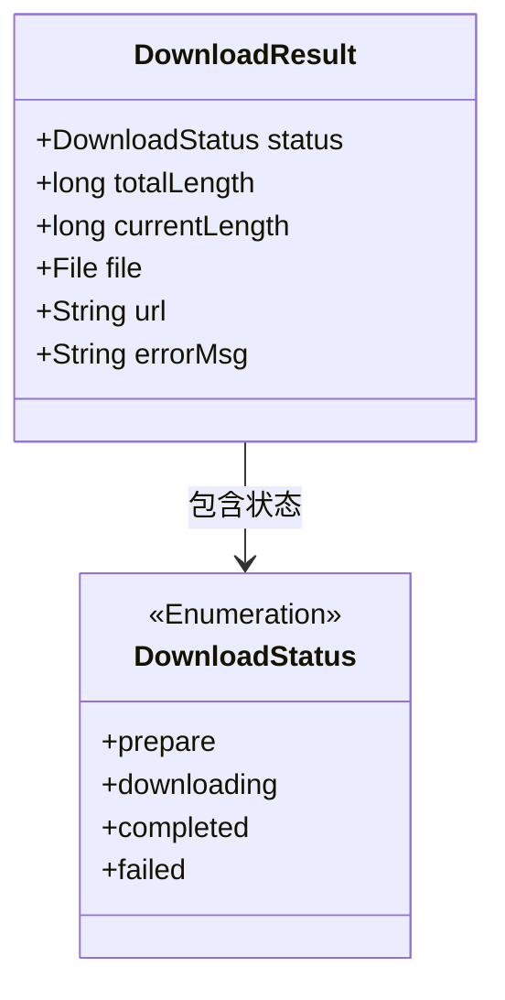
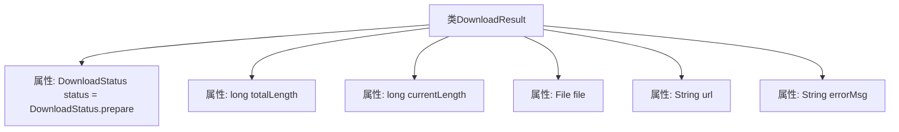

# 基础信息

|      |      |
|------|------|
| 名称 | DownloadResult |
| 编码语言 | .java |
| 代码路径 | WeFe/common/java/common-lang/src/main/java/com/welab/wefe/common/http/download/DownloadResult.java |
| 包名 | com.welab.wefe.common.http.download |
| 依赖项 | ['java.io.File'] |
| 概述说明 | DownloadResult类包含下载状态、文件总大小、当前大小、文件对象、URL和错误信息。 |

# 说明

DownloadResult类用于表示下载任务的结果状态，包含下载状态status（初始为prepare）、文件总大小totalLength、当前已下载大小currentLength、下载文件对象file、下载链接url以及错误信息errorMsg。这些字段共同提供了下载任务的完整进度和结果信息。

# 类列表 Class Summary

| 名称   | 类型  | 说明 |
|-------|------|-------------|
| DownloadResult | class | DownloadResult类包含下载状态、文件总大小、当前大小、文件对象、URL和错误信息。 |

## 类 DownloadResult

|      |      |
|------|------|
| 访问范围 | public |
| 类型 | class |
| 名称 | DownloadResult |
| 说明 | DownloadResult类包含下载状态、文件总大小、当前大小、文件对象、URL和错误信息。 |

### UML类图

这段类图展示了下载结果的数据结构，其中DownloadResult类包含6个公有字段：status表示下载状态枚举（准备/下载中/完成/失败），totalLength和currentLength记录文件大小和进度，file存储目标文件，url保存下载地址，errorMsg记录错误信息。DownloadStatus作为枚举类被关联使用，清晰地描述了下载过程可能的状态流转。该设计适用于需要跟踪下载进度和结果的场景。

### 内部方法调用关系图

该流程图展示了DownloadResult类的结构，包含6个核心属性：status表示下载状态（初始为prepare），totalLength和currentLength分别记录文件总大小和当前进度，file存储目标文件对象，url保存下载链接地址，errorMsg用于存储错误信息。所有属性均为public访问级别，可直接被外部访问和修改。

### 字段列表 Field List

| 名称  | 类型  | 说明 |
|-------|-------|------|
| currentLength | long | 当前长度值，类型为长整型。 |
| url | String | 公开字符串变量url，用于存储网址。 |
| totalLength | long | 声明一个公共长整型变量totalLength。 |
| file | File | 声明一个公开的文件类型变量file。 |
| status = DownloadStatus.prepare | DownloadStatus | 下载状态初始化为准备中。 |
| errorMsg | String | 声明一个公共字符串变量errorMsg，用于存储错误信息。 |

### 方法列表

| 名称  | 类型  | 说明 |
|-------|-------|------|

