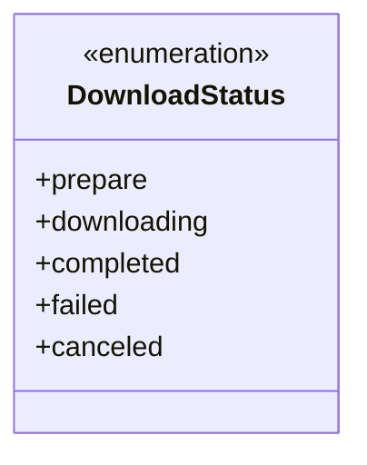
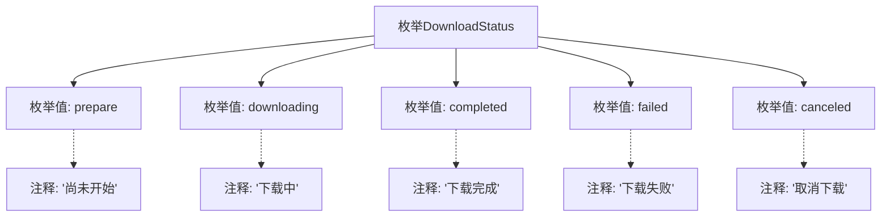

# 基础信息

|      |      |
|------|------|
| 名称 | DownloadStatus |
| 编码语言 | .java |
| 代码路径 | WeFe/common/java/common-lang/src/main/java/com/welab/wefe/common/http/download/DownloadStatus.java |
| 包名 | com.welab.wefe.common.http.download |
| 依赖项 | [] |
| 概述说明 | 枚举DownloadStatus定义了下载状态：准备中、下载中、完成、失败、取消。 |

# 说明

该枚举类型定义了文件下载的5种状态：prepare表示下载尚未开始；downloading表示文件正在下载中；completed表示下载已完成；failed表示下载失败；canceled表示下载被取消。每个状态都有对应的注释说明其含义。

# 类列表 Class Summary

| 名称   | 类型  | 说明 |
|-------|------|-------------|
| DownloadStatus | enum | 枚举DownloadStatus定义下载状态：准备中、下载中、完成、失败、取消。 |

## 类 DownloadStatus

|      |      |
|------|------|
| 访问范围 | public |
| 类型 | enum |
| 名称 | DownloadStatus |
| 说明 | 枚举DownloadStatus定义下载状态：准备中、下载中、完成、失败、取消。 |

### UML类图

该枚举类定义了五种下载状态：prepare（准备）、downloading（下载中）、completed（完成）、failed（失败）和canceled（取消）。每个状态通过不同的枚举值表示，用于清晰地标识下载过程中的各个阶段或结果。这种设计便于状态管理和逻辑判断，同时提高了代码的可读性和可维护性。枚举类型的使用确保了状态值的唯一性和类型安全。

### 内部方法调用关系图

该流程图展示了DownloadStatus枚举的结构，包含5个枚举值(prepare/downloading/completed/failed/canceled)及其对应的中文注释。每个枚举值通过虚线连接到其描述性注释，清晰表达了下载过程中可能出现的不同状态及其含义。这种设计常用于文件下载器等需要状态跟踪的场景，通过枚举值可以明确标识下载流程的各个阶段。

### 字段列表 Field List

| 名称  | 类型  | 说明 |
|-------|-------|------|

### 方法列表

| 名称  | 类型  | 说明 |
|-------|-------|------|

