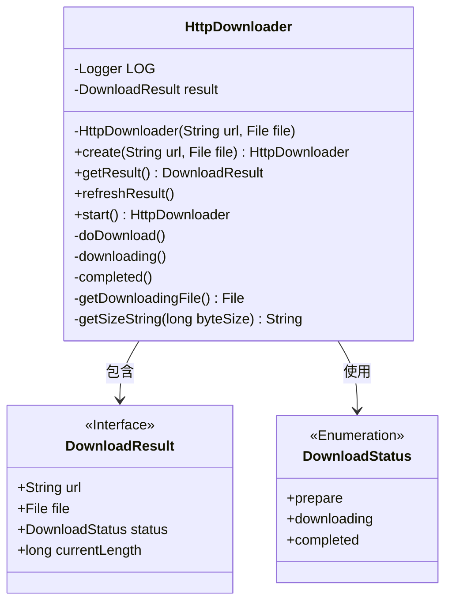
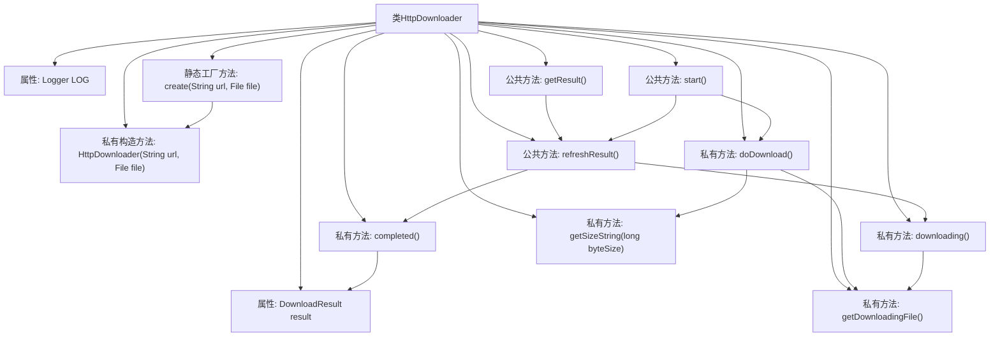
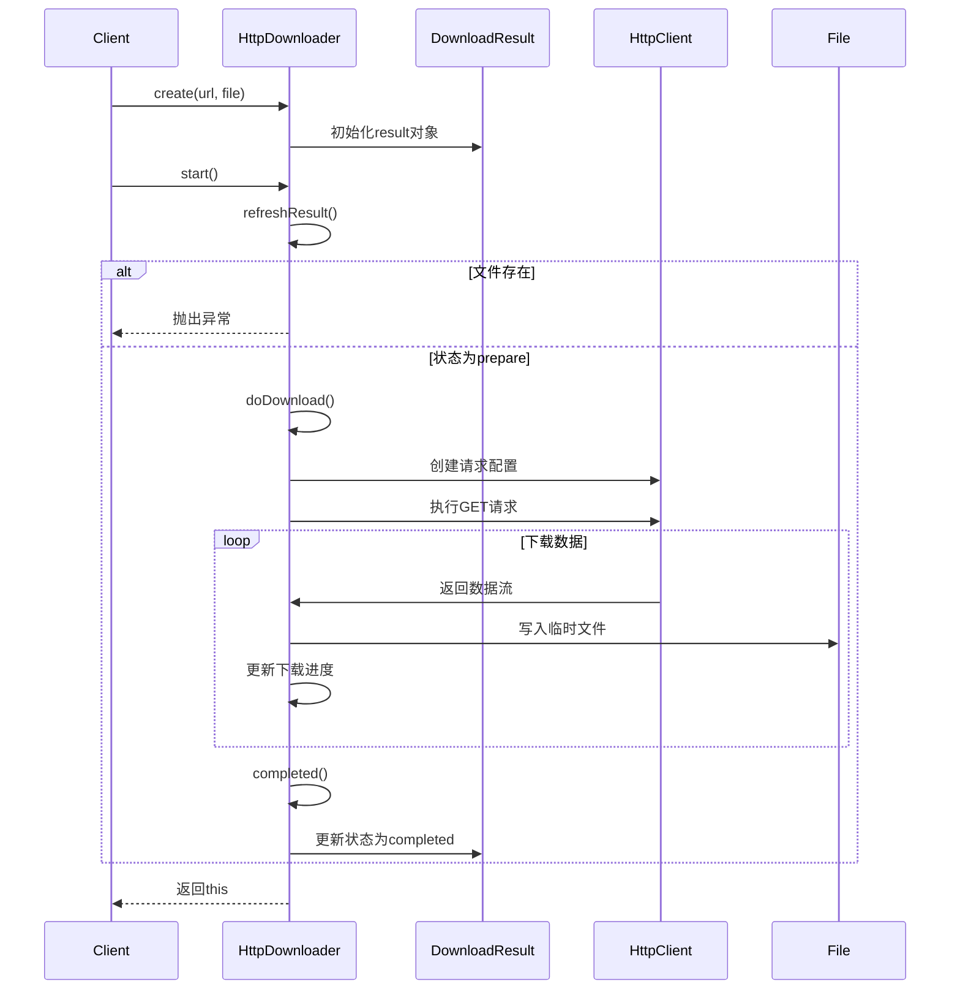

# 基础信息

|      |      |
|------|------|
| 名称 | HttpDownloader |
| 编码语言 | .java |
| 代码路径 | WeFe/common/java/common-lang/src/main/java/com/welab/wefe/common/http/download/HttpDownloader.java |
| 包名 | com.welab.wefe.common.http.download |
| 依赖项 | ['org.apache.http.client.config.RequestConfig', 'org.apache.http.client.methods.CloseableHttpResponse', 'org.apache.http.client.methods.HttpGet', 'org.apache.http.impl.client.CloseableHttpClient', 'org.apache.http.impl.client.HttpClients', 'org.slf4j.Logger', 'org.slf4j.LoggerFactory', 'java.io.File', 'java.io.FileOutputStream', 'java.io.IOException', 'java.io.InputStream', 'java.math.BigDecimal', 'java.math.RoundingMode'] |
| 概述说明 | HttpDownloader类用于HTTP文件下载，支持创建下载任务、检查状态、执行下载及进度跟踪。下载前检查文件存在性，下载中生成临时文件，完成后更新状态。提供超时设置和缓冲区优化。 |

# 说明

HttpDownloader是一个用于HTTP文件下载的Java类，通过静态工厂方法create创建实例。它使用DownloadResult对象跟踪下载状态、URL和目标文件。构造函数会检查文件是否已存在以避免覆盖。核心方法start触发下载流程，内部通过doDownload方法执行实际下载，使用Apache HttpClient处理请求，设置超时参数并分块写入临时文件（后缀.downloading）。下载过程中会记录进度，完成后重命名文件。提供refreshResult方法更新下载状态（准备/下载中/完成），并包含辅助方法处理文件大小格式化。异常处理包括文件存在性检查和连接释放。

# 类列表 Class Summary

| 名称   | 类型  | 说明 |
|-------|------|-------------|
| HttpDownloader | class | HttpDownloader类用于HTTP文件下载，包含下载状态管理、超时设置、进度监控和文件处理功能。 |

## 类 HttpDownloader

|      |      |
|------|------|
| 访问范围 | public |
| 类型 | class |
| 名称 | HttpDownloader |
| 说明 | HttpDownloader类用于HTTP文件下载，包含下载状态管理、超时设置、进度监控和文件处理功能。 |

### UML类图

类图描述：
HttpDownloader是一个用于HTTP文件下载的工具类，包含核心下载逻辑和状态管理。它通过DownloadResult接口存储下载结果（URL、目标文件、状态和当前大小），并使用DownloadStatus枚举管理下载状态（准备/下载中/完成）。类提供创建实例、获取结果、刷新状态、启动下载等方法，私有方法处理实际下载过程、状态转换和文件操作。通过临时.downloading文件实现下载过程跟踪，包含详细的异常处理和日志记录功能。

### 内部方法调用关系图

流程图展示了HttpDownloader类的完整结构，包含11个主要成员和8条内部调用关系。核心流程是：通过工厂方法创建实例后，调用start()触发下载，期间通过refreshResult()管理状态，最终由doDownload()完成HTTP请求和文件写入。时序图则详细描述了从创建实例到完成下载的交互过程，突出了状态检查和HTTP通信的关键步骤。

### 字段列表 Field List

| 名称  | 类型  | 说明 |
|-------|-------|------|
| LOG = LoggerFactory.getLogger(HttpDownloader.class) | Logger | 定义HttpDownloader类的私有静态日志对象LOG。 |
| result | DownloadResult | 私有下载结果对象result |

### 方法列表

| 名称  | 类型  | 说明 |
|-------|-------|------|
| completed | void | 检查文件存在性，不存在则报错；设置状态为完成，若当前长度为0则更新为文件实际长度。 |
| start | HttpDownloader | 该方法启动下载器，首先刷新状态，若状态非准备则直接返回；否则执行下载并返回当前对象。可能抛出IO异常。 |
| getResult | DownloadResult | 方法getResult刷新结果后返回下载结果。 |
| refreshResult | void | 方法refreshResult检查下载状态：若文件存在且状态为下载中则调用completed()；若下载中的文件存在则调用downloading()。 |
| downloading | void | 该方法检查下载文件是否存在，不存在则抛出异常。设置状态为下载中，若当前长度为0则更新为文件长度。 |
| doDownload | void | 方法doDownload实现文件下载功能，设置HTTP请求超时参数，创建临时文件，分块读取数据并写入文件，实时显示下载进度，完成后关闭资源。 |
| create | HttpDownloader | 创建一个静态方法，根据URL和文件路径生成HttpDownloader实例。 |
| getDownloadingFile | File | 获取下载中的临时文件路径，在原文件路径后添加.downloading后缀。 |
| getSizeString | String | 将字节数转换为易读的字符串，小于1024显示字节，1024到1MB显示KB，大于1MB显示MB，保留两位小数。 |

