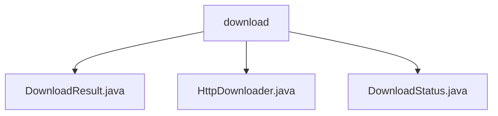

# 基础信息

|      |      |
|------|------|
| 名称 | download |
| 编码语言 | .java |
| 代码路径 | WeFe/common/java/common-lang/src/main/java/com/welab/wefe/common/http/download |
| 包名 | docs.common.java.common-lang.src.main.java.com.welab.wefe.common.http.download |
| 概述说明 | DownloadResult类记录下载状态、大小、文件等。HttpDownloader处理HTTP下载，检查文件、分块写入、更新状态。DownloadStatus枚举定义5种下载状态：准备、下载中、完成、失败、取消。 |

# 说明

## 概述  
该模块核心职责是实现HTTP文件下载功能，通过状态跟踪和分块写入确保下载可靠性。接口规范包括DownloadResult封装结果数据、HttpDownloader执行下载流程、DownloadStatus枚举定义状态机。关键数据结构为DownloadResult，包含status、totalLength等字段，类似任务进度报告。外部依赖仅为Apache HttpClient。例如通过.downloading临时文件实现断点续传，通过refreshResult更新状态。

## 主要业务场景  
典型应用为多线程分块下载大文件，流程包括创建实例→检查文件→分块下载→重命名。交互模式类似观察者模式，通过DownloadResult回调进度。完整功能涵盖状态管理（如failed/canceled）、异常处理和文件存在性校验。API类型为工厂模式（create）和命令模式（start）。例如避免覆盖已有文件，格式化文件大小显示。

### 包内部结构视图

该流程图展示了WeFe项目中common-lang模块下的HTTP下载功能相关文件结构。根节点为download目录，包含三个Java实现文件：DownloadResult.java处理下载结果，HttpDownloader.java实现下载器核心逻辑，DownloadStatus.java定义下载状态枚举。这些文件共同构成了HTTP下载功能的基础组件，体现了模块化的设计思想。

# 文件列表

| 名称   | 类型  | 说明 |
|-------|------|-------------|
| [DownloadResult.java](DownloadResult.md) | file | DownloadResult类包含下载状态、文件总大小、当前大小、文件对象、URL和错误信息。 |
| [HttpDownloader.java](HttpDownloader.md) | file | HttpDownloader类用于HTTP文件下载，支持创建下载任务、检查状态、执行下载及进度跟踪。下载前检查文件存在性，下载中生成临时文件，完成后更新状态。提供超时设置和缓冲区优化。 |
| [DownloadStatus.java](DownloadStatus.md) | file | 枚举DownloadStatus定义了下载状态：准备中、下载中、完成、失败、取消。 |

