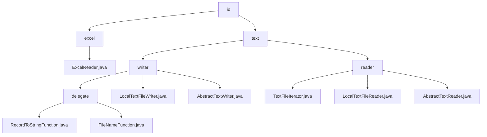

# 基础信息

|      |      |
|------|------|
| 名称 | io |
| 编码语言 | .java |
| 代码路径 | WeFe/common/java/common-lang/src/main/java/com/welab/wefe/common/io |
| 包名 | docs.common.java.common-lang.src.main.java.com.welab.wefe.common.io |
| 概述说明 | ExcelReader是Java类，支持读取Excel数据，提供多种初始化方式及数据遍历功能。文本处理模块支持数据序列化、分片存储和逐行读取，适用于ETL和高吞吐日志处理。 |

# 说明

## 概述  
该模块是面向数据处理的多功能工具集，核心职责包括Excel文件解析和文本数据批处理。ExcelReader提供工作簿操作和类型感知的单元格读取（类似POI的轻量封装），而文本模块实现分片存储与迭代读取（类似MapReduce模式）。统一接口规范涵盖Closeable资源管理、Iterator遍历和函数式序列化接口。关键数据结构包含Excel工作表/单元格、文本分片配置及读取状态跟踪。依赖JVM关闭钩子、Java IO库和同步锁机制，例如日志转CSV、数据库导出和分布式计算中间存储。

## 主要业务场景  
模块支持结构化与非结构化数据处理闭环。Excel端实现"加载-遍历-关闭"流程（如报表解析），文本端组合分片写入与缓冲读取（如日志归档）。交互模式均采用迭代器接口，Excel支持Map/List两种行数据映射，文本模块实现预读和行号追踪。典型场景包括ETL流水线（如Excel转CSV）、批量日志分析和高吞吐数据持久化，类似消息总线的生产消费模型。

### 包内部结构视图

该流程图展示了WeFe项目中common-lang模块下io目录的层级结构。顶层为io目录，下分excel和text两个子目录。excel目录包含ExcelReader.java文件，text目录则分为writer和reader两部分。writer部分包含抽象类、实现类及delegate目录，reader部分包含抽象类和具体实现类。整个结构清晰地反映了文件读写功能的模块化设计。

# 文件列表

| 名称   | 类型  | 说明 |
|-------|------|-------------|
| [excel](excel/_module.md) | package | ExcelReader类用于读取Excel文件，支持通过文件名、文件或输入流初始化。提供获取工作表数量、行数列数、行数据及列名等功能，支持带标题行或无标题行的数据遍历，并自动处理空单元格。实现Closeable接口确保资源释放。 |
| [text](text/_module.md) | package | 文本处理工具集含写入与读取模块。写入模块支持记录序列化、动态分片存储，依赖JVM钩子与同步锁，适用于ETL流水线。读取模块通过迭代器逐行处理文本，用于日志分析等场景。均基于Java标准IO，线程安全。 |

