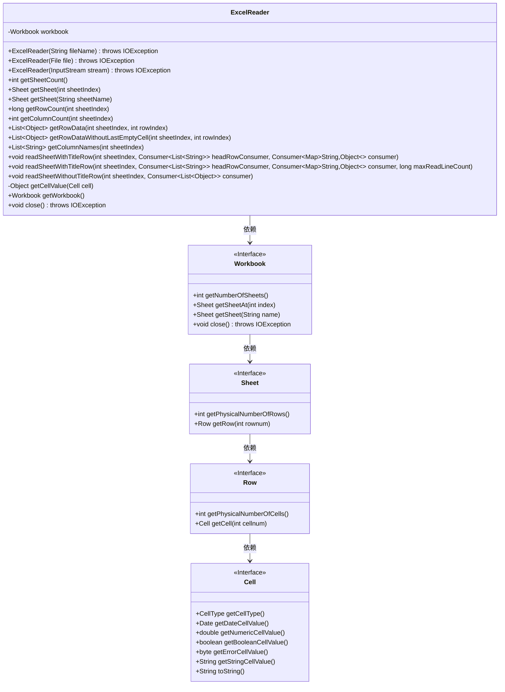
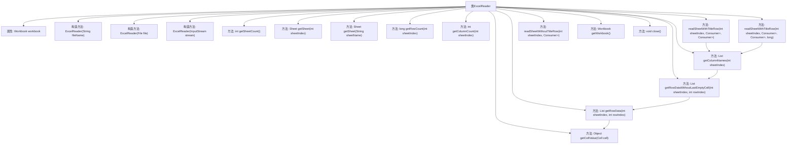

# 基础信息

|      |      |
|------|------|
| 名称 | ExcelReader |
| 编码语言 | .java |
| 代码路径 | WeFe/common/java/common-lang/src/main/java/com/welab/wefe/common/io/excel/ExcelReader.java |
| 包名 | com.welab.wefe.common.io.excel |
| 依赖项 | ['com.alibaba.fastjson.util.TypeUtils', 'com.welab.wefe.common.util.StringUtil', 'org.apache.poi.ss.usermodel', 'java.io.Closeable', 'java.io.File', 'java.io.IOException', 'java.io.InputStream', 'java.util.ArrayList', 'java.util.LinkedHashMap', 'java.util.List', 'java.util.Map', 'java.util.function.Consumer', 'java.util.stream.Collectors'] |
| 概述说明 | ExcelReader类用于读取Excel文件，支持通过文件名、文件或输入流初始化。提供获取工作表数量、行数列数、行数据及列名等功能，支持带标题行或无标题行的数据遍历，并自动处理空单元格。实现Closeable接口确保资源释放。 |

# 说明

ExcelReader是一个实现了Closeable接口的Java类，用于读取Excel文件数据。它支持通过文件名、File对象或InputStream初始化工作簿。提供获取工作表数量、获取指定工作表、获取行数和列数等功能。可以读取单行数据，支持自动排除末尾空单元格。提供获取列标题和两种遍历方式：带标题行遍历（将数据转为Map）和不带标题行遍历（直接返回行数据列表）。内部方法getCellValue处理不同类型单元格数据（数值、日期、布尔值、字符串等）。最后通过close方法关闭工作簿释放资源。

# 类列表 Class Summary

| 名称   | 类型  | 说明 |
|-------|------|-------------|
| ExcelReader | class | ExcelReader类用于读取Excel文件，支持从文件、输入流构造，提供获取工作表、行列数、行数据及遍历功能，支持带标题行或无标题行读取，自动处理单元格类型并关闭资源。 |

## 类 ExcelReader

|      |      |
|------|------|
| 访问范围 | public |
| 类型 | class |
| 名称 | ExcelReader |
| 说明 | ExcelReader类用于读取Excel文件，支持从文件、输入流构造，提供获取工作表、行列数、行数据及遍历功能，支持带标题行或无标题行读取，自动处理单元格类型并关闭资源。 |

### UML类图

该类图展示了ExcelReader类的结构及其与相关接口的依赖关系。ExcelReader是一个实现了Closeable接口的类，用于读取Excel文件内容，提供了多种构造方法支持不同输入源。核心功能包括获取工作表数量、读取行列数据、处理单元格值等。该类通过Workbook接口操作Excel文档，Workbook进一步依赖Sheet、Row和Cell接口来访问工作表、行和单元格数据。私有方法getCellValue()处理不同类型单元格值的转换，体现了对Excel数据格式的细致处理能力。

### 内部方法调用关系图

该流程图展示了ExcelReader类的完整结构，包含3种构造方法、12个核心方法和1个私有工具方法。类通过Workbook对象操作Excel文件，提供多种数据读取方式，包括带标题行/无标题行的遍历、行列计数、单元格值获取等功能。关键方法如getRowData和getCellValue形成调用链，支持灵活的数据处理流程。所有方法最终依赖底层Workbook实现Excel操作，并通过Closeable接口确保资源释放。

### 字段列表 Field List

| 名称  | 类型  | 说明 |
|-------|-------|------|
| workbook | Workbook | 私有Workbook对象实例。 |

### 方法列表

| 名称  | 类型  | 说明 |
|-------|-------|------|
| getSheetCount | int | 获取工作簿中的工作表数量。 |
| getWorkbook | Workbook | 获取当前工作簿对象的方法。 |
| getRowDataWithoutLastEmptyCell | List<Object> | 该方法获取指定工作表行数据并移除末尾空单元格，返回处理后的列表。 |
| readSheetWithoutTitleRow | void | 读取指定工作表数据（无标题行），逐行处理并传递给消费者。 |
| getCellValue | Object | 获取单元格值的方法，处理不同类型如数字、日期、布尔值、错误、字符串和空白，返回对应值或null。 |
| getRowData | List<Object> | 获取Excel指定工作表行数据，返回单元格值列表。若行为空返回null。 |
| getColumnCount | int | 获取指定工作表索引的列数，返回该表首行的实际单元格数量。 |
| readSheetWithTitleRow | void | 读取Excel指定工作表数据，处理标题行和每行数据，支持最大行数限制。标题行通过headRowConsumer回调，数据行转为Map后通过consumer处理。 |
| readSheetWithTitleRow | void | 该方法用于读取带标题行的表格，通过回调函数处理标题行和数据行，支持指定表格索引和可选行数限制。 |
| getSheet | Sheet | 获取指定名称的工作表。 |
| getColumnNames | List<String> | 该方法获取指定工作表索引的首行数据，转换为字符串列表返回，自动过滤末尾空单元格。 |
| getSheet | Sheet | 获取指定索引的工作表。方法调用workbook的getSheetAt，返回对应sheetIndex的Sheet对象。 |
| getRowCount | long | 获取指定工作表的总行数。 |
| close | void | 该方法重写close()，调用workbook.close()并可能抛出IOException。 |

