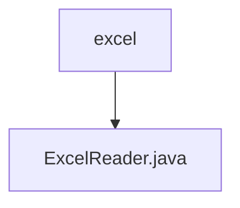

# 基础信息

|      |      |
|------|------|
| 名称 | excel |
| 编码语言 | .java |
| 代码路径 | WeFe/common/java/common-lang/src/main/java/com/welab/wefe/common/io/excel |
| 包名 | docs.common.java.common-lang.src.main.java.com.welab.wefe.common.io.excel |
| 概述说明 | ExcelReader类用于读取Excel文件，支持通过文件名、文件或输入流初始化。提供获取工作表数量、行数列数、行数据及列名等功能，支持带标题行或无标题行的数据遍历，并自动处理空单元格。实现Closeable接口确保资源释放。 |

# 说明

ExcelReader是一个实现了Closeable接口的Java类，用于读取Excel文件数据。它支持通过文件名、File对象或InputStream初始化工作簿。提供获取工作表数量、获取指定工作表、获取行数和列数等功能。可以读取单行数据，支持自动排除末尾空单元格。提供获取列标题和两种遍历方式：带标题行遍历（将数据转为Map）和不带标题行遍历（直接返回行数据列表）。内部方法getCellValue处理不同类型单元格数据（数值、日期、布尔值、字符串等）。最后通过close方法关闭工作簿释放资源。

### 包内部结构视图

该流程图展示了WeFe项目中common-lang模块下的excel包结构关系。顶层节点为excel目录，其下级包含一个具体的Java文件ExcelReader.java。这个结构清晰地反映了Excel读取功能的代码组织方式，其中ExcelReader.java作为核心实现文件位于excel包内。整个结构简洁明了，符合Java项目的标准包组织规范。

# 文件列表

| 名称   | 类型  | 说明 |
|-------|------|-------------|
| [ExcelReader.java](ExcelReader.md) | file | ExcelReader类用于读取Excel文件，支持通过文件名、文件或输入流初始化。提供获取工作表数量、行数列数、行数据及列名等功能，支持带标题行或无标题行的数据遍历，并自动处理空单元格。实现Closeable接口确保资源释放。 |

