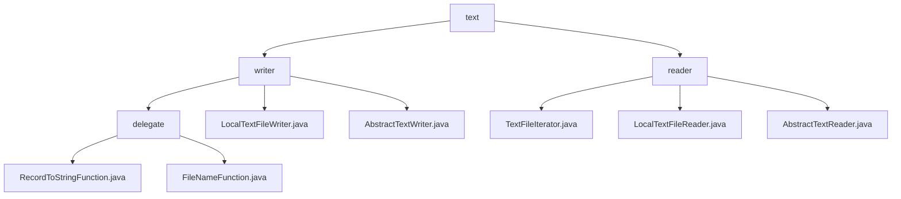

# 基础信息

|      |      |
|------|------|
| 名称 | text |
| 编码语言 | .java |
| 代码路径 | WeFe/common/java/common-lang/src/main/java/com/welab/wefe/common/io/text |
| 包名 | docs.common.java.common-lang.src.main.java.com.welab.wefe.common.io.text |
| 概述说明 | 文本处理工具集含写入与读取模块。写入模块支持记录序列化、动态分片存储，依赖JVM钩子与同步锁，适用于ETL流水线。读取模块通过迭代器逐行处理文本，用于日志分析等场景。均基于Java标准IO，线程安全。 |

# 说明

## 概述  
该模块是面向文本数据处理的通用工具集，核心职责包括记录序列化/分片存储和逐行读取（类似MapReduce的Mapper与迭代器模式组合）。提供函数式接口RecordToStringFunction/FileNameFunction用于写入，以及Iterator/Closeable规范用于读取。关键数据结构涵盖写入统计指标、文件配置项和读取状态（行号/缓冲器）。依赖JVM关闭钩子、BufferedWriter和Java标准IO库，线程安全通过同步锁实现。例如日志转CSV、HDFS分块存储和日志文件逐行分析。

## 主要业务场景  
模块支撑ETL流水线与批量数据处理，形成"处理-存储-读取"闭环。写入端通过LocalTextFileWriter组合序列化与分片功能（如数据库转CSV并按序号轮转文件），读取端通过TextFileIterator实现预读和行号追踪。交互模式统一采用Iterator接口（如while(hasNext)遍历），适用于高吞吐日志归档、分布式计算持久化及日志分析等场景，类似事件总线模式的消息落地与消费。

### 包内部结构视图

该流程图展示了WeFe项目中文本IO处理的模块结构。顶层为text目录，下分writer和reader两个子模块。writer模块包含具体实现类LocalTextFileWriter、抽象类AbstractTextWriter以及delegate子目录；reader模块包含迭代器实现TextFileIterator、具体实现类LocalTextFileReader和抽象类AbstractTextReader。delegate目录下包含两个功能类文件。

# 文件列表

| 名称   | 类型  | 说明 |
|-------|------|-------------|
| [reader](reader/_module.md) | package | TextFileIterator逐行读取文本文件，维护行号和状态。LocalTextFileReader读取本地文件，支持字符集和大小计算。AbstractTextReader是文本读取的抽象基类，提供文件名和读取器获取方法。 |
| [writer](writer/_module.md) | package | 提供两个泛型函数接口：RecordToStringFunction（记录转文本）和FileNameFunction（生成存储路径），适用于ETL等数据处理场景。LocalTextFileWriter是线程安全的本地文本写入器，支持自动分片和错误处理。AbstractTextWriter是抽象基类，提供核心写入功能与统计指标。 |

