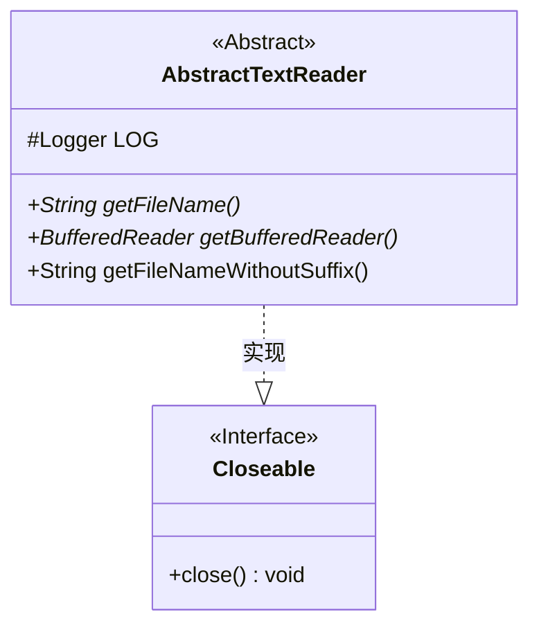
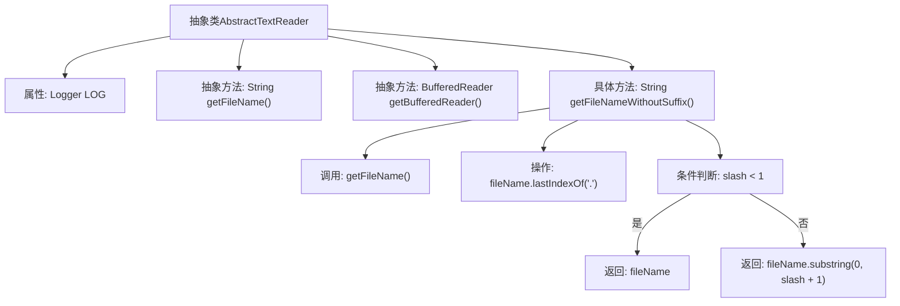

# 基础信息

|      |      |
|------|------|
| 名称 | AbstractTextReader |
| 编码语言 | .java |
| 代码路径 | WeFe/common/java/common-lang/src/main/java/com/welab/wefe/common/io/text/reader/AbstractTextReader.java |
| 包名 | com.welab.wefe.common.io.text.reader |
| 依赖项 | ['org.slf4j.Logger', 'org.slf4j.LoggerFactory', 'java.io.BufferedReader', 'java.io.Closeable'] |
| 概述说明 | 抽象类AbstractTextReader实现Closeable接口，提供获取文件名、无后缀文件名及BufferedReader对象的抽象方法，包含日志记录功能。 |

# 说明

AbstractTextReader是一个抽象类，实现了Closeable接口，用于读取文本文件。它包含一个受保护的Logger对象用于日志记录。该类提供了三个方法：getFileName是抽象方法，用于获取文件名；getBufferedReader也是抽象方法，返回BufferedReader对象以便逐行读取文件内容；getFileNameWithoutSuffix是具体方法，通过截取最后一个点号前的字符串来获取无后缀的文件名。该类为文本读取提供了基础框架，具体实现需由子类完成。

# 类列表 Class Summary

| 名称   | 类型  | 说明 |
|-------|------|-------------|
| AbstractTextReader | class | 抽象类AbstractTextReader实现Closeable接口，提供获取文件名、BufferedReader对象及无后缀文件名的方法。 |

## 类 AbstractTextReader

|      |      |
|------|------|
| 访问范围 | public abstract |
| 类型 | class |
| 名称 | AbstractTextReader |
| 说明 | 抽象类AbstractTextReader实现Closeable接口，提供获取文件名、BufferedReader对象及无后缀文件名的方法。 |

### UML类图

这段代码展示了一个抽象类AbstractTextReader，它实现了Closeable接口。该类包含一个受保护的Logger对象和三个方法：两个抽象方法getFileName()和getBufferedReader()，以及一个具体方法getFileNameWithoutSuffix()。该类主要用于文件读取操作，提供了获取文件名、缓冲读取器以及去除后缀的文件名等功能。抽象方法需要子类实现具体逻辑，体现了模板方法设计模式的思想。

### 内部方法调用关系图

这段代码定义了一个抽象类AbstractTextReader，包含日志记录器、两个抽象方法和一个具体方法。流程图展示了类结构和方法调用关系，重点描述了getFileNameWithoutSuffix()的内部逻辑：先获取文件名，查找最后一个点号位置，根据判断返回带或不带后缀的文件名。该设计为文本读取器提供了基础框架，强制子类实现关键文件操作功能。

### 字段列表 Field List

| 名称  | 类型  | 说明 |
|-------|-------|------|
| LOG = LoggerFactory.getLogger(this.getClass()) | Logger | 类中定义了一个受保护且不可变的日志记录器实例，用于当前类的日志输出。 |

### 方法列表

| 名称  | 类型  | 说明 |
|-------|-------|------|
| getFileName | String | 抽象方法getFileName，返回文件名字符串。 |
| getBufferedReader | BufferedReader | 抽象方法，返回BufferedReader对象。 |
| getFileNameWithoutSuffix | String | 获取不带后缀的文件名，若文件名无后缀则返回原文件名。 |

