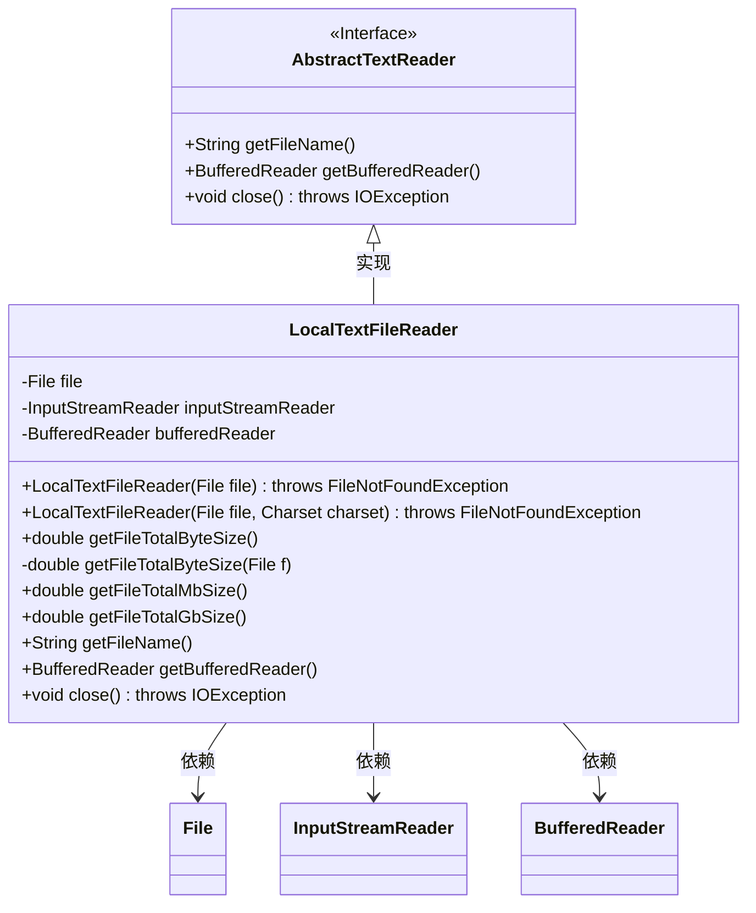
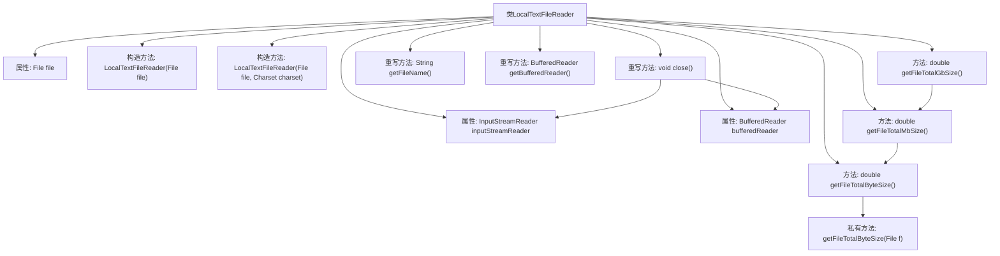

# 基础信息

|      |      |
|------|------|
| 名称 | LocalTextFileReader |
| 编码语言 | .java |
| 代码路径 | WeFe/common/java/common-lang/src/main/java/com/welab/wefe/common/io/text/reader/LocalTextFileReader.java |
| 包名 | com.welab.wefe.common.io.text.reader |
| 依赖项 | ['java.io', 'java.nio.charset.Charset', 'java.nio.charset.StandardCharsets'] |
| 概述说明 | LocalTextFileReader类继承AbstractTextReader，支持读取本地文本文件，默认UTF-8编码，提供文件大小计算（字节/MB/GB）及关闭资源功能。 |

# 说明

LocalTextFileReader类继承AbstractTextReader，用于读取本地文本文件。构造函数支持指定字符集（默认UTF-8），会检查文件是否存在。提供获取文件名、文件大小（字节/MB/GB）的方法，其中文件大小计算支持递归处理目录。通过BufferedReader读取内容，并实现资源关闭逻辑，确保安全释放输入流和读取器。

# 类列表 Class Summary

| 名称   | 类型  | 说明 |
|-------|------|-------------|
| LocalTextFileReader | class | LocalTextFileReader类继承AbstractTextReader，用于读取本地文本文件，支持UTF-8编码，提供文件大小计算（字节/MB/GB）和关闭资源功能。 |

## 类 LocalTextFileReader

|      |      |
|------|------|
| 访问范围 | public |
| 类型 | class |
| 名称 | LocalTextFileReader |
| 说明 | LocalTextFileReader类继承AbstractTextReader，用于读取本地文本文件，支持UTF-8编码，提供文件大小计算（字节/MB/GB）和关闭资源功能。 |

### UML类图

类图描述：LocalTextFileReader类继承自AbstractTextReader接口，实现了文件读取功能。核心成员包括File对象、InputStreamReader和BufferedReader，提供构造方法支持UTF-8或指定字符集读取。主要功能包括递归计算文件字节大小（支持MB/GB单位转换）、获取文件名、获取缓冲读取器以及资源关闭方法。通过组合模式处理文件大小计算，体现了良好的资源管理机制。

### 内部方法调用关系图

流程图描述了LocalTextFileReader类的结构及其方法调用关系。该类继承自AbstractTextReader，包含文件读取相关属性和构造方法，提供计算文件大小的功能（字节/MB/GB单位转换），并实现关闭资源的逻辑。核心方法getFileTotalByteSize通过递归计算文件总大小，其他方法基于此进行单位转换。流程图清晰展示了构造方法初始化流对象、递归计算逻辑以及资源关闭的顺序调用关系。

### 字段列表 Field List

| 名称  | 类型  | 说明 |
|-------|-------|------|
| file | File | 私有文件对象file。 |
| inputStreamReader | InputStreamReader | InputStreamReader是Java中用于将字节流转换为字符流的类。 |
| bufferedReader | BufferedReader | 声明一个BufferedReader类型的变量bufferedReader。 |

### 方法列表

| 名称  | 类型  | 说明 |
|-------|-------|------|
| close | void | 该方法关闭bufferedReader和inputStreamReader资源，确保在关闭后将其置为null，防止内存泄漏。 |
| getFileTotalMbSize | double | 该方法将文件总字节数转换为兆字节大小，通过除以1024两次实现单位转换。 |
| getFileTotalByteSize | double | 方法getFileTotalByteSize返回文件总字节大小，调用同名方法处理具体文件参数。 |
| getFileName | String | 方法重写，返回文件名。 |
| getFileTotalGbSize | double | 该方法将文件总大小从MB转换为GB，除以1024实现单位换算。 |
| getFileTotalByteSize | double | 递归计算文件或目录总字节数，文件直接返回大小，目录则遍历子项累加。 |
| getBufferedReader | BufferedReader | 该方法返回一个BufferedReader对象实例。 |

