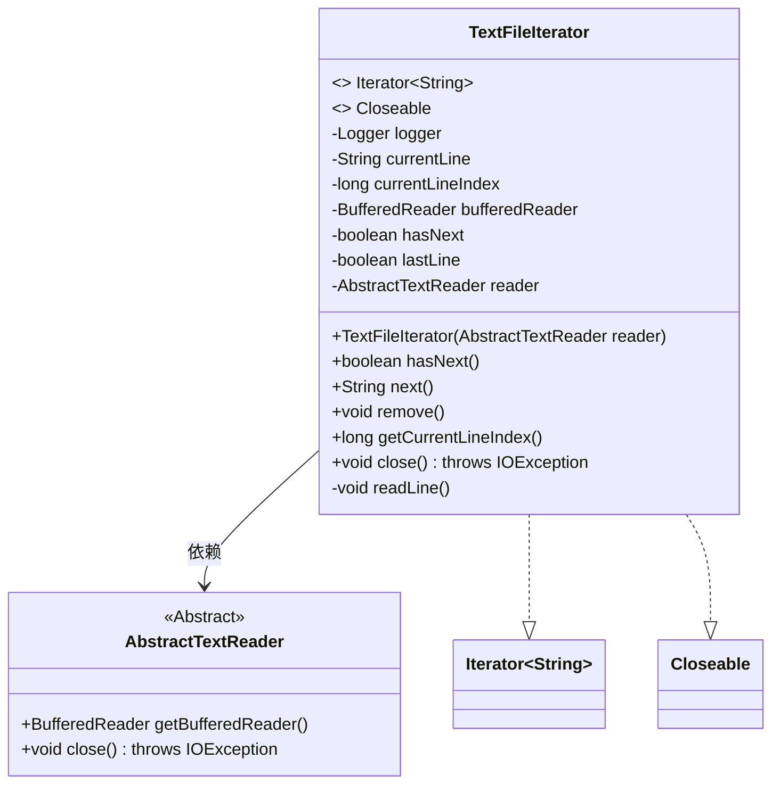
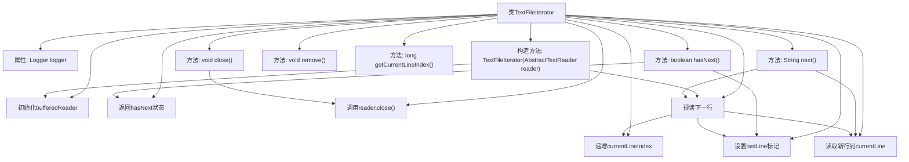

# 基础信息

|      |      |
|------|------|
| 名称 | TextFileIterator |
| 编码语言 | .java |
| 代码路径 | WeFe/common/java/common-lang/src/main/java/com/welab/wefe/common/io/text/reader/TextFileIterator.java |
| 包名 | com.welab.wefe.common.io.text.reader |
| 依赖项 | ['org.slf4j.Logger', 'org.slf4j.LoggerFactory', 'java.io.BufferedReader', 'java.io.Closeable', 'java.io.IOException', 'java.util.Iterator'] |
| 概述说明 | TextFileIterator类实现Iterator和Closeable接口，用于逐行读取文本文件。包含当前行内容、行号、读取状态等属性，通过hasNext和next方法遍历文件，支持关闭资源。 |

# 说明

TextFileIterator是一个实现了Iterator和Closeable接口的类，用于逐行读取文本文件。它通过BufferedReader读取文件内容，维护当前行内容currentLine、行号currentLineIndex及状态标志hasNext和lastLine。构造函数接收AbstractTextReader实例并初始化读取器，预先读取第一行。hasNext方法根据状态判断是否可继续读取，next方法返回当前行并预读下一行。readLine方法实际执行读取操作并更新状态。类还提供了获取当前行号的方法及关闭资源的close方法，但不支持remove操作。

# 类列表 Class Summary

| 名称   | 类型  | 说明 |
|-------|------|-------------|
| TextFileIterator | class | TextFileIterator类实现迭代器和可关闭接口，用于逐行读取文本文件，记录行号和状态，支持预读和资源释放。 |

## 类 TextFileIterator

|      |      |
|------|------|
| 访问范围 | public |
| 类型 | class |
| 名称 | TextFileIterator |
| 说明 | TextFileIterator类实现迭代器和可关闭接口，用于逐行读取文本文件，记录行号和状态，支持预读和资源释放。 |

### UML类图

这段代码展示了一个实现了`Iterator<String>`和`Closeable`接口的`TextFileIterator`类，用于逐行读取文本文件。它通过`AbstractTextReader`获取`BufferedReader`进行底层文件操作，维护当前行状态和索引，并提供标准的迭代器方法。类图清晰地显示了其继承关系、私有状态和对外接口，体现了文件读取和迭代功能的结合。

### 内部方法调用关系图

这段代码实现了一个文本文件迭代器，主要功能是按行读取文本文件内容。流程图展示了类结构、属性关系和方法调用链。核心逻辑是通过BufferedReader预读取下一行来实现Iterator接口，同时维护行号索引和文件结束标记。构造时立即预读首行，next()方法返回缓存行时触发下一次预读，形成流水线操作。异常处理和资源关闭通过Closeable接口实现，remove()方法被明确禁止。

### 字段列表 Field List

| 名称  | 类型  | 说明 |
|-------|-------|------|
| currentLineIndex = -1 | long | 变量currentLineIndex初始化为-1，用于记录当前行索引。 |
| lastLine = false | boolean | 变量lastLine是布尔类型，初始值为false，标记是否为最后一行。 |
| hasNext = true | boolean | 布尔变量hasNext表示是否有下一个元素，初始值为true。 |
| logger = LoggerFactory.getLogger(this.getClass()) | Logger | 类中定义受保护日志对象，使用当前类初始化日志记录器。 |
| currentLine | String | 当前行字符串变量 |
| bufferedReader | BufferedReader | 私有成员变量bufferedReader，类型为BufferedReader。 |
| reader | AbstractTextReader | 私有文本阅读器实例。 |

### 方法列表

| 名称  | 类型  | 说明 |
|-------|-------|------|
| hasNext | boolean | 检查迭代器是否有下一元素：若已到最后一行则返回false，否则返回hasNext状态。 |
| next | String | 该方法返回当前行内容并预读下一行。每次调用时返回已读取的currentLine，同时调用readLine()预读后续内容以便hasNext判断。 |
| readLine | void | 方法readLine读取下一行文本，行号递增。若读到末尾设置lastLine为true，异常时记录错误日志。 |
| remove | void | Java方法重写，抛出UnsupportedOperationException异常，提示非法操作。 |
| getCurrentLineIndex | long | 获取当前行索引的方法，返回长整型值currentLineIndex。 |
| close | void | Java方法重写，调用reader的close方法并可能抛出IOException异常。 |

