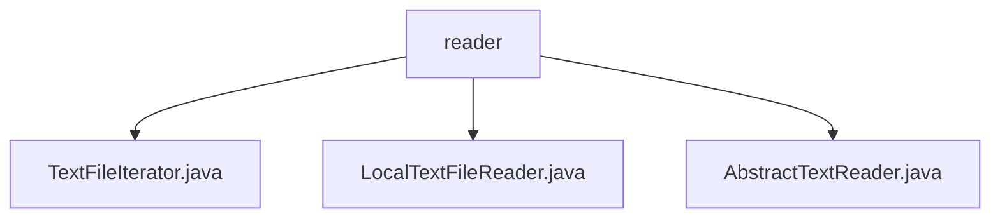

# 基础信息

|      |      |
|------|------|
| 名称 | reader |
| 编码语言 | .java |
| 代码路径 | WeFe/common/java/common-lang/src/main/java/com/welab/wefe/common/io/text/reader |
| 包名 | docs.common.java.common-lang.src.main.java.com.welab.wefe.common.io.text.reader |
| 概述说明 | TextFileIterator逐行读取文本文件，维护行号和状态。LocalTextFileReader读取本地文件，支持字符集和大小计算。AbstractTextReader是文本读取的抽象基类，提供文件名和读取器获取方法。 |

# 说明

## 概述  
该模块提供文本文件逐行读取能力，核心职责是通过迭代器模式安全高效地处理本地文本文件（类似事件总线模式）。接口规范包括Iterator的hasNext/next操作、Closeable的资源释放及行号查询等扩展功能。关键数据结构包含currentLine（当前行内容）、currentLineIndex（行号计数器）和BufferedReader（缓冲读取器）。外部依赖仅为Java标准IO库。例如TextFileIterator实现预读机制，LocalTextFileReader支持递归计算目录大小。

## 主要业务场景  
模块适用于日志分析、批量数据处理等需逐行读取文本的场景。完整流程包括初始化读取器（可指定字符集）、迭代获取行内容并最终关闭资源。交互模式统一通过Iterator接口实现，例如while(hasNext())处理每行数据。典型应用如结合LocalTextFileReader读取本地日志文件，通过getFileNameWithoutSuffix获取无后缀文件名进行后续处理。API类型包含状态查询（hasNext）、内容获取（next）和资源管理（close）三类。

### 包内部结构视图

该流程图展示了WeFe项目中文本读取模块的类结构关系。根节点"reader"表示文本读取器目录，包含三个具体实现类：TextFileIterator处理文本文件迭代，LocalTextFileReader实现本地文本读取，AbstractTextReader作为抽象基类提供通用功能。整个结构清晰地反映了文本处理模块的层次化设计。

# 文件列表

| 名称   | 类型  | 说明 |
|-------|------|-------------|
| [TextFileIterator.java](TextFileIterator.md) | file | TextFileIterator类实现Iterator和Closeable接口，用于逐行读取文本文件。包含当前行内容、行号、读取状态等属性，通过hasNext和next方法遍历文件，支持关闭资源。 |
| [LocalTextFileReader.java](LocalTextFileReader.md) | file | LocalTextFileReader类继承AbstractTextReader，支持读取本地文本文件，默认UTF-8编码，提供文件大小计算（字节/MB/GB）及关闭资源功能。 |
| [AbstractTextReader.java](AbstractTextReader.md) | file | 抽象类AbstractTextReader实现Closeable接口，提供获取文件名、无后缀文件名及BufferedReader对象的抽象方法，包含日志记录功能。 |

