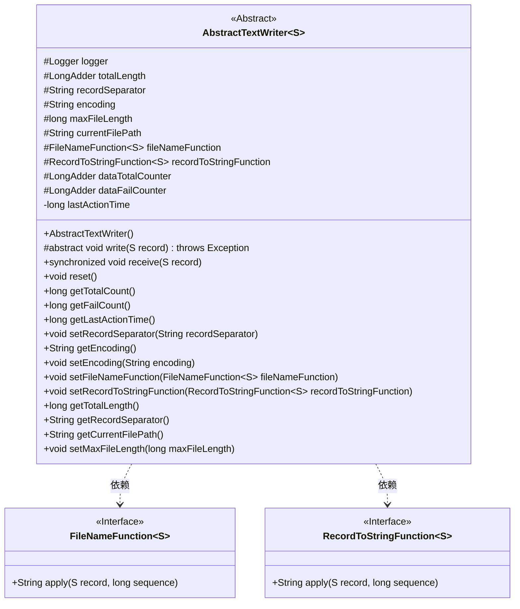

# 基础信息

|      |      |
|------|------|
| 名称 | AbstractTextWriter |
| 编码语言 | .java |
| 代码路径 | WeFe/common/java/common-lang/src/main/java/com/welab/wefe/common/io/text/writer/AbstractTextWriter.java |
| 包名 | com.welab.wefe.common.io.text.writer |
| 依赖项 | ['com.alibaba.fastjson.JSON', 'com.welab.wefe.common.io.text.writer.delegate.FileNameFunction', 'com.welab.wefe.common.io.text.writer.delegate.RecordToStringFunction', 'org.slf4j.Logger', 'org.slf4j.LoggerFactory', 'java.io.Closeable', 'java.io.IOException', 'java.util.concurrent.atomic.LongAdder'] |
| 概述说明 | 抽象文本写入类，支持自定义编码、分隔符和文件名生成，记录写入数据量、失败次数及最后活动时间，提供重置和统计功能。 |

# 说明

这是一个抽象文本写入器类AbstractTextWriter，实现了Closeable接口。它包含记录分隔符、文本编码、最大文件长度等配置项，以及当前文件路径、文件名生成函数、记录转字符串函数等核心组件。类内部维护了写入总长度、接收数据总数、写入失败数等计数器，以及最后活动时间戳。构造函数注册了JVM关闭钩子确保资源释放。主要功能包括接收数据并调用抽象写入方法、重置计数器、获取各项统计指标，以及提供相关属性的getter/setter方法。所有写入操作通过同步方法保证线程安全，失败时会记录错误日志并更新失败计数器。

# 类列表 Class Summary

| 名称   | 类型  | 说明 |
|-------|------|-------------|
| AbstractTextWriter | class | 抽象文本写入类AbstractTextWriter，实现Closeable，含日志、计数器、编码、分隔符等配置，提供数据接收、写入、重置及统计功能，支持自定义文件名和记录转换函数。 |

## 类 AbstractTextWriter

|      |      |
|------|------|
| 访问范围 | public abstract |
| 类型 | class |
| 名称 | AbstractTextWriter |
| 说明 | 抽象文本写入类AbstractTextWriter，实现Closeable，含日志、计数器、编码、分隔符等配置，提供数据接收、写入、重置及统计功能，支持自定义文件名和记录转换函数。 |

### UML类图

这段代码定义了一个抽象类 `AbstractTextWriter`，它是一个泛型类，用于处理文本数据的写入操作。该类包含多个受保护的成员变量，如日志记录器、计数器、文件路径等，并提供了数据接收、重置、计数查询等功能。`AbstractTextWriter` 依赖于两个接口 `FileNameFunction` 和 `RecordToStringFunction`，分别用于生成文件名和将记录转换为字符串。该类还实现了 `Closeable` 接口，确保在程序关闭时能够正确释放资源。

### 内部方法调用关系图

```mermaid
graph TD
    A["抽象类AbstractTextWriter<S>"]
    B["属性: Logger logger"]
    C["属性: LongAdder totalLength"]
    D["属性: String recordSeparator"]
    E["属性: String encoding"]
    F["属性: long maxFileLength"]
    G["属性: String currentFilePath"]
    H["属性: FileNameFunction<S> fileNameFunction"]
    I["属性: RecordToStringFunction<S> recordToStringFunction"]
    J["属性: LongAdder dataTotalCounter"]
    K["属性: LongAdder dataFailCounter"]
    L["属性: long lastActionTime"]
    M["构造方法: AbstractTextWriter()"]
    N["抽象方法: write(S record)"]
    O["方法: receive(S record)"]
    P["方法: reset()"]
    Q["方法: getTotalCount()"]
    R["方法: getFailCount()"]
    S["方法: getLastActionTime()"]
    T["方法: setRecordSeparator(String)"]
    U["方法: getEncoding()"]
    V["方法: setEncoding(String)"]
    W["方法: setFileNameFunction(FileNameFunction<S>)"]
    X["方法: setRecordToStringFunction(RecordToStringFunction<S>)"]
    Y["方法: getTotalLength()"]
    Z["方法: getRecordSeparator()"]
    AA["方法: getCurrentFilePath()"]
    AB["方法: setMaxFileLength(long)"]

    A --> B
    A --> C
    A --> D
    A --> E
    A --> F
    A --> G
    A --> H
    A --> I
    A --> J
    A --> K
    A --> L
    A --> M
    A --> N
    A --> O
    A --> P
    A --> Q
    A --> R
    A --> S
    A --> T
    A --> U
    A --> V
    A --> W
    A --> X
    A --> Y
    A --> Z
    A --> AA
    A --> AB
    M --> M1["注册ShutdownHook"]
    M1 --> M2["调用close()"]
    O --> O1["dataTotalCounter.increment()"]
    O --> O2["更新lastActionTime"]
    O --> O3["调用write(record)"]
    O3 --> O4["异常处理: dataFailCounter.increment()"]
    P --> P1["重置所有计数器"]
    P --> P2["清空currentFilePath"]
```

这段代码展示了一个抽象类`AbstractTextWriter<S>`的设计，主要用于处理文本数据的写入操作。类中包含多个属性用于记录写入状态（如总长度、失败计数等），以及各种设置和获取方法。核心功能包括接收数据（`receive`方法）、抽象写入方法（`write`）和重置方法（`reset`）。构造方法中注册了JVM关闭时的清理钩子，确保资源被正确释放。该类通过抽象方法模式允许子类实现具体的写入逻辑，同时提供了完整的错误处理和状态跟踪机制。

### 字段列表 Field List

| 名称  | 类型  | 说明 |
|-------|-------|------|
| currentFilePath | String | 当前文件路径的字符串变量，用于存储或访问文件位置信息。 |
| encoding = "utf-8" | String | 定义字符串变量encoding，默认值为"utf-8"，使用protected修饰符限制访问范围。 |
| fileNameFunction | FileNameFunction<S> | 保护的文件名生成函数，类型为FileNameFunction<S>。 |
| dataFailCounter = new LongAdder() | LongAdder | 声明一个受保护的长整型累加器变量dataFailCounter并初始化为新实例。 |
| dataTotalCounter = new LongAdder() | LongAdder | 定义一个受保护的LongAdder类型变量dataTotalCounter，用于线程安全地累加数据总量。 |
| totalLength = new LongAdder() | LongAdder | 声明一个受保护的长整型累加器totalLength，初始化为新LongAdder实例。 |
| maxFileLength = Integer.MAX_VALUE | long | 最大文件长度限制为整型最大值。 |
| recordSeparator = System.lineSeparator() | String | 定义字符串变量recordSeparator，其值为系统默认的行分隔符。 |
| lastActionTime = System.currentTimeMillis() | long | 记录最后一次操作时间的变量，初始值为当前系统时间。 |
| recordToStringFunction = (record, sequence) -> JSON.toJSONString(record) | RecordToStringFunction<S> | 将记录对象转换为JSON字符串的函数，使用JSON库的序列化方法。 |
| logger = LoggerFactory.getLogger(this.getClass()) | Logger | 定义当前类的日志记录器实例，用于输出日志信息。 |

### 方法列表

| 名称  | 类型  | 说明 |
|-------|-------|------|
| setMaxFileLength | void | 设置文件最大长度的公共方法，参数为长整型maxFileLength，赋值给类变量this.maxFileLength。 |
| getTotalLength | long | 获取总长度的长整型数值。 |
| getRecordSeparator | String | 获取记录分隔符的方法，返回字符串类型的recordSeparator变量。 |
| getCurrentFilePath | String | 获取当前文件路径的方法，返回字符串类型的路径值。 |
| setEncoding | void | 设置字符串编码的方法，将输入参数赋值给类成员变量encoding。 |
| reset | void | 该方法重置计数器并清空当前文件路径，包括数据总数、失败数和总长度的计数器归零，同时将currentFilePath设为null。 |
| getEncoding | String | 获取当前编码字符串。 |
| setRecordSeparator | void | 设置记录分隔符的方法，将输入字符串赋值给类的recordSeparator成员变量。 |
| getFailCount | long | 获取失败计数的方法，返回长整型数值。 |
| getTotalCount | long | 获取数据总量的方法，返回长整型数值。 |
| receive | void | 同步方法receive接收记录S，更新总计数器，记录最后操作时间。尝试写入记录，失败时更新失败计数器并记录错误日志。 |
| getLastActionTime | long | 获取最后操作时间的方法，返回long类型值lastActionTime。 |
| write | void | 抽象方法write，接收S类型参数，可能抛出异常。 |
| setFileNameFunction | void | 设置文件名生成函数，参数为FileNameFunction类型，用于指定文件命名规则。 |
| setRecordToStringFunction | void | 设置记录转字符串函数，用于将记录对象转换为字符串。 |

