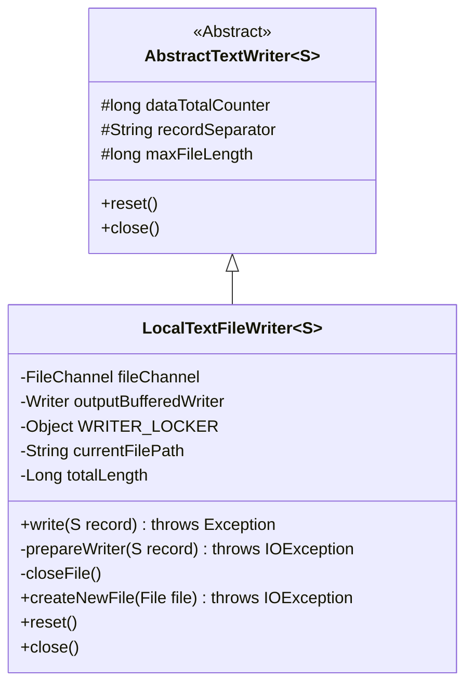
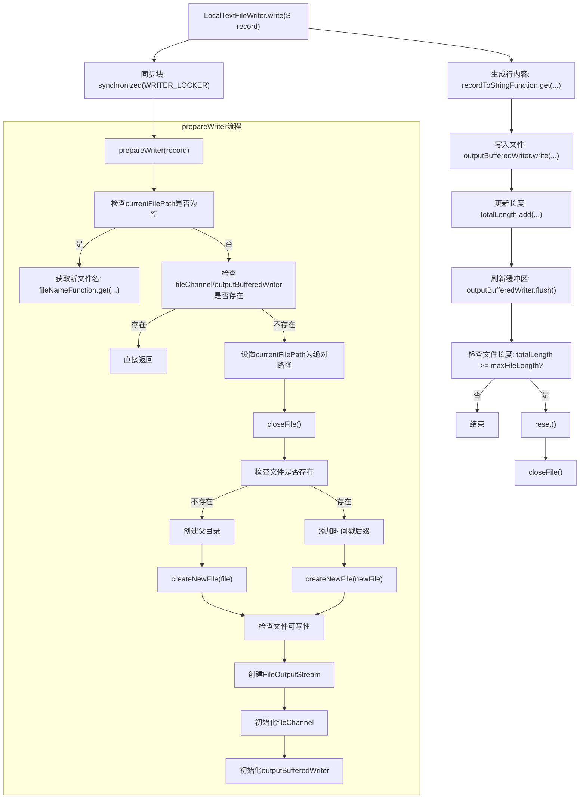

# 基础信息

|      |      |
|------|------|
| 名称 | LocalTextFileWriter |
| 编码语言 | .java |
| 代码路径 | WeFe/common/java/common-lang/src/main/java/com/welab/wefe/common/io/text/writer/LocalTextFileWriter.java |
| 包名 | com.welab.wefe.common.io.text.writer |
| 依赖项 | ['org.apache.commons.lang3.StringUtils', 'java.io', 'java.nio.channels.Channels', 'java.nio.channels.FileChannel'] |
| 概述说明 | 本地文本文件写入类，支持同步写入、文件大小限制、自动创建目录和文件，确保线程安全及资源释放。 |

# 说明

LocalTextFileWriter是一个继承自AbstractTextWriter的泛型类，用于将记录写入本地文本文件。它通过同步锁确保线程安全，使用BufferedWriter高效写入数据，并自动处理文件创建、路径生成和大小限制。当文件达到最大长度时自动重置，提供资源释放和错误处理机制，支持自定义文件名和编码格式。

# 类列表 Class Summary

| 名称   | 类型  | 说明 |
|-------|------|-------------|
| LocalTextFileWriter | class | LocalTextFileWriter类继承AbstractTextWriter，实现线程安全的本地文件写入功能，支持文件大小限制、路径创建和资源释放。 |

## 类 LocalTextFileWriter

|      |      |
|------|------|
| 访问范围 | public |
| 类型 | class |
| 名称 | LocalTextFileWriter |
| 说明 | LocalTextFileWriter类继承AbstractTextWriter，实现线程安全的本地文件写入功能，支持文件大小限制、路径创建和资源释放。 |

### UML类图

类图描述：LocalTextFileWriter 是一个泛型类，继承自 AbstractTextWriter，用于将记录写入本地文本文件。它包含文件通道、缓冲写入器等私有成员，通过同步锁保证线程安全，提供文件创建、资源释放等功能。当文件达到最大长度时会自动重置，实现了完整的文件写入生命周期管理。

### 内部方法调用关系图

这段代码实现了一个本地文本文件写入器，主要功能包括线程安全的文件写入、自动文件切换和资源管理。核心流程是：通过同步块保护文件准备阶段，将记录转换为字符串写入缓冲区，根据文件长度决定是否重置文件。prepareWriter方法处理文件路径生成、目录创建和文件初始化，确保写入前文件处于可用状态。closeFile方法负责安全释放所有文件资源。该设计特别注重线程安全和资源泄漏防护。

### 字段列表 Field List

| 名称  | 类型  | 说明 |
|-------|-------|------|
| fileChannel | FileChannel | 私有文件通道变量fileChannel。 |
| WRITER_LOCKER = new Object() | Object | 定义一个私有不可变对象WRITER_LOCKER，用于同步写操作。 |
| outputBufferedWriter | Writer | 私有写入器输出缓冲流。 |

### 方法列表

| 名称  | 类型  | 说明 |
|-------|-------|------|
| createNewFile | boolean | 检查文件是否存在，不存在则创建新文件。存在返回false，创建失败且文件仍不存在则抛出异常。 |
| closeFile | void | 关闭文件方法，安全关闭outputBufferedWriter和fileChannel，捕获并记录IO异常，最终置空资源。 |
| write | void | 同步写入记录，预处理后转为字符串写入缓冲区，刷新并检查文件长度，超限则重置。 |
| prepareWriter | void | 方法prepareWriter准备文件写入器：若路径为空则生成新路径；检查文件可写性，必要时创建父目录或重命名文件；初始化输出流和缓冲写入器。异常时抛出IO错误。 |
| reset | void | 方法reset关闭文件并调用父类reset方法。 |
| close | void | Java方法重写，调用closeFile()关闭文件。 |

