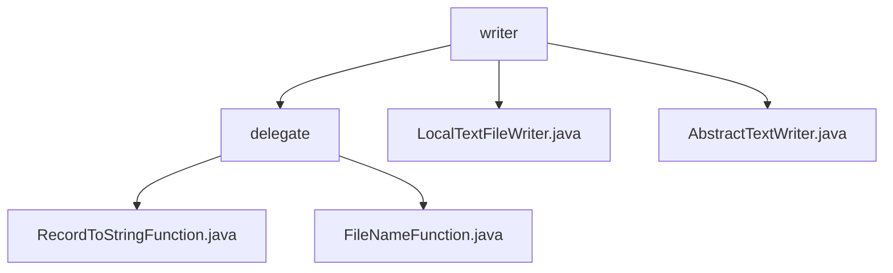

# 基础信息

|      |      |
|------|------|
| 名称 | writer |
| 编码语言 | .java |
| 代码路径 | WeFe/common/java/common-lang/src/main/java/com/welab/wefe/common/io/text/writer |
| 包名 | docs.common.java.common-lang.src.main.java.com.welab.wefe.common.io.text.writer |
| 概述说明 | 提供两个泛型函数接口：RecordToStringFunction（记录转文本）和FileNameFunction（生成存储路径），适用于ETL等数据处理场景。LocalTextFileWriter是线程安全的本地文本写入器，支持自动分片和错误处理。AbstractTextWriter是抽象基类，提供核心写入功能与统计指标。 |

# 说明

## 概述  
该模块是面向文本数据处理的通用工具集，核心职责包括记录序列化与分片存储（类似MapReduce的Mapper和OutputFormat组合）。提供两个函数式接口：RecordToStringFunction（记录转文本）和FileNameFunction（动态路径生成），均采用泛型设计并通过@FunctionalInterface约束。关键数据结构包含写入统计指标（总长度/失败数等）和文件配置项（最大长度/编码等）。依赖JVM关闭钩子机制和BufferedWriter，线程安全通过同步锁实现。例如日志格式化转CSV、HDFS分块路径生成。

## 主要业务场景  
典型应用于ETL数据流水线，实现"处理-存储"闭环。LocalTextFileWriter作为具体实现，组合两种接口功能：先通过RecordToStringFunction序列化记录（如数据库转CSV），再使用FileNameFunction分片存储（例如按序号轮转文件）。抽象层AbstractTextWriter提供基础能力，包括自动文件切割、线程安全写入和资源回收。适用于高吞吐日志归档、分布式计算结果持久化等场景，类似事件总线模式的消息落地处理。

### 包内部结构视图

该流程图展示了WeFe项目中文本写入相关的类结构。顶层是writer目录，包含delegate子目录和两个直接文件。delegate目录下包含两个功能类文件，分别处理记录转换和文件名生成。整个结构清晰地反映了文本写入功能的模块划分和依赖关系。

# 文件列表

| 名称   | 类型  | 说明 |
|-------|------|-------------|
| [LocalTextFileWriter.java](LocalTextFileWriter.md) | file | 本地文本文件写入类，支持同步写入、文件大小限制、自动创建目录和文件，确保线程安全及资源释放。 |
| [AbstractTextWriter.java](AbstractTextWriter.md) | file | 抽象文本写入类，支持自定义编码、分隔符和文件名生成，记录写入数据量、失败次数及最后活动时间，提供重置和统计功能。 |
| [delegate](delegate/_module.md) | package | RecordToStringFunction是Java函数式接口，用于将数据记录和序列号转换为字符串。FileNameFunction是函数式接口，用于根据数据记录和序列号生成文件路径。两者均用@FunctionalInterface标记，适用于数据处理和动态路径生成场景。 |

