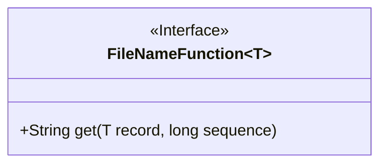
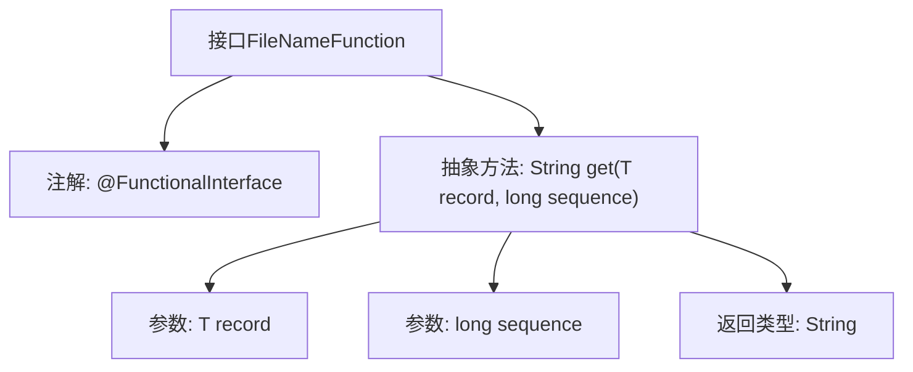

# 基础信息

|      |      |
|------|------|
| 名称 | FileNameFunction |
| 编码语言 | .java |
| 代码路径 | WeFe/common/java/common-lang/src/main/java/com/welab/wefe/common/io/text/writer/delegate/FileNameFunction.java |
| 包名 | com.welab.wefe.common.io.text.writer.delegate |
| 依赖项 | [] |
| 概述说明 | 定义函数式接口FileNameFunction，含方法get，根据记录和序号返回数据存储路径。 |

# 说明

这是一个名为FileNameFunction的函数式接口，使用@FunctionalInterface注解标记。它定义了一个抽象方法get，用于获取数据存储路径。该方法接收两个参数：record表示数据对象，sequence表示数据的序列号。接口的泛型设计允许灵活适配不同类型的数据对象。该接口主要用于根据数据和序列号动态生成文件路径的场景。

# 类列表 Class Summary

| 名称   | 类型  | 说明 |
|-------|------|-------------|
| FileNameFunction | interface | 定义函数式接口FileNameFunction，含方法get，根据记录和序号返回数据存储路径。 |

## 类 FileNameFunction

|      |      |
|------|------|
| 访问范围 | @FunctionalInterface;public |
| 类型 | interface |
| 名称 | FileNameFunction |
| 说明 | 定义函数式接口FileNameFunction，含方法get，根据记录和序号返回数据存储路径。 |

### UML类图

这段代码定义了一个泛型函数式接口`FileNameFunction<T>`，使用`@FunctionalInterface`注解标记。该接口包含一个抽象方法`get()`，接收泛型类型`T`的参数`record`和`long`类型参数`sequence`，返回`String`类型结果。接口设计用于获取数据存储路径，通过实现该接口可定义不同的文件名生成策略。图中清晰展示了接口的泛型声明和唯一方法签名。

### 内部方法调用关系图

这段流程图描述了一个泛型函数式接口FileNameFunction<T>的结构。该接口被@FunctionalInterface注解标记，表示它是一个单一抽象方法的函数式接口。核心抽象方法get接收两个参数：泛型类型T的record和long类型的sequence，并返回String类型结果。该接口主要用于定义获取数据存储路径的规范，通过传入数据记录和序号来生成对应的路径字符串，适用于需要动态生成文件名的场景。

### 字段列表 Field List

| 名称  | 类型  | 说明 |
|-------|-------|------|

### 方法列表

| 名称  | 类型  | 说明 |
|-------|-------|------|
| get | String | 获取指定记录和序列号对应的字符串值。 |

