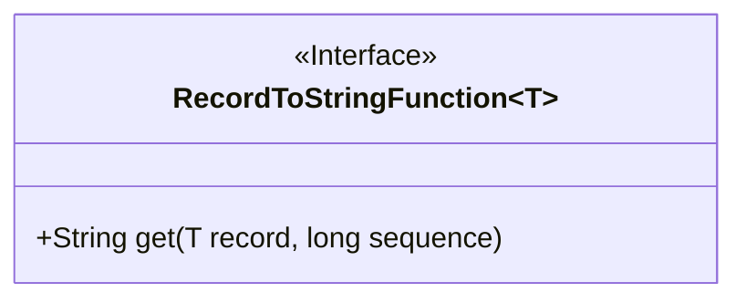
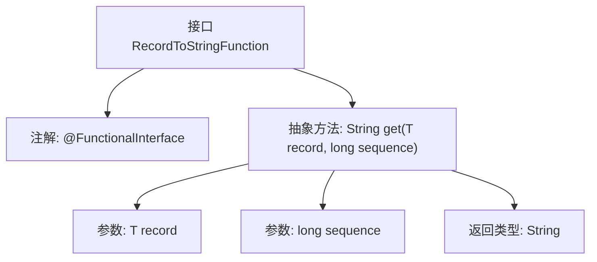

# 基础信息

|      |      |
|------|------|
| 名称 | RecordToStringFunction |
| 编码语言 | .java |
| 代码路径 | WeFe/common/java/common-lang/src/main/java/com/welab/wefe/common/io/text/writer/delegate/RecordToStringFunction.java |
| 包名 | com.welab.wefe.common.io.text.writer.delegate |
| 依赖项 | [] |
| 概述说明 | 这是一个函数式接口，定义将记录和序号转换为字符串的方法。 |

# 说明

这是一个名为RecordToStringFunction的Java函数式接口，用于将数据记录转换为文本。接口使用@FunctionalInterface注解标记，表明它是一个单一抽象方法的函数式接口。接口定义了一个get方法，接收两个参数：record表示要转换的数据对象，sequence表示该数据的序列号。方法返回转换后的字符串结果。该接口适用于需要按顺序处理数据并生成文本输出的场景。

# 类列表 Class Summary

| 名称   | 类型  | 说明 |
|-------|------|-------------|
| RecordToStringFunction | interface | 这是一个函数式接口，定义了一个方法，用于将记录和序号转换为字符串。 |

## 类 RecordToStringFunction

|      |      |
|------|------|
| 访问范围 | @FunctionalInterface;public |
| 类型 | interface |
| 名称 | RecordToStringFunction |
| 说明 | 这是一个函数式接口，定义了一个方法，用于将记录和序号转换为字符串。 |

### UML类图

该类图展示了一个泛型函数式接口`RecordToStringFunction<T>`，其中定义了一个抽象方法`get`，用于将泛型记录转换为字符串。接口使用`<<Interface>>`标记，方法接收泛型记录和序号参数，返回字符串结果。作为函数式接口，它适合用于Lambda表达式或方法引用场景，常用于数据转换处理流程中。

### 内部方法调用关系图

该流程图展示了一个泛型函数式接口的结构，包含`@FunctionalInterface`注解和核心抽象方法`get()`的定义。方法接收泛型记录和序号参数，返回字符串类型结果，用于实现记录到文本的转换逻辑。接口设计简洁，符合单一职责原则，适用于Lambda表达式或方法引用场景。

### 字段列表 Field List

| 名称  | 类型  | 说明 |
|-------|-------|------|

### 方法列表

| 名称  | 类型  | 说明 |
|-------|-------|------|
| get | String | 获取记录指定位置的值。参数为记录对象和序列号，返回字符串类型。 |

