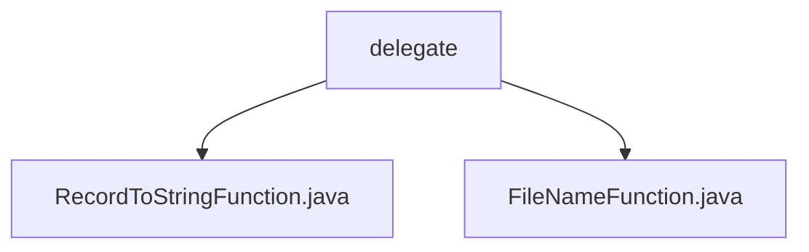

# 基础信息

|      |      |
|------|------|
| 名称 | delegate |
| 编码语言 | .java |
| 代码路径 | WeFe/common/java/common-lang/src/main/java/com/welab/wefe/common/io/text/writer/delegate |
| 包名 | docs.common.java.common-lang.src.main.java.com.welab.wefe.common.io.text.writer.delegate |
| 概述说明 | RecordToStringFunction是Java函数式接口，用于将数据记录和序列号转换为字符串。FileNameFunction是函数式接口，用于根据数据记录和序列号生成文件路径。两者均用@FunctionalInterface标记，适用于数据处理和动态路径生成场景。 |

# 说明

## 概述  
该模块提供两个核心函数式接口：RecordToStringFunction和FileNameFunction，均采用泛型设计。RecordToStringFunction负责将数据记录转换为文本，例如日志格式化；FileNameFunction则根据数据和序列号生成存储路径，类似文件命名策略模式。两者均通过@FunctionalInterface确保单一职责，接收record对象和sequence序号参数，支持顺序处理场景。  

## 主要业务场景  
适用于数据流水线处理场景，例如ETL过程中的文本转换和路径动态生成。RecordToStringFunction实现记录序列化，如数据库记录转CSV行；FileNameFunction用于分片存储，例如按序号生成HDFS分块路径。两者协同工作可完成"处理-存储"闭环，类似MapReduce中的Mapper和OutputFormat组合。

### 包内部结构视图

该流程图展示了WeFe项目中common-lang模块下text writer delegate的代码结构。根节点为delegate目录，包含两个Java文件：RecordToStringFunction.java和FileNameFunction.java，分别实现不同的文本写入功能。结构简洁，层级清晰，符合给定的路径信息。

# 文件列表

| 名称   | 类型  | 说明 |
|-------|------|-------------|
| [RecordToStringFunction.java](RecordToStringFunction.md) | file | 这是一个函数式接口，定义将记录和序号转换为字符串的方法。 |
| [FileNameFunction.java](FileNameFunction.md) | file | 定义函数式接口FileNameFunction，含方法get，根据记录和序号返回数据存储路径。 |

