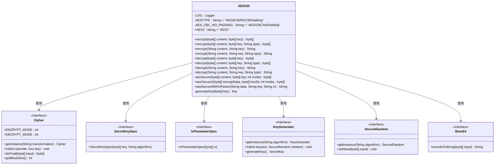
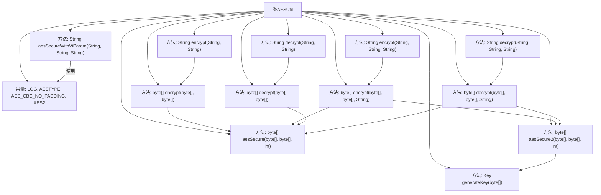

# 基础信息

|      |      |
|------|------|
| 名称 | AESUtil |
| 编码语言 | .java |
| 代码路径 | WeFe/common/java/common-lang/src/main/java/com/welab/wefe/common/util/AESUtil.java |
| 包名 | com.welab.wefe.common.util |
| 依赖项 | ['com.welab.wefe.common.constant.Constant', 'org.apache.commons.codec.binary.Base64', 'org.slf4j.Logger', 'org.slf4j.LoggerFactory', 'javax.crypto.Cipher', 'javax.crypto.KeyGenerator', 'javax.crypto.spec.IvParameterSpec', 'javax.crypto.spec.SecretKeySpec', 'java.io.IOException', 'java.io.UnsupportedEncodingException', 'java.security.Key', 'java.security.SecureRandom'] |
| 概述说明 | AESUtil类提供AES加密解密功能，支持ECB和CBC模式，包含多种加密方法和异常处理。 |

# 说明

AESUtil是一个提供AES加密解密功能的工具类，支持多种加密模式和填充方式。类中定义了两种加密类型AES/ECB/PKCS5Padding和AES/CBC/NoPadding，以及一个自定义类型AES2。主要功能包括对字节数组和字符串的加密解密操作，支持不同加密类型的调用。加密方法使用密钥生成器生成密钥，并通过Cipher类实现加解密。解密方法将加密后的十六进制字符串转换为原始数据。类中还提供了带初始向量IV参数的加密方法，确保数据块对齐后进行加密。异常处理通过日志记录错误信息。所有方法均为静态方法，可直接调用。

# 类列表 Class Summary

| 名称   | 类型  | 说明 |
|-------|------|-------------|
| AESUtil | class | AESUtil类提供AES加密解密功能，支持ECB和CBC模式，包含字符串和字节数组的加解密方法，处理不同加密类型和异常日志。 |

## 类 AESUtil

|      |      |
|------|------|
| 访问范围 | public |
| 类型 | class |
| 名称 | AESUtil |
| 说明 | AESUtil类提供AES加密解密功能，支持ECB和CBC模式，包含字符串和字节数组的加解密方法，处理不同加密类型和异常日志。 |

### UML类图

这段代码展示了一个AES加密工具类AESUtil，它提供了多种AES加密和解密的方法，支持不同的加密模式和填充方式。类中包含了静态常量定义加密算法类型，以及多个重载的encrypt和decrypt方法，处理字节数组和字符串类型的输入输出。私有方法aesSecure和aesSecure2实现了核心的加密逻辑，而aesSecureWithViParam方法支持带初始化向量的加密。该类依赖Java加密标准库中的Cipher、SecretKeySpec等接口，通过组合这些接口实现AES加解密功能，同时使用Base64进行编码转换。整个设计体现了对多种AES加密场景的灵活支持，同时通过异常处理和日志记录增强了健壮性。

### 内部方法调用关系图

这段代码展示了一个AES加密工具类AESUtil，提供了多种AES加密和解密的方法。类中包含两种加密模式（AES/ECB/PKCS5Padding和AES/CBC/NoPadding）和对应的加解密方法，支持字节数组和字符串的输入输出。核心方法aesSecure和aesSecure2实现了具体的加解密逻辑，而其他方法主要是不同参数类型的重载和封装。类中还包含带初始化向量(IV)的加密方法aesSecureWithViParam和密钥生成方法generateKey。所有方法都处理了可能的异常情况并通过日志记录错误。

### 字段列表 Field List

| 名称  | 类型  | 说明 |
|-------|-------|------|
| LOG = LoggerFactory.getLogger(AESUtil.class) | Logger | AESUtil类中定义了一个静态不可变日志对象LOG。 |
| AES_CBC_NO_PADDING = "AES/CBC/NoPadding" | String | AES加密算法，CBC模式，无填充方式。 |
| AESTYPE = "AES/ECB/PKCS5Padding" | String | AES加密算法，ECB模式，PKCS5填充方式。 |
| AES2 = "AES2" | String | 定义了一个公共静态常量字符串AES2，值为"AES2"。 |

### 方法列表

| 名称  | 类型  | 说明 |
|-------|-------|------|
| decrypt | String | 静态方法decrypt用于解密字符串内容，输入为加密内容和密钥，返回解密后的字符串。若编码异常则记录错误并返回null。 |
| aesSecure | byte[] | 使用AES算法加解密内容，支持加密或解密模式，基于密钥生成安全随机数，异常时记录日志。 |
| encrypt | byte[] | 静态方法encrypt接收字节数组content和key，使用AES加密模式返回加密后的字节数组。 |
| decrypt | String | 静态方法decrypt用于解密字符串内容，接收内容、密钥和类型参数，返回解密后的字符串。若编码异常则记录日志并返回null。 |
| encrypt | String | 静态方法encrypt用于加密字符串，接受内容、密钥和类型参数，返回十六进制字符串或null。异常时记录错误日志。 |
| aesSecureWithViParam | String | 该方法使用AES CBC模式无填充加密数据，处理输入数据长度对齐块大小，用密钥和IV加密后返回Base64编码结果，出错返回null。 |
| generateKey | Key | 方法generateKey接收字节数组key，生成AES密钥。成功返回SecretKeySpec，失败记录错误并返回null。 |
| aesSecure2 | byte[] | Java方法aesSecure2使用AES算法加解密数据，接收字节数组参数和模式，返回处理结果，异常时记录日志。 |
| encrypt | String | 静态方法encrypt接收内容和密钥字符串，使用UTF-8编码转为字节数组加密，返回十六进制字符串。异常时记录日志并返回null。 |
| decrypt | byte[] | 这是一个Java静态方法，用于AES解密。输入加密内容和密钥，返回解密后的字节数组。内部调用aesSecure方法，操作模式为解密。 |
| decrypt | byte[] | 静态方法decrypt根据类型type使用AES解密内容content，支持两种AES模式。 |
| encrypt | byte[] | 加密方法：根据类型参数选择AES加密方式，AES2类型调用aesSecure2，否则调用aesSecure，均使用加密模式。 |

