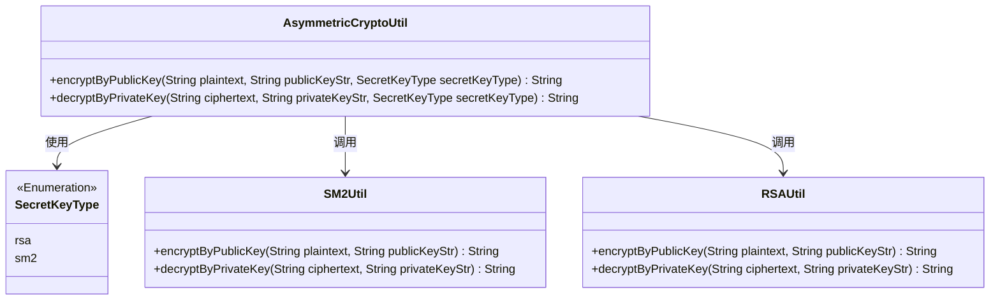
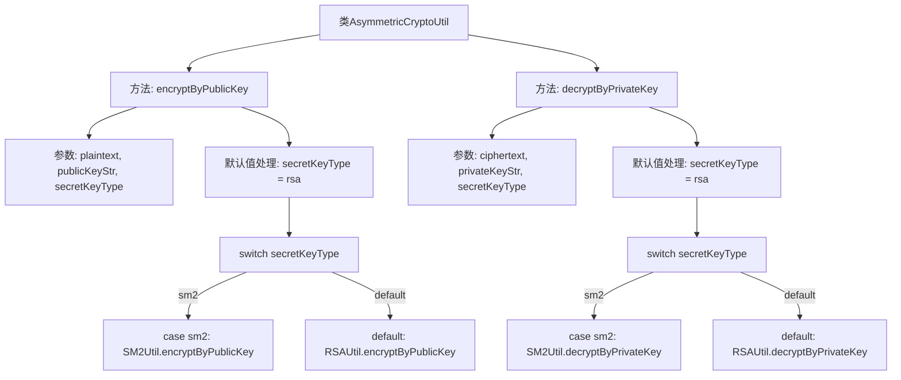

# 基础信息

|      |      |
|------|------|
| 名称 | AsymmetricCryptoUtil |
| 编码语言 | .java |
| 代码路径 | WeFe/common/java/common-lang/src/main/java/com/welab/wefe/common/util/AsymmetricCryptoUtil.java |
| 包名 | com.welab.wefe.common.util |
| 依赖项 | ['com.welab.wefe.common.constant.SecretKeyType'] |
| 概述说明 | 非对称加密工具类，支持公钥加密和私钥解密，默认RSA，可选SM2。 |

# 说明

AsymmetricCryptoUtil类提供非对称加密功能，包含两个静态方法。encryptByPublicKey方法使用公钥加密明文，支持SM2和RSA算法，默认RSA。decryptByPrivateKey方法使用私钥解密密文，同样支持SM2和RSA算法，默认RSA。两种方法均接收密钥字符串和密钥类型参数，未指定类型时自动选择RSA。

# 类列表 Class Summary

| 名称   | 类型  | 说明 |
|-------|------|-------------|
| AsymmetricCryptoUtil | class | 非对称加密工具类，支持公钥加密和私钥解密，默认RSA算法，可选SM2。 |

## 类 AsymmetricCryptoUtil

|      |      |
|------|------|
| 访问范围 | public |
| 类型 | class |
| 名称 | AsymmetricCryptoUtil |
| 说明 | 非对称加密工具类，支持公钥加密和私钥解密，默认RSA算法，可选SM2。 |

### UML类图

该图展示了非对称加密工具类AsymmetricCryptoUtil的结构，它通过枚举SecretKeyType选择加密算法，并委托给SM2Util或RSAUtil实现具体操作。核心功能包括公钥加密和私钥解密，支持RSA和SM2两种算法，默认使用RSA。类间关系清晰体现了策略模式的应用。

### 内部方法调用关系图

这段代码展示了一个非对称加密工具类，包含公钥加密和私钥解密两个核心方法。流程图清晰呈现了方法调用路径：首先处理密钥类型默认值，然后根据密钥类型(sm2/rsa)路由到对应的加密实现(SM2Util或RSAUtil)。两个方法结构对称，都包含参数校验、默认值处理和算法路由逻辑，体现了良好的代码复用性和扩展性设计。

### 字段列表 Field List

| 名称  | 类型  | 说明 |
|-------|-------|------|

### 方法列表

| 名称  | 类型  | 说明 |
|-------|-------|------|
| encryptByPublicKey | String | 使用公钥加密明文，支持RSA和SM2算法，默认RSA。 |
| decryptByPrivateKey | String | 该方法通过私钥解密文本，支持RSA和SM2算法，默认使用RSA。根据传入的密钥类型调用对应的解密工具类。 |

