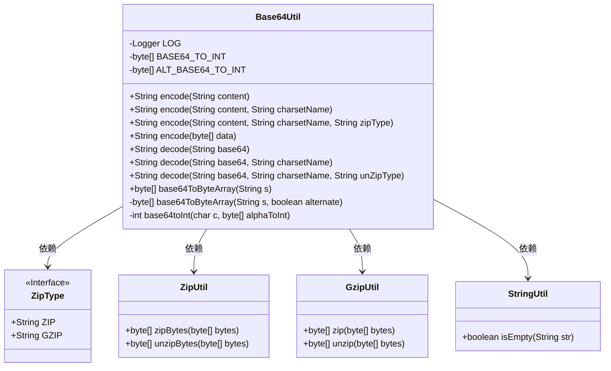
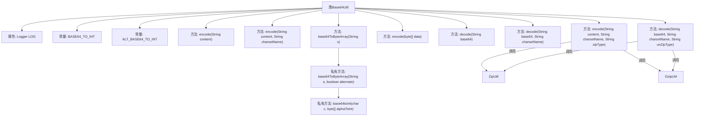

# 基础信息

|      |      |
|------|------|
| 名称 | Base64Util |
| 编码语言 | .java |
| 代码路径 | WeFe/common/java/common-lang/src/main/java/com/welab/wefe/common/util/Base64Util.java |
| 包名 | com.welab.wefe.common.util |
| 依赖项 | ['com.welab.wefe.common.constant.Constant', 'com.welab.wefe.common.constant.ZipType', 'org.apache.commons.codec.binary.Base64', 'org.slf4j.Logger', 'org.slf4j.LoggerFactory', 'java.io.UnsupportedEncodingException', 'java.nio.charset.Charset'] |
| 概述说明 | Base64工具类，提供字符串与Base64编码互转功能，支持UTF-8编码及ZIP/GZIP压缩选项。 |

# 说明

Base64Util是一个提供Base64编码解码功能的工具类。它支持字符串和字节数组的编码与解码操作，默认使用UTF-8字符集。编码方法允许可选压缩（ZIP或GZIP），解码方法支持对应的解压操作。类中包含两个内部查找表BASE64_TO_INT和ALT_BASE64_TO_INT，用于将Base64字符转换为6位整数。私有方法base64ToByteArray和base64toInt实现了Base64字符串到字节数组的转换逻辑，严格验证输入格式。所有操作都通过静态方法提供，并包含错误处理日志记录。

# 类列表 Class Summary

| 名称   | 类型  | 说明 |
|-------|------|-------------|
| Base64Util | class | Base64工具类，提供字符串与Base64互转功能，支持UTF-8编码及ZIP/GZIP压缩选项。 |

## 类 Base64Util

|      |      |
|------|------|
| 访问范围 | public |
| 类型 | class |
| 名称 | Base64Util |
| 说明 | Base64工具类，提供字符串与Base64互转功能，支持UTF-8编码及ZIP/GZIP压缩选项。 |

### UML类图

Base64Util 是一个提供 Base64 编码解码功能的工具类，支持 UTF-8 编码、ZIP/GZIP 压缩以及多种字符集处理。它包含静态方法用于字符串和字节数组的编码解码，内部使用 ZipUtil 和 GzipUtil 进行压缩解压操作，并通过 StringUtil 进行字符串空值检查。类中定义了 BASE64 字符映射表和替代映射表用于底层转换。

### 内部方法调用关系图

该流程图展示了Base64Util类的完整结构，包含编码/解码核心方法和辅助方法。类通过重载设计提供多种编码方式（支持UTF-8默认编码、自定义字符集、ZIP/GZIP压缩选项），解码过程镜像对应编码逻辑。私有方法base64ToByteArray实现Base64字符串到字节数组的精确转换，通过base64toInt方法进行字符映射校验。压缩功能通过ZipUtil和GzipUtil工具类实现，整体采用分层设计确保各功能模块独立性。

### 字段列表 Field List

| 名称  | 类型  | 说明 |
|-------|-------|------|
| LOG = LoggerFactory.getLogger(Base64Util.class) | Logger | Base64Util类中定义了一个受保护的静态final日志记录器LOG。 |
| ALT_BASE64_TO_INT = {-1, -1, -1, -1, -1, -1, -1, -1, -1, -1, -1, -1, -1, -1, -1,            -1, -1, -1, -1, -1, -1, -1, -1, -1, -1, -1, -1, -1, -1, -1, -1, -1, -1, 0, 1, 2, 3, 4, 5, 6, 7,            8, -1, 62, 9, 10, 11, -1, 52, 53, 54, 55, 56, 57, 58, 59, 60, 61, 12, 13, 14, -1, 15, 63, 16, -1,            -1, -1, -1, -1, -1, -1, -1, -1, -1, -1, -1, -1, -1, -1, -1, -1, -1, -1, -1, -1, -1, -1, -1, -1,            -1, 17, -1, 18, 19, 21, 20, 26, 27, 28, 29, 30, 31, 32, 33, 34, 35, 36, 37, 38, 39, 40, 41, 42,            43, 44, 45, 46, 47, 48, 49, 50, 51, 22, 23, 24, 25} | byte[] | 定义ALT_BASE64字符到索引的映射数组，-1表示无效字符。 |
| BASE64_TO_INT = {-1, -1, -1, -1, -1, -1, -1, -1, -1, -1, -1, -1, -1, -1, -1,            -1, -1, -1, -1, -1, -1, -1, -1, -1, -1, -1, -1, -1, -1, -1, -1, -1, -1, -1, -1, -1, -1, -1, -1,            -1, -1, -1, -1, 62, -1, -1, -1, 63, 52, 53, 54, 55, 56, 57, 58, 59, 60, 61, -1, -1, -1, -1, -1,            -1, -1, 0, 1, 2, 3, 4, 5, 6, 7, 8, 9, 10, 11, 12, 13, 14, 15, 16, 17, 18, 19, 20, 21, 22, 23, 24,            25, -1, -1, -1, -1, -1, -1, 26, 27, 28, 29, 30, 31, 32, 33, 34, 35, 36, 37, 38, 39, 40, 41, 42,            43, 44, 45, 46, 47, 48, 49, 50, 51} | byte[] | BASE64解码用字节数组，-1表示无效字符，其余为对应数值。 |

### 方法列表

| 名称  | 类型  | 说明 |
|-------|-------|------|
| encode | String | 静态方法encode接收字符串内容和字符集名称，调用同名方法并传入空参数，返回编码结果。 |
| encode | String | 该方法将字节数组编码为Base64字符串，若输入为空则返回空。 |
| encode | String | 静态方法encode将字符串按指定字符集编码为字节数组，可选压缩后Base64编码，最终返回字符集对应的字符串。处理异常并记录日志。 |
| decode | String | 静态方法decode接收base64字符串，默认使用UTF-8编码解码返回结果。 |
| encode | String | 静态方法encode将字符串按UTF-8编码转换，调用重载方法实现。 |
| decode | String | 静态方法decode接收Base64字符串、字符集和压缩类型，解码后按需解压，最终转为指定字符集的字符串返回。 |
| base64ToByteArray | byte[] | 将Base64字符串转换为字节数组，默认不处理换行符。 |
| base64ToByteArray | byte[] | 将Base64字符串转换为字节数组，处理完整组和部分组，支持备用编码表，验证输入长度并处理填充字符。 |
| decode | String | 静态方法decode接收base64和charsetName参数，调用重载方法decode并返回结果，第三个参数为null。 |
| base64toInt | int | 该方法将Base64字符转换为对应整数值，若字符非法则抛出异常。 |

