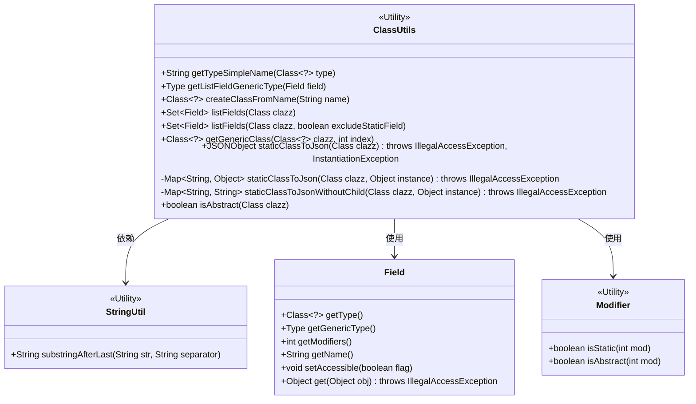
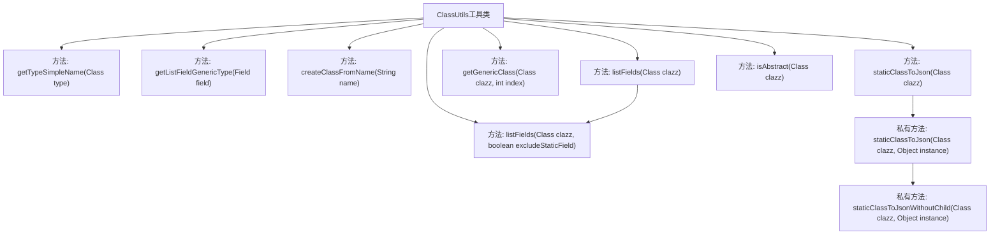
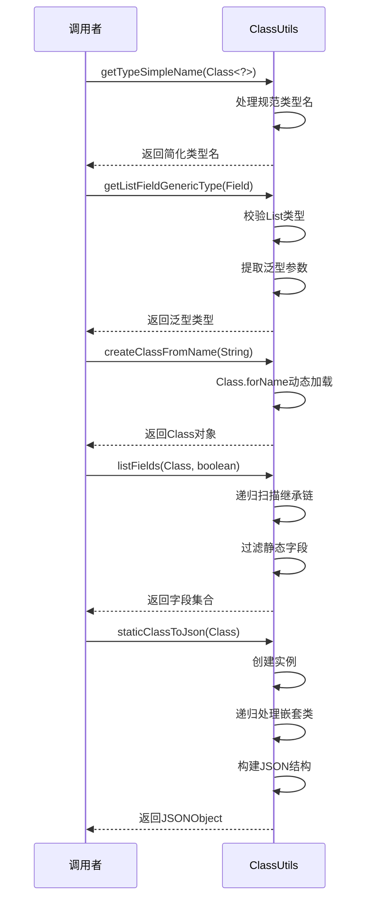

# 基础信息

|      |      |
|------|------|
| 名称 | ClassUtils |
| 编码语言 | .java |
| 代码路径 | WeFe/common/java/common-lang/src/main/java/com/welab/wefe/common/util/ClassUtils.java |
| 包名 | com.welab.wefe.common.util |
| 依赖项 | ['com.alibaba.fastjson.JSONObject', 'sun.reflect.generics.reflectiveObjects.TypeVariableImpl', 'java.lang.reflect.Field', 'java.lang.reflect.Modifier', 'java.lang.reflect.ParameterizedType', 'java.lang.reflect.Type', 'java.util'] |
| 概述说明 | ClassUtils提供静态方法处理类信息：获取类型简名、列表泛型类型、创建类实例、列出类字段（含父类）、获取泛型类、静态类转JSON及判断抽象类。 |

# 说明

ClassUtils是一个工具类，提供了一系列处理Java类信息的静态方法。主要功能包括：获取类的简化名称，获取List字段的泛型类型，根据类名创建类实例，列出类的所有字段（包括父类字段并可选择排除静态字段），获取类的泛型类型，将静态类转换为JSON格式，以及判断类是否为抽象类。这些方法涵盖了类信息的获取、处理和转换等常见操作，适用于各种Java开发场景。

# 类列表 Class Summary

| 名称   | 类型  | 说明 |
|-------|------|-------------|
| ClassUtils | class | ClassUtils工具类提供静态方法：获取类型简名、列表泛型类型、类名创建类、列出类字段（含父类）、获取泛型类、静态类转JSON及判断抽象类。 |

## 类 ClassUtils

|      |      |
|------|------|
| 访问范围 | public |
| 类型 | class |
| 名称 | ClassUtils |
| 说明 | ClassUtils工具类提供静态方法：获取类型简名、列表泛型类型、类名创建类、列出类字段（含父类）、获取泛型类、静态类转JSON及判断抽象类。 |

### UML类图

这段类图展示了`ClassUtils`工具类的结构及其与其他关键类的关系。`ClassUtils`提供了多种静态方法用于类操作，包括获取类型名称、处理泛型字段、列出类字段、转换类到JSON等。它依赖于`StringUtil`进行字符串处理，使用`Field`类操作字段属性，并通过`Modifier`检查修饰符状态。图中清晰呈现了各方法的访问权限、参数和返回类型，以及工具类之间的协作关系。

### 内部方法调用关系图

该流程图展示了ClassUtils工具类的核心方法调用关系，包含类型处理、反射操作和JSON转换三大功能模块。时序图详细描述了主要方法的调用过程，包括参数校验、递归处理、异常捕获等关键步骤，特别突出了listFields方法的继承链扫描和staticClassToJson的嵌套类处理机制。整体结构清晰展现了工具类对Java反射机制的封装和扩展能力。

### 字段列表 Field List

| 名称  | 类型  | 说明 |
|-------|-------|------|

### 方法列表

| 名称  | 类型  | 说明 |
|-------|-------|------|
| getGenericClass | Class<?> | 获取类的泛型类型，支持父类和接口，返回指定位置的泛型类或null。 |
| createClassFromName | Class<?> | 静态方法根据类名字符串创建类对象，成功返回类对象，失败打印异常并返回null。 |
| listFields | Set<Field> | 方法列出类的所有字段，包括父类，可选排除静态字段。输入类为空返回空，结果去重。 |
| getListFieldGenericType | Type | 获取List字段的泛型类型，若非List类型则抛出异常。 |
| getTypeSimpleName | String | 该方法获取类的简化名称：先取全限定名，截取最后一个点后的部分，将美元符号替换为点，返回结果。 |
| isAbstract | boolean | 该方法检查给定类是否为抽象类，通过获取类的修饰符并调用Modifier.isAbstract进行判断。 |
| staticClassToJson | JSONObject | 将类实例转为JSONObject，调用同名方法处理实例后返回结果。 |
| staticClassToJsonWithoutChild | Map<String, String> | 该方法将类的字段名和值转为Map，不处理子类字段。通过反射获取字段并转为字符串存入结果。 |
| staticClassToJson | Map<String, Object> | 将类及其内部类转换为JSON格式的静态方法，递归处理子类并合并结果。 |
| listFields | Set<Field> | 静态方法listFields接收Class参数，返回其字段集合，默认包含继承字段。 |

