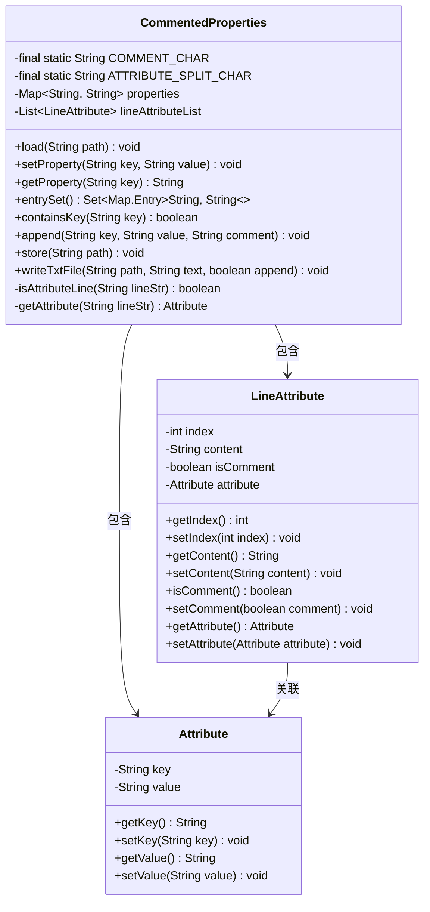
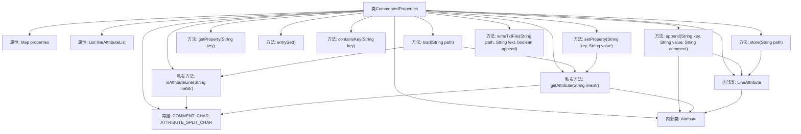

# 基础信息

|      |      |
|------|------|
| 名称 | CommentedProperties |
| 编码语言 | .java |
| 代码路径 | WeFe/common/java/common-lang/src/main/java/com/welab/wefe/common/util/CommentedProperties.java |
| 包名 | com.welab.wefe.common.util |
| 依赖项 | ['java.io.FileWriter', 'java.io.IOException', 'java.io.Writer', 'java.util'] |
| 概述说明 | CommentedProperties类用于管理带注释的属性文件，支持加载、修改、添加和保存属性，保留注释和行顺序。 |

# 说明

CommentedProperties类是一个用于管理带注释属性文件的工具类。它使用HashMap存储键值对属性，并用LineAttribute列表维护原始行信息，包括行号、内容、注释状态和属性对象。类提供加载文件、获取/设置属性、追加新属性、保存文件等功能。支持以#开头的注释行，属性行用=分隔键值。内部类LineAttribute记录每行元数据，Attribute类封装键值对。文件操作时保留原始格式和注释，确保读写一致性。

# 类列表 Class Summary

| 名称   | 类型  | 说明 |
|-------|------|-------------|
| CommentedProperties | class | CommentedProperties类用于管理带注释的属性文件，支持加载、修改、添加和存储属性，保留注释和行顺序。 |

## 类 CommentedProperties

|      |      |
|------|------|
| 访问范围 | public |
| 类型 | class |
| 名称 | CommentedProperties |
| 说明 | CommentedProperties类用于管理带注释的属性文件，支持加载、修改、添加和存储属性，保留注释和行顺序。 |

### UML类图

该类图展示了一个带注释的属性文件处理器CommentedProperties，包含两个内部类LineAttribute和Attribute。主类通过Map存储键值对，用List维护原始行信息，支持加载、修改、追加和保存属性文件。LineAttribute记录每行内容和类型（注释/属性），Attribute封装键值对结构。整体设计实现了属性文件的行级精确维护和注释保留功能。

### 内部方法调用关系图

这段代码实现了一个带注释的属性文件处理器，主要功能包括加载属性文件、设置/获取属性值、追加新属性、保存文件等。流程图展示了类结构、常量定义、主要方法调用关系以及两个内部类LineAttribute和Attribute的关联。核心逻辑集中在load()方法解析文件内容，setProperty()修改属性，以及store()方法持久化数据，整个过程维护了属性键值对和原始行信息的映射关系。

### 字段列表 Field List

| 名称  | 类型  | 说明 |
|-------|-------|------|
| COMMENT_CHAR = "#" | String | 定义私有静态常量COMMENT_CHAR，值为"#"，用于表示注释符号。 |
| lineAttributeList = new ArrayList<>() | List<LineAttribute> | 声明一个不可变的LineAttribute类型列表变量lineAttributeList，初始化为空ArrayList。 |
| properties = new HashMap<>(16) | Map<String, String> | 定义一个不可变Map变量properties，初始容量16，键值对类型均为String。 |
| ATTRIBUTE_SPLIT_CHAR = "=" | String | 常量字符串ATTRIBUTE_SPLIT_CHAR定义为等号，用于属性分隔。 |

### 方法列表

| 名称  | 类型  | 说明 |
|-------|-------|------|
| getAttribute | Attribute | 方法getAttribute接收字符串参数，去除首尾空格后创建Attribute对象。若字符串包含分隔符，则拆分为键值对赋值；否则键为原字符串，值为空。最后返回Attribute对象。 |
| setProperty | void | 方法setProperty更新属性值：检查键非空且存在，值非空则设为空字符串；更新properties映射，遍历lineAttributeList匹配键并更新对应属性和内容。 |
| append | void | 方法`append`用于添加键值对和注释。若键为空或已存在则跳过。添加键值到`properties`，若有注释则生成注释行属性。最后创建键值行属性并添加到列表。 |
| entrySet | Set<Map.Entry<String, String>> | 该方法返回一个包含键值对的集合，直接调用内部properties的entrySet方法实现。 |
| store | void | 该方法将字符串列表按行写入指定路径的文件，确保资源释放。 |
| getProperty | String | 获取指定键对应的属性值。 |
| load | void | 该方法从指定路径读取UTF-8编码文件，逐行解析内容。每行创建LineAttribute对象，记录行号和内容。若行包含属性（通过isAttributeLine判断），则提取键值对存入properties映射，并标记为非注释行。所有行属性存入lineAttributeList列表。 |
| isAttributeLine | boolean | 检查字符串是否非空且非注释行。 |
| writeTxtFile | void | 静态方法writeTxtFile接收路径、文本和追加标志，用FileWriter写入文本到指定文件，可选择追加或覆盖，最后关闭写入器。可能抛出IOException。 |
| containsKey | boolean | 检查properties是否包含指定key，返回布尔值。 |

