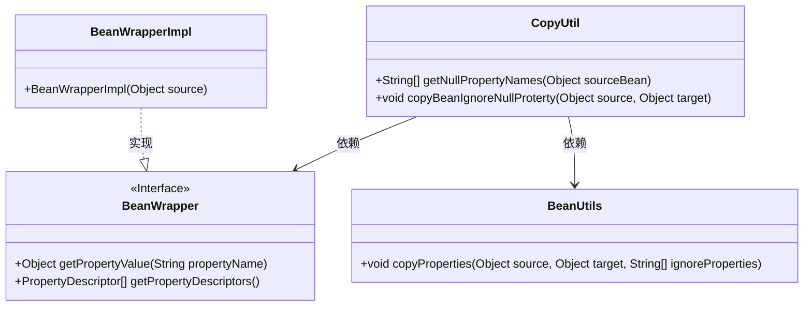
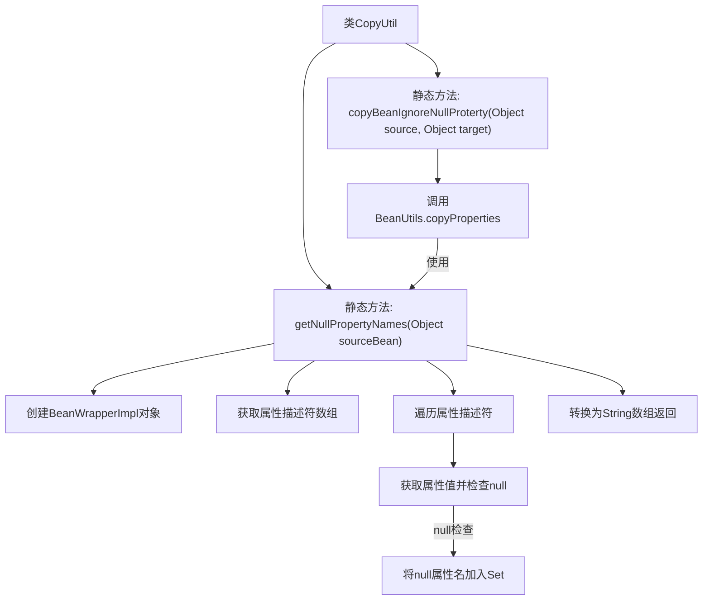

# 基础信息

|      |      |
|------|------|
| 名称 | CopyUtil |
| 编码语言 | .java |
| 代码路径 | WeFe/common/java/common-lang/src/main/java/com/welab/wefe/common/util/CopyUtil.java |
| 包名 | com.welab.wefe.common.util |
| 依赖项 | ['org.springframework.beans.BeanUtils', 'org.springframework.beans.BeanWrapper', 'org.springframework.beans.BeanWrapperImpl', 'java.util.HashSet', 'java.util.Set'] |
| 概述说明 | CopyUtil类提供两个静态方法：getNullPropertyNames获取对象空属性名数组，copyBeanIgnoreNullProterty复制非空属性到目标对象。 |

# 说明

CopyUtil类提供两个静态方法处理JavaBean属性复制。getNullPropertyNames方法接收一个对象，通过BeanWrapper获取其所有属性描述符，检查每个属性值是否为null，收集所有null属性名并返回字符串数组。copyBeanIgnoreNullProterty方法利用Spring的BeanUtils.copyProperties，在复制source对象属性到target对象时，自动过滤掉source中值为null的属性，实现非空属性选择性复制。

# 类列表 Class Summary

| 名称   | 类型  | 说明 |
|-------|------|-------------|
| CopyUtil | class | CopyUtil类提供两个静态方法：getNullPropertyNames获取对象空属性名数组，copyBeanIgnoreNullProterty复制非空属性到目标对象。 |

## 类 CopyUtil

|      |      |
|------|------|
| 访问范围 | public |
| 类型 | class |
| 名称 | CopyUtil |
| 说明 | CopyUtil类提供两个静态方法：getNullPropertyNames获取对象空属性名数组，copyBeanIgnoreNullProterty复制非空属性到目标对象。 |

### UML类图

这段代码展示了一个工具类`CopyUtil`，主要用于处理JavaBean的属性复制操作。核心功能包括检测源对象中的null属性(`getNullPropertyNames`)和忽略null属性的复制操作(`copyBeanIgnoreNullProterty`)。类图中清晰地展示了`CopyUtil`与`BeanWrapper`接口、`BeanWrapperImpl`实现类以及`BeanUtils`工具类之间的依赖关系。`BeanWrapper`接口定义了获取属性值和描述符的基本操作，而`BeanWrapperImpl`是其具体实现。整个设计体现了对Spring框架中Bean操作工具的良好封装，特别适合在需要忽略null值的属性复制场景中使用。

### 内部方法调用关系图

这段代码流程图展示了CopyUtil工具类的两个核心方法。getNullPropertyNames方法通过BeanWrapper获取对象所有属性，筛选出值为null的属性名集合并返回数组。copyBeanIgnoreNullProterty方法则利用前者结果，调用Spring的BeanUtils实现忽略null值的属性拷贝。整个流程体现了安全的属性复制机制，有效避免了目标对象属性被意外覆盖为null的情况。

### 字段列表 Field List

| 名称  | 类型  | 说明 |
|-------|-------|------|

### 方法列表

| 名称  | 类型  | 说明 |
|-------|-------|------|
| copyBeanIgnoreNullProterty | void | 方法copyBeanIgnoreNullProterty复制源对象非空属性到目标对象，忽略空值属性。使用BeanUtils.copyProperties和getNullPropertyNames实现。 |
| getNullPropertyNames | String[] | 获取对象中所有值为null的属性名数组。通过BeanWrapper检查属性值，收集空值属性名并返回字符串数组。 |

