# 基础信息

|      |      |
|------|------|
| 名称 | DateUtil |
| 编码语言 | .java |
| 代码路径 | WeFe/common/java/common-lang/src/main/java/com/welab/wefe/common/util/DateUtil.java |
| 包名 | com.welab.wefe.common.util |
| 依赖项 | ['org.apache.commons.lang3.StringUtils', 'org.apache.commons.lang3.math.NumberUtils', 'org.apache.commons.lang3.time.DateUtils', 'org.slf4j.Logger', 'org.slf4j.LoggerFactory', 'java.math.BigInteger', 'java.text.ParseException', 'java.text.SimpleDateFormat', 'java.time.Duration', 'java.time.LocalDateTime', 'java.time.ZoneId', 'java.time.ZoneOffset', 'java.util'] |
| 概述说明 | DateUtil类提供日期时间处理功能，包括常量定义、格式转换、时间差计算、日期增减、范围判断等。支持多种日期格式，如YYYY-MM-DD、YYYYMMDDHHmmss等，可获取小时、星期、月份间隔，检查时间范围，转换毫秒与秒，处理UTC时间等。 |

# 说明

DateUtil是一个日期时间工具类，提供丰富的日期时间处理功能。包含常用时间常量定义，如天、小时、月的毫秒/秒数，以及多种日期格式字符串。主要功能包括：获取时间的小时、星期信息；计算两个时间的间隔天数、月数；日期字符串与时间戳相互转换；日期加减操作；日期范围判断；时区转换；日期格式化输出；获取月初时间、前后N天/月的日期；时间差友好显示等。支持多种日期格式解析，包含异常处理和日志记录，适用于复杂的日期时间计算和转换场景。

# 类列表 Class Summary

| 名称   | 类型  | 说明 |
|-------|------|-------------|
| DateUtil | class | DateUtil类提供日期时间处理功能，包括常量定义、格式转换、时间差计算、日期增减、范围判断等常用操作。 |

## 类 DateUtil

|      |      |
|------|------|
| 访问范围 | public |
| 类型 | class |
| 名称 | DateUtil |
| 说明 | DateUtil类提供日期时间处理功能，包括常量定义、格式转换、时间差计算、日期增减、范围判断等常用操作。 |

### UML类图

```mermaid
classDiagram
    class DateUtil {
        -Logger LOG
        +long DAY_IN_MILLIS
        +long MONTH_IN_SECOND
        +long HOUR_IN_MILLIS
        +String YYYY_MM_DD
        +String YYYY_MM
        +String YYYYMM
        +String YYYY_MM_DD_HH_MM_SS
        +String YYYY_MM_DD_HH_MM_SS2
        +String YYYY_MM_DD_HH_MM_SS3
        +String YYYY_MM_DD_HH_MM_SS4
        +String YYYY_MM_DD_HH_MM
        +String YYYY_MM_DD_HH
        +String Y4_M2_D2_H2_M2_S2
        +String Y4_M2_D2_H2
        +String YYYY_MM_DDTHH_MM_SS_SSSZ
        +String Y4_M2_D2
        +int getHour(Long timeInMillis)
        +int getDay(Long timeInMillis)
        +Long intervalSeconds(long timeInMillis1, long timeInMillis2)
        +Long intervalDays(long timeInMillis1, long timeInMillis2)
        +Long intervalDays(long timeInMillis1, long timeInMillis2, boolean isAbs)
        +Long intervalDays(String timeString1, String timeString2)
        +long intervalMonths(long timeInMillis1, long timeInMillis2)
        +Long intervalDaysUntilNow(long currentTime, long timeInMillis)
        +Long intervalDaysUntilNow(String date)
        +boolean isWithinSpecifiedTime(long currentTime, long timeInMillis, long maxDays)
        +boolean isWithinSpecifiedTime4Month(long currentTime, long timeInMillis, long maxMonths)
        +String timeInMillisToDate(Long timeInMillis)
        +String timeInMillisToDate(Long timeInMillis, String pattern)
        +long stringToTimeInMillis(String dateStr, String pattern)
        +String getCurrentTimeStr(String format)
        +long getTimestamp(String timestr)
        +long getTimeFromtFormat(String dateString)
        +String toString(Date date, String pattern)
        +String toStringYYYY_MM_DD(Date date)
        +String toStringYYYY_MM_DD_HH_MM_SS2(Date date)
        +String toStringYYYY_MM_DDTHH_MM_SS_SSSZ(Date date)
        +Date fromString(String dateStr, String pattern)
        +String getFirstSecondOfMonthString(long currentTimeInMillis, int monthsBefore, String pattern)
        +long getFirstSecondOfMonth(long currentTimeInMillis, int monthsBefore)
        +long dateToTimeInMillis(String in, String formatString)
        +String getCurrentDate()
        +String getCurrentDate2()
        +String getCurrentDate3()
        +long currentDateMillis()
        +long dateMillis(Date date)
        +Date getCurrentDay()
        +int daysBetween(Date date1, Date date2)
        +String spend2PrettyText(long spend)
        +List~String~ getEverydays(long timeInMillis1, long timeInMillis2)
        +List~String~ getEveryMonths(long timeInMillis1, long timeInMillis2)
        +Date getLastDay(Date date)
        +Date getNextDay(Date date)
        +Date getLastMonthFirstDay(Date date)
        +Date getNextMonthFirstDay(Date date)
        +int monthsBetween(Date date1, Date date2)
        +long convertSecond(long date)
        +long convertSecond(String date)
        +long convertMillisecond(long date)
        +Date getDate(long date)
        +String formatStringDate(String dateStr, String pattern)
        +boolean isDatePattern(String dateStr, String pattern)
        +Date addYears(Date date, long years)
        +Date addMonths(Date date, long months)
        +Date addDays(Date date, long days)
        +Date addHours(Date date, long hours)
        +Date addMinutes(Date date, long minutes)
        +Date minusDays(Date date, long days)
        +long getTimeFromtFormat2(String dateString)
        +long getTimeLong(LocalDateTime time)
        +boolean isEffectiveDate(Date nowTime, Date startTime, Date endTime)
        +Date localToUtc(Date localDate)
        +Date stringToDate(String str, String format)
        +String addMonth(String date, String format, int months)
        +boolean dateBetween(Date startDate, Date endDate, Date targetDate, String format)
        +Date formatDate(String dateStr)
        +int intervalMonths(String endMonth, String startMonth)
        +String getDateBeforeMonth(int howmanymonth)
        +Date hexStrToDate(String hexString)
    }
```

这段代码定义了一个名为DateUtil的工具类，主要用于处理日期和时间相关的操作。它包含了大量的静态方法和常量，用于日期格式化、时间转换、日期计算、时区处理等。类中定义了多种日期格式常量，提供了从字符串到日期、从日期到字符串的转换方法，以及计算两个日期之间的差异、添加或减去时间单位等功能。此外，还包含了一些实用方法，如判断日期是否在有效范围内、将时间转换为可读文本等。这个工具类设计全面，覆盖了日常开发中大部分日期时间处理需求。

### 内部方法调用关系图

```mermaid
graph TD
    A["类DateUtil"]
    B["常量: 时间格式字符串(YYYY_MM_DD等)"]
    C["常量: 时间单位换算(DAY_IN_MILLIS等)"]
    D["日志对象: LOG"]
    E["基础方法"]
    F["时间获取方法"]
    G["时间转换方法"]
    H["时间计算/比较方法"]
    I["时间格式化方法"]
    J["辅助方法"]

    A --> B
    A --> C
    A --> D
    A --> E
    A --> F
    A --> G
    A --> H
    A --> I
    A --> J

    E --> E1["getHour(Long)"]
    E --> E2["getDay(Long)"]
    E --> E3["intervalSeconds(long,long)"]
    
    F --> F1["getCurrentTimeStr(String)"]
    F --> F2["getCurrentDate()系列"]
    F --> F3["currentDateMillis()"]
    
    G --> G1["timeInMillisToDate(Long,String)"]
    G --> G2["stringToTimeInMillis(String,String)"]
    G --> G3["getTimeFromtFormat(String)"]
    
    H --> H1["intervalDays(long,long,boolean)"]
    H --> H2["intervalMonths(long,long)"]
    H --> H3["isWithinSpecifiedTime()系列"]
    
    I --> I1["toString(Date,String)"]
    I --> I2["toStringYYYY_MM_DD()系列"]
    I --> I3["fromString(String,String)"]
    
    J --> J1["addDays(Date,long)"]
    J --> J2["addMonths(Date,long)"]
    J --> J3["spend2PrettyText(long)"]
    J --> J4["getEverydays(long,long)"]
```

该流程图展示了DateUtil工具类的完整结构，包含6个主要功能模块：常量定义、基础方法、时间获取、时间转换、时间计算/比较和格式化方法。核心功能包括时间单位转换（如毫秒转天数）、日期计算（如间隔天数）、多种时间格式处理（支持20+种日期格式）和时区转换等。类设计采用静态方法模式，通过Calendar和LocalDateTime实现精确时间操作，并包含完善的异常处理和日志记录机制。

### 字段列表 Field List

| 名称  | 类型  | 说明 |
|-------|-------|------|
| Y4_M2_D2 = "yyyyMMdd" | String | 定义常量Y4_M2_D2，值为日期格式"yyyyMMdd"。 |
| HOUR_IN_MILLIS = 60 * 60 * 1000 | long | 定义常量HOUR_IN_MILLIS表示1小时的毫秒数，值为3600000。 |
| YYYY_MM_DD_HH_MM_SS3 = "yyyy-MM-dd HH:mm:00" | String | 定义常量YYYY_MM_DD_HH_MM_SS3，值为日期时间格式字符串"yyyy-MM-dd HH:mm:00"。 |
| YYYY_MM = "yyyy-MM" | String | 定义常量字符串YYYY_MM，值为"yyyy-MM"，表示年月格式。 |
| YYYY_MM_DD_HH_MM_SS = "yyyy-MM-dd.HH.mm.ss" | String | 定义日期时间格式常量，格式为年-月-日.时.分.秒。 |
| YYYY_MM_DDTHH_MM_SS_SSSZ = "yyyy-MM-dd'T'HH:mm:ss.SSSZ" | String | 定义日期时间格式常量，格式为年-月-日T时:分:秒.毫秒时区。 |
| YYYYMM = "yyyyMM" | String | 定义常量字符串YYYYMM，值为"yyyyMM"，表示年月格式。 |
| Y4_M2_D2_H2_M2_S2 = "yyyyMMddHHmmss" | String | 定义日期时间格式常量Y4_M2_D2_H2_M2_S2，值为"yyyyMMddHHmmss"。 |
| YYYY_MM_DD_HH = "yyyy-MM-dd HH:00:00" | String | 定义常量YYYY_MM_DD_HH，值为"yyyy-MM-dd HH:00:00"，表示日期时间格式。 |
| YYYY_MM_DD = "yyyy-MM-dd" | String | 定义日期格式常量"YYYY_MM_DD"，值为"yyyy-MM-dd"。 |
| LOG = LoggerFactory.getLogger(DateUtil.class) | Logger | 声明一个名为LOG的静态常量日志记录器，用于DateUtil类的日志输出。 |
| DAY_IN_MILLIS = 24 * 60 * 60 * 1000 | long | 定义一天的毫秒数常量，值为24小时乘以60分钟乘以60秒乘以1000毫秒。 |
| YYYY_MM_DD_HH_MM = "yyyy-MM-dd HH:mm" | String | 定义日期时间格式常量，格式为年-月-日 时:分。 |
| MONTH_IN_SECOND = 30 * 24 * 60 * 60 | long | 定义一个月的时间长度（秒），值为30天的总秒数。 |
| Y4_M2_D2_H2 = "yyyyMMddHH" | String | 定义常量Y4_M2_D2_H2，表示日期时间格式"yyyyMMddHH"。 |
| YYYY_MM_DD_HH_MM_SS4 = "yyyy-MM-dd HH:00:00" | String | 定义常量YYYY_MM_DD_HH_MM_SS4，值为"yyyy-MM-dd HH:00:00"，表示日期时间格式，精确到小时。 |
| YYYY_MM_DD_HH_MM_SS2 = "yyyy-MM-dd HH:mm:ss" | String | 定义日期时间格式常量，格式为年-月-日 时:分:秒。 |

### 方法列表

| 名称  | 类型  | 说明 |
|-------|-------|------|
| getLastDay | Date | 获取给定日期的前一天。通过调用getAfterDay方法并传入-1实现。 |
| daysBetween | int | 计算两个日期之间的天数差，通过毫秒数转换实现。 |
| isWithinSpecifiedTime4Month | boolean | 检查当前时间与给定时间间隔是否在指定月数内，返回布尔结果。 |
| isWithinSpecifiedTime | boolean | 静态方法检查当前时间与给定时间差是否在指定天数内，返回布尔值。参数为当前时间、比较时间和最大天数。 |
| addMinutes | Date | 这是一个Java方法，用于给指定日期增加指定分钟数，返回新日期。方法先将Date转为LocalDateTime，增加分钟后再转回Date。 |
| getCurrentDay | Date | 静态方法返回当前日期对象。 |
| intervalDaysUntilNow | Long | 静态方法计算当前时间与输入日期间的天数差，输入为空返回-1，异常时打印错误并返回0。 |
| timeInMillisToDate | String | 将毫秒时间戳转换为默认格式YYYY_MM_DD的日期字符串。 |
| intervalDaysUntilNow | Long | 静态方法计算当前时间与给定毫秒时间戳之间的天数差，返回长整型结果。 |
| addYears | Date | 静态方法addYears接收日期和年数，返回增加指定年数后的新日期。使用LocalDateTime进行时间计算，确保时区一致。 |
| getCurrentDate3 | String | 该方法使用SimpleDateFormat格式化当前日期时间，返回YYYY-MM-DD HH:MM:SS格式的字符串。 |
| isDatePattern | boolean | 检查字符串是否符合指定日期格式，空字符串返回false，格式错误记录日志并返回false。 |
| getCurrentDate2 | String | 静态方法getCurrentDate2使用SimpleDateFormat按指定格式返回当前日期时间字符串。 |
| intervalMonths | long | 静态方法计算两个毫秒时间戳间隔的月数，通过天数除以30估算。 |
| addMonths | Date | 该方法接收日期和月份数，将日期转换为本地时间并增加指定月份，然后返回新日期。 |
| getCurrentDate | String | 定义一个静态方法getCurrentDate，使用SimpleDateFormat按YYYY_MM_DD_HH_MM_SS2格式返回当前日期时间字符串。 |
| getDate | Date | 静态方法getDate接收长整型date，将其转为毫秒时间戳。若结果为0返回null，否则返回对应Date对象。 |
| currentDateMillis | long | 该方法返回当天零点的毫秒时间戳，通过Calendar实例设置时分秒毫秒为0后获取。 |
| dateToTimeInMillis | long | 将日期字符串按指定格式转换为毫秒时间戳。需处理异常。 |
| intervalDays | Long | 静态方法intervalDays计算两个毫秒时间戳间的天数差，调用重载方法并默认取绝对值。 |
| convertMillisecond | long | 静态方法convertMillisecond接收长整型日期参数，若长度为13位直接返回，10位则乘以1000转为毫秒，否则返回0。 |
| getFirstSecondOfMonth | long | 该方法根据给定毫秒时间和月份偏移量，返回对应月份第一天的起始时间戳（秒级）。通过调整日历对象并重置日、时、分、秒为最小值实现。 |
| intervalSeconds | Long | 计算两个毫秒时间戳的间隔秒数，返回绝对差值除以1000的结果。 |
| intervalDays | Long | 计算两个毫秒时间戳间隔天数，可选绝对值。参数为时间戳1、时间戳2及是否取绝对值标记。使用东八区时区转换后计算差值。 |
| convertSecond | long | 静态方法convertSecond将字符串日期转为长整型秒数，空字符串返回0。 |
| addDays | Date | Java方法：将指定日期增加天数后返回新日期对象。使用LocalDateTime处理时区转换。 |
| getFirstSecondOfMonthString | String | 该方法根据给定时间戳和月份偏移量计算指定月份的第一秒时间，并按指定格式返回日期字符串。 |
| timeInMillisToDate | String | 将毫秒时间戳按指定格式转换为日期字符串。 |
| getDay | int | 该方法接收毫秒时间戳，转换为日期后通过日历类获取星期几并返回。 |
| convertSecond | long | 该方法将13位毫秒时间戳转换为10位秒级时间戳，若输入为10位则直接返回。处理前检查字符串非空。 |
| formatStringDate | String | 静态方法formatStringDate将日期字符串从"MMM d, yyyy h:m:s a"格式转换为指定格式，若转换失败返回null。 |
| addMonth | String | Java方法：按指定格式给日期增加月份数，出错返回空字符串并记录日志。 |
| intervalDays | Long | 静态方法intervalDays计算两个日期字符串之间的天数差，使用YYYY_MM_DD格式解析，异常时返回0。 |
| getTimeFromtFormat | long | 该方法将日期字符串转换为时间戳。若字符串非空，先替换时区格式，再尝试按两种格式解析。成功则返回时间戳，失败记录错误并返回-1。 |
| toStringYYYY_MM_DD_HH_MM_SS2 | String | 静态方法，将日期对象格式化为YYYY_MM_DD_HH_MM_SS2格式的字符串。 |
| stringToDate | Date | 将字符串按指定格式转为日期对象，默认格式为YYYY_MM_DD_HH_MM_SS2，失败返回null。 |
| getLastMonthFirstDay | Date | 获取指定日期上个月的第一天。通过调用getAfterMonthFirstDay方法并传入-1实现。 |
| getTimestamp | long | 静态方法getTimestamp将时间字符串转换为秒级时间戳，调用getTimeFromtFormat获取毫秒值后除以1000返回。若转换失败则返回0。 |
| addHours | Date | Java方法：将指定日期增加若干小时，返回新日期对象。使用LocalDateTime处理时区转换。 |
| getAfterDay | Date | 该方法接收日期和天数，返回指定天数后的日期，时间部分设为零点。 |
| isEffectiveDate | boolean | 检查当前时间是否在起止时间内，包含边界值。 |
| getCurrentTimeStr | String | 该方法接收一个日期格式字符串，返回当前时间按该格式转换后的字符串。 |
| getEveryMonths | List<String> | 该方法获取两个时间戳之间的所有月份，格式化为YYYY_MM_DD字符串列表。从起始时间当月1日开始，按月递增直到结束时间。 |
| toStringYYYY_MM_DDTHH_MM_SS_SSSZ | String | 这是一个Java静态方法，将Date对象格式化为YYYY_MM_DDTHH_MM_SS_SSSZ格式的字符串。 |
| getTimeLong | long | 将LocalDateTime转换为北京时间戳（秒级），忽略毫秒。 |
| stringToTimeInMillis | long | 静态方法将日期字符串按指定格式转为毫秒时间戳，失败返回-1。 |
| getEverydays | List<String> | 该方法获取两个时间戳之间的所有日期，格式化为YYYY_MM_DD字符串列表。从起始时间戳的零点开始，逐日增加直到结束时间戳。 |
| getTimeFromtFormat2 | long | 静态方法getTimeFromtFormat2将日期字符串转为时间戳。处理+08:00和08:00格式，支持两种日期格式解析。异常返回-1。 |
| getNextMonthFirstDay | Date | 获取给定日期下个月第一天的日期，调用方法计算一个月后的首日。 |
| spend2PrettyText | String | 将毫秒时间转换为易读格式，如天、小时、分钟、秒和毫秒。输入需非负，零返回0 ms。 |
| getAfterMonthFirstDay | Date | 该方法接收日期和月份数，返回该日期加上指定月份后的当月首日零点时间。 |
| minusDays | Date | 静态方法minusDays接收Date对象和天数，返回减去指定天数后的新Date对象。使用LocalDateTime进行日期计算并转换回Date类型。 |
| localToUtc | Date | 将本地时间转换为UTC时间，通过计算时区和夏令时偏移量调整时间。 |
| dateBetween | boolean | 检查目标日期是否在起止日期之间，通过字符串比较实现，需指定日期格式。 |
| formatDate | Date | 静态方法formatDate将字符串日期转为Date对象。检查输入有效性后，按分隔符拆分年月日，设置Calendar对象并返回。无效输入返回null。 |
| intervalMonths | int | 计算两个月份字符串之间的月份差，格式为YYYY-MM。若出错返回-1。 |
| getDateBeforeMonth | String | 该方法计算当前日期前指定月份的日期，处理跨年和不同月份天数差异，返回格式为YYYY-MM-DD的字符串。 |
| hexStrToDate | Date | 将16进制字符串转换为日期对象，支持0x前缀，忽略大小写。 |
| getNextDay | Date | 静态方法getNextDay接收Date参数，返回后一天的日期，内部调用getAfterDay实现，偏移量为1。 |
| fromString | Date | 静态方法将字符串按指定格式转为Date对象，失败时记录错误并返回null。 |
| dateMillis | long | 该方法将给定日期的时间部分清零，返回当天的起始时间戳（毫秒）。 |
| getHour | int | 静态方法getHour接收毫秒时间戳，返回对应的小时数（24小时制）。 |
| monthsBetween | int | 计算两个日期之间的月份差，返回整数结果。处理异常时记录日志并返回0。 |
| toStringYYYY_MM_DD | String | 静态方法toStringYYYY_MM_DD将Date对象格式化为YYYY-MM-DD字符串。 |
| toString | String | 该方法将日期对象按指定格式转为字符串，若日期为空则返回空。 |

