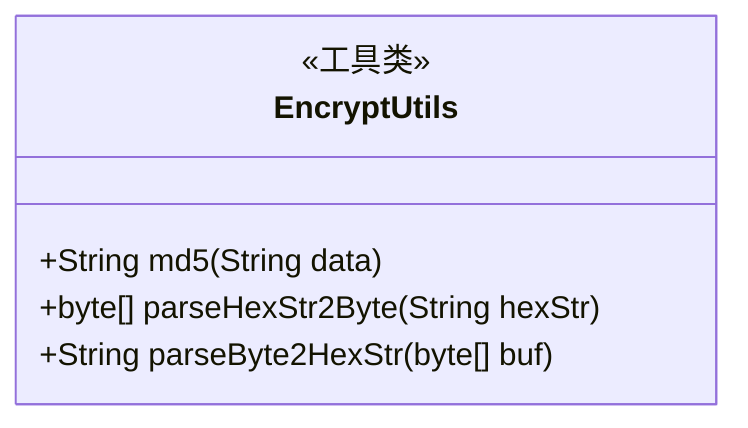
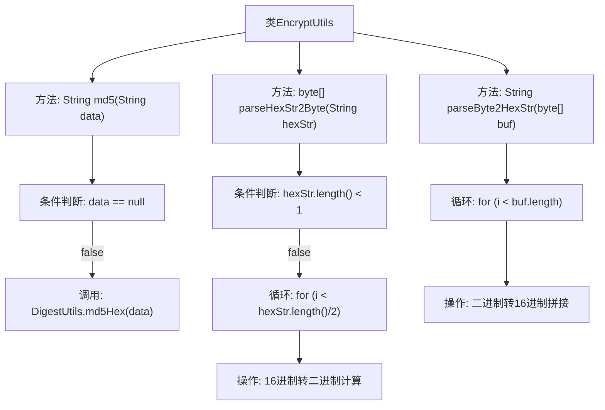

# 基础信息

|      |      |
|------|------|
| 名称 | EncryptUtils |
| 编码语言 | .java |
| 代码路径 | WeFe/common/java/common-lang/src/main/java/com/welab/wefe/common/util/EncryptUtils.java |
| 包名 | com.welab.wefe.common.util |
| 依赖项 | ['org.apache.commons.codec.digest.DigestUtils'] |
| 概述说明 | EncryptUtils类提供MD5摘要生成、16进制与二进制互转功能。包含md5、parseHexStr2Byte和parseByte2HexStr三个静态方法。 |

# 说明

EncryptUtils类提供三个静态加密工具方法：md5方法对输入字符串计算32位小写MD5摘要，空输入返回null；parseHexStr2Byte将16进制字符串转为二进制数组，空输入返回null；parseByte2HexStr将二进制数组转为大写16进制字符串。方法均包含空值或边界处理。

# 类列表 Class Summary

| 名称   | 类型  | 说明 |
|-------|------|-------------|
| EncryptUtils | class | EncryptUtils类提供MD5加密、16进制与二进制互转功能。md5方法生成32位小写摘要，parseHexStr2Byte将16进制转二进制，parseByte2HexStr反之。 |

## 类 EncryptUtils

|      |      |
|------|------|
| 访问范围 | public |
| 类型 | class |
| 名称 | EncryptUtils |
| 说明 | EncryptUtils类提供MD5加密、16进制与二进制互转功能。md5方法生成32位小写摘要，parseHexStr2Byte将16进制转二进制，parseByte2HexStr反之。 |

### UML类图

该代码展示了一个加密工具类 `EncryptUtils`，包含三个静态方法：`md5()` 用于生成字符串的MD5摘要，`parseHexStr2Byte()` 将16进制字符串转换为二进制字节数组，`parseByte2HexStr()` 将二进制字节数组转换为16进制字符串。类设计为无状态工具类，所有方法均为静态方法，专注于数据格式转换和哈希计算功能。方法均包含空值或边界值处理（如 `md5()` 的空值检查、`parseHexStr2Byte()` 的空字符串判断），体现了对健壮性的考虑。

### 内部方法调用关系图

该流程图展示了EncryptUtils类的三个核心方法：md5()进行MD5哈希计算，parseHexStr2Byte()实现16进制字符串转字节数组，parseByte2HexStr()完成字节数组转16进制字符串。每个方法都包含必要的空值检查或长度验证，并通过循环或第三方库调用完成数据转换。流程清晰展现了条件分支和循环处理逻辑，突出了数据格式转换的关键步骤。

### 字段列表 Field List

| 名称  | 类型  | 说明 |
|-------|-------|------|

### 方法列表

| 名称  | 类型  | 说明 |
|-------|-------|------|
| md5 | String | 该方法用于生成字符串的MD5哈希值，若输入为null则返回null，否则返回MD5哈希字符串。 |
| parseHexStr2Byte | byte[] | 将16进制字符串转换为字节数组。空字符串返回null。每两个字符解析为一个字节，高4位和低4位分别计算后合并。 |
| parseByte2HexStr | String | 将字节数组转换为十六进制字符串，每个字节转为两位大写十六进制字符，不足补零。 |

