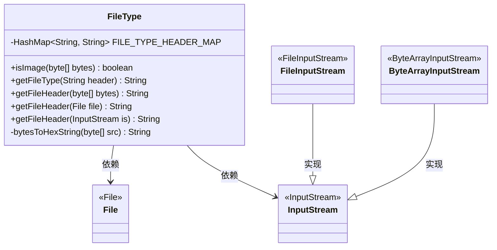
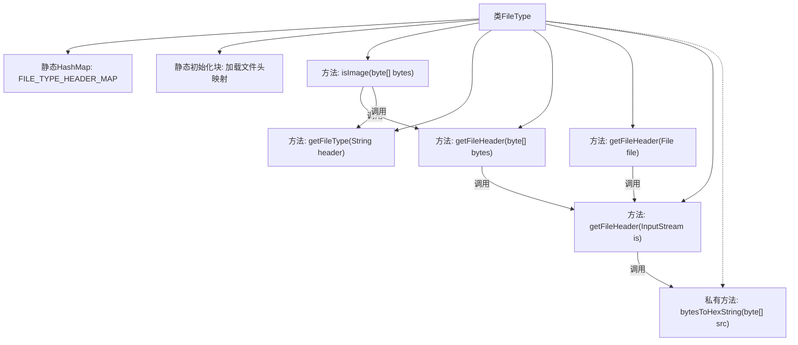

# 基础信息

|      |      |
|------|------|
| 名称 | FileType |
| 编码语言 | .java |
| 代码路径 | WeFe/common/java/common-lang/src/main/java/com/welab/wefe/common/util/FileType.java |
| 包名 | com.welab.wefe.common.util |
| 依赖项 | ['java.io', 'java.util.HashMap', 'java.util.Map'] |
| 概述说明 | FileType类通过文件头识别文件类型，支持图片、文档、音视频等多种格式，提供获取文件头和判断是否为图片的方法。 |

# 说明

该代码定义了一个FileType类，用于通过文件头信息识别文件类型。类中包含一个静态HashMap，存储了常见文件类型的十六进制文件头标识及其对应扩展名，如图片（jpg、png等）、文档（doc、pdf等）、音频视频（wav、avi等）。提供了多个方法：isImage判断是否为图片文件，getFileType根据文件头获取文件类型，getFileHeader从字节数组、文件或输入流中提取文件头信息。辅助方法bytesToHexString将字节数组转换为十六进制字符串以便比较。该类封装了文件类型检测的核心逻辑，支持多种输入方式。

# 类列表 Class Summary

| 名称   | 类型  | 说明 |
|-------|------|-------------|
| FileType | class | FileType类通过文件头标识判断文件类型，支持图片、文档、音视频等格式，提供字节数组、文件和输入流的类型检测方法。 |

## 类 FileType

|      |      |
|------|------|
| 访问范围 | public |
| 类型 | class |
| 名称 | FileType |
| 说明 | FileType类通过文件头标识判断文件类型，支持图片、文档、音视频等格式，提供字节数组、文件和输入流的类型检测方法。 |

### UML类图

这段代码定义了一个`FileType`类，用于通过文件头信息识别文件类型。类中包含一个静态哈希表`FILE_TYPE_HEADER_MAP`存储常见文件类型的特征码，提供了`isImage()`方法判断是否为图片，以及多个重载的`getFileHeader()`方法从不同输入源获取文件头。私有方法`bytesToHexString()`将字节数组转换为16进制字符串。该类依赖于Java IO类如`File`和`InputStream`及其子类来实现功能。

### 内部方法调用关系图

这段代码实现了一个文件类型检测工具，通过文件头特征码识别文件类型。核心是通过静态哈希表存储文件头特征码与类型的映射关系，提供isImage方法判断是否为图片类型，getFileHeader系列方法提取文件头信息，bytesToHexString方法实现字节到十六进制字符串的转换。流程图展示了类结构和方法调用链，重点突出了文件头特征码加载过程和类型检测的调用关系。

### 字段列表 Field List

| 名称  | 类型  | 说明 |
|-------|-------|------|
| FILE_TYPE_HEADER_MAP = new HashMap<>() | HashMap<String, String> | 定义静态常量哈希映射，键值对均为字符串类型，用于存储文件类型与头信息的对应关系。 |

### 方法列表

| 名称  | 类型  | 说明 |
|-------|-------|------|
| isImage | boolean | 该方法通过检查文件头判断是否为图片，支持PNG、JPG、JPEG、GIF、TIF和BMP格式，不匹配则返回false。 |
| getFileType | String | 该方法通过文件头匹配预设类型映射表返回文件类型，无匹配或空输入时返回null。 |
| getFileHeader | String | 静态方法`getFileHeader`接收文件对象，尝试通过文件输入流获取文件头信息。若文件未找到则打印异常并返回空字符串。 |
| getFileHeader | String | 静态方法getFileHeader读取输入流前4字节转为16进制字符串，处理异常并确保流关闭。 |
| bytesToHexString | String | 将字节数组转换为十六进制字符串，空数组返回null，单字符前补零，结果大写。 |
| getFileHeader | String | Java静态方法，通过字节数组获取文件头信息，内部调用ByteArrayInputStream处理。 |

