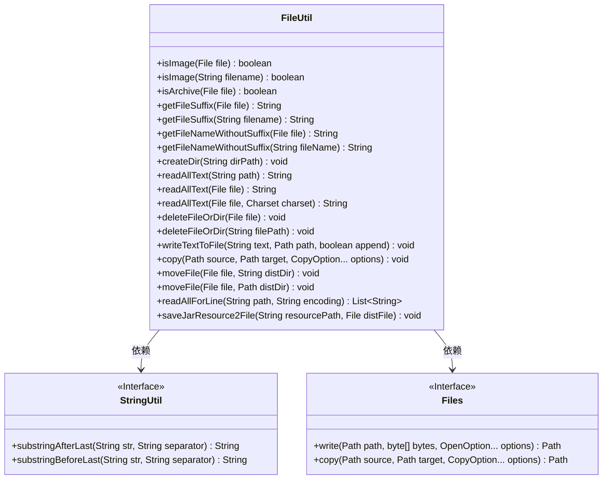

# 基础信息

|      |      |
|------|------|
| 名称 | FileUtil |
| 编码语言 | .java |
| 代码路径 | WeFe/common/java/common-lang/src/main/java/com/welab/wefe/common/util/FileUtil.java |
| 包名 | com.welab.wefe.common.util |
| 依赖项 | ['java.io', 'java.nio.charset.Charset', 'java.nio.charset.StandardCharsets', 'java.nio.file', 'java.util.ArrayList', 'java.util.List'] |
| 概述说明 | FileUtil类提供文件操作功能，包括判断文件类型（图片、压缩包）、获取文件后缀、读写文件、创建删除目录、移动复制文件等。 |

# 说明

FileUtil是一个Java工具类，提供文件操作相关功能。主要功能包括：判断文件是否为图片或压缩包，获取文件后缀名和文件名（不含后缀），创建目录，读取文件内容（支持按行读取和全部读取），删除文件或目录，写入文本到文件（支持追加或覆盖），文件复制和移动，以及将JAR包内资源保存为文件。该类处理了文件路径、编码（默认UTF-8）和异常情况，适用于常见的文件操作需求。

# 类列表 Class Summary

| 名称   | 类型  | 说明 |
|-------|------|-------------|
| FileUtil | class | FileUtil类提供文件操作工具方法，包括判断文件类型、获取文件后缀、读写文件、删除文件、移动文件等功能。 |

## 类 FileUtil

|      |      |
|------|------|
| 访问范围 | public |
| 类型 | class |
| 名称 | FileUtil |
| 说明 | FileUtil类提供文件操作工具方法，包括判断文件类型、获取文件后缀、读写文件、删除文件、移动文件等功能。 |

### UML类图

该类图展示了FileUtil工具类的结构及其与StringUtil和Files接口的依赖关系。FileUtil提供了丰富的文件操作方法，包括判断文件类型、获取文件后缀、读写文件内容、移动/复制文件等。其中isImage()和isArchive()方法通过文件后缀判断文件类型，readAllText()和readAllForLine()实现了不同格式的文件读取，deleteFileOrDir()支持递归删除目录。该类通过依赖StringUtil进行字符串处理，依赖Files接口实现底层文件操作，体现了工具类的高内聚特性。

### 内部方法调用关系图

```mermaid
graph TD
    A["类FileUtil"]
    B["方法: isImage(File file)"]
    C["方法: isImage(String filename)"]
    D["方法: isArchive(File file)"]
    E["方法: getFileSuffix(File file)"]
    F["方法: getFileSuffix(String filename)"]
    G["方法: getFileNameWithoutSuffix(File file)"]
    H["方法: getFileNameWithoutSuffix(String fileName)"]
    I["方法: createDir(String dirPath)"]
    J["方法: readAllText(String path)"]
    K["方法: readAllText(File file)"]
    L["方法: readAllText(File file, Charset charset)"]
    M["方法: deleteFileOrDir(File file)"]
    N["方法: deleteFileOrDir(String filePath)"]
    O["方法: writeTextToFile(String text, Path path, boolean append)"]
    P["方法: copy(Path source, Path target, CopyOption... options)"]
    Q["方法: moveFile(File file, String distDir)"]
    R["方法: moveFile(File file, Path distDir)"]
    S["方法: readAllForLine(String path, String encoding)"]
    T["方法: saveJarResource2File(String resourcePath, File distFile)"]
    U["方法: main(String[] args)"]

    A --> B
    A --> C
    A --> D
    A --> E
    A --> F
    A --> G
    A --> H
    A --> I
    A --> J
    A --> K
    A --> L
    A --> M
    A --> N
    A --> O
    A --> P
    A --> Q
    A --> R
    A --> S
    A --> T
    A --> U

    B --> C
    E --> F
    G --> H
    J --> K
    K --> L
    M --> N
    Q --> R
    U --> T
    U --> L
```

这段代码是一个文件工具类FileUtil，提供了多种文件操作方法，包括判断文件类型（图片、压缩包）、获取文件后缀、读取文件内容、删除文件或目录、写入文本到文件、复制和移动文件等。流程图展示了类中各个方法的调用关系，其中部分方法之间存在依赖调用，如isImage(File file)会调用isImage(String filename)，getFileSuffix(File file)会调用getFileSuffix(String filename)等。main方法演示了如何使用该类的方法来保存JAR包内的资源为文件并读取其内容。

### 字段列表 Field List

| 名称  | 类型  | 说明 |
|-------|-------|------|

### 方法列表

| 名称  | 类型  | 说明 |
|-------|-------|------|
| readAllForLine | List<String> | 静态方法读取文件所有行，按指定编码处理，返回字符串列表，异常时抛出IO错误，确保资源关闭。 |
| deleteFileOrDir | void | 递归删除文件或目录：检查非空后，若是文件直接删除；若是目录则递归删除子项后删除自身。 |
| moveFile | void | 移动文件到目标目录，若已在目标目录则跳过。确保目标目录存在，若目标文件存在则删除，最后移动文件。 |
| copy | void | Java方法：复制文件到目标路径，自动创建父目录，可指定复制选项，可能抛出IO异常。 |
| main | void | Java代码示例：从jar包提取资源文件并读取内容，保存到D盘test.txt后输出。 |
| readAllText | String | 静态方法readAllText读取文件内容并以UTF-8编码返回字符串，可能抛出IOException异常。 |
| createDir | void | 创建目录方法：检查路径是否存在，不存在则创建多级目录。 |
| writeTextToFile | void | 静态方法writeTextToFile将文本写入指定路径文件，可选追加模式。若为覆盖模式则删除原文件，确保目录存在后以UTF-8编码写入。 |
| getFileNameWithoutSuffix | String | 静态方法获取无后缀文件名：若输入为目录返回空字符串，否则调用同名方法处理文件名。 |
| getFileSuffix | String | 该方法用于获取文件名的后缀，通过截取最后一个点号后的字符串实现。 |
| deleteFileOrDir | void | 静态方法deleteFileOrDir接收文件路径字符串参数，调用同名方法处理对应的File对象。 |
| readAllText | String | Java静态方法，读取指定路径文件的全部文本内容，使用UTF-8编码，可能抛出IOException异常。 |
| isArchive | boolean | 判断文件是否为压缩文件，支持zip、tar、gz、tgz、7z和rar格式。 |
| readAllText | String | 读取文件内容并返回字符串，处理指定字符集和异常，确保资源释放。 |
| isImage | boolean | 检查文件扩展名是否为常见图片格式（如jpg、png等），是则返回true，否则false。 |
| getFileSuffix | String | 该方法检查文件是否为目录，若是则返回null，否则返回文件名的后缀。 |
| moveFile | void | 移动文件到指定目录的方法，参数为文件对象和目标路径字符串。 |
| saveJarResource2File | void | 将JAR资源保存到文件，若文件存在则删除，通过流读写完成。 |
| isImage | boolean | 检查文件是否为图片：若为目录返回false，否则检查文件名是否为图片格式。 |
| getFileNameWithoutSuffix | String | 静态方法获取无后缀文件名，输入为空返回空字符串，否则截取最后一个点号前的部分。 |

