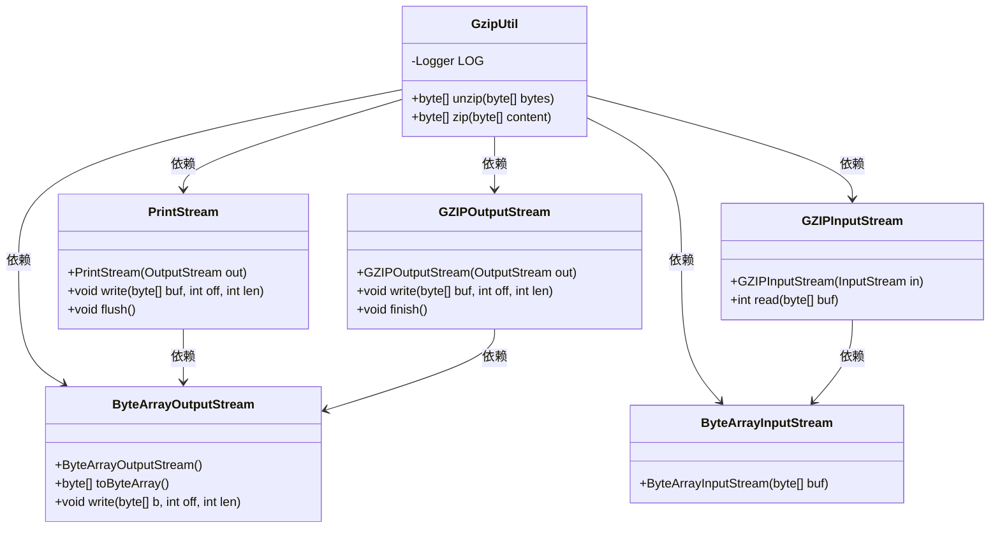
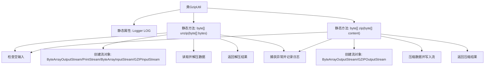

# 基础信息

|      |      |
|------|------|
| 名称 | GzipUtil |
| 编码语言 | .java |
| 代码路径 | WeFe/common/java/common-lang/src/main/java/com/welab/wefe/common/util/GzipUtil.java |
| 包名 | com.welab.wefe.common.util |
| 依赖项 | ['org.slf4j.Logger', 'org.slf4j.LoggerFactory', 'java.io.ByteArrayInputStream', 'java.io.ByteArrayOutputStream', 'java.io.PrintStream', 'java.util.zip.GZIPInputStream', 'java.util.zip.GZIPOutputStream'] |
| 概述说明 | GzipUtil类提供zip和unzip方法，用于字节数组的压缩和解压，处理异常并记录日志。 |

# 说明

GzipUtil是一个提供GZIP压缩和解压功能的工具类。包含两个静态方法：unzip方法接收字节数组，通过GZIPInputStream解压数据并返回解压后的字节数组；zip方法接收字节数组，通过GZIPOutputStream压缩数据并返回压缩后的字节数组。两个方法都处理了空输入，使用try-with-resources确保资源释放，捕获异常并记录日志。解压时采用1024字节缓冲区读取数据，压缩后调用finish确保数据完整。异常时返回null。

# 类列表 Class Summary

| 名称   | 类型  | 说明 |
|-------|------|-------------|
| GzipUtil | class | GzipUtil类提供静态方法zip和unzip，用于字节数组的GZIP压缩和解压，处理异常并记录日志。 |

## 类 GzipUtil

|      |      |
|------|------|
| 访问范围 | public |
| 类型 | class |
| 名称 | GzipUtil |
| 说明 | GzipUtil类提供静态方法zip和unzip，用于字节数组的GZIP压缩和解压，处理异常并记录日志。 |

### UML类图

该类图展示了GzipUtil工具类的结构及其依赖关系。GzipUtil提供了zip和unzip两个静态方法，分别用于字节数组的压缩和解压操作。在实现过程中，它依赖于Java I/O类库中的多个类：ByteArrayOutputStream用于缓存输出数据，PrintStream用于写入解压数据，ByteArrayInputStream用于读取输入数据，GZIPInputStream和GZIPOutputStream分别处理GZIP格式的压缩和解压。所有资源都通过try-with-resources语法自动管理，确保正确释放。

### 内部方法调用关系图

这段代码展示了GzipUtil工具类，包含两个核心静态方法：unzip用于解压GZIP格式数据，zip用于压缩数据为GZIP格式。两个方法都先检查输入有效性，然后通过Java的IO流体系处理数据转换，使用try-with-resources确保资源自动释放，并统一捕获异常记录日志。解压过程采用1024字节缓冲区逐步读取，压缩过程则直接写入并调用finish确保数据完整性。

### 字段列表 Field List

| 名称  | 类型  | 说明 |
|-------|-------|------|
| LOG = LoggerFactory.getLogger(GzipUtil.class) | Logger | GzipUtil类中定义了一个静态不可变的日志记录器LOG。 |

### 方法列表

| 名称  | 类型  | 说明 |
|-------|-------|------|
| unzip | byte[] | 静态方法unzip解压GZIP格式字节数组，输入空则返回空。使用流处理数据，异常时记录日志并返回空。 |
| zip | byte[] | 静态方法zip将字节数组压缩为GZIP格式，空输入返回null，异常时记录日志并返回null。 |

