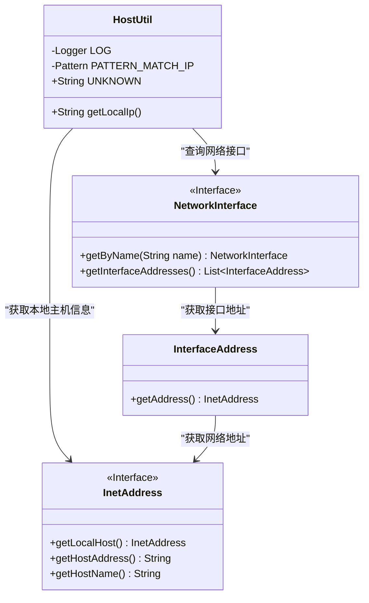
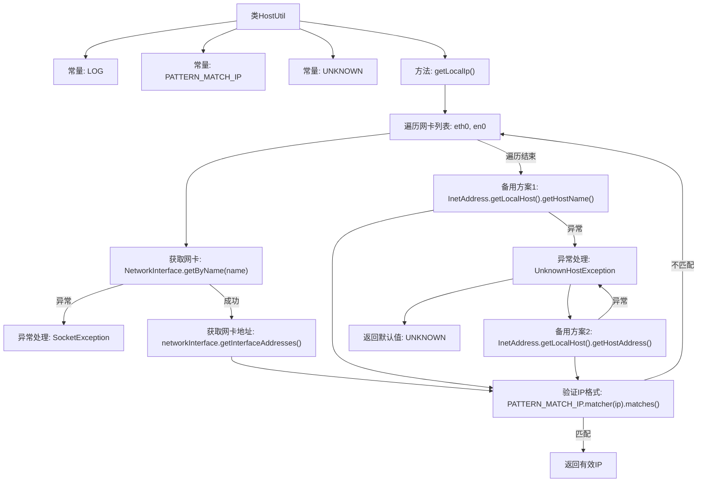

# 基础信息

|      |      |
|------|------|
| 名称 | HostUtil |
| 编码语言 | .java |
| 代码路径 | WeFe/common/java/common-lang/src/main/java/com/welab/wefe/common/util/HostUtil.java |
| 包名 | com.welab.wefe.common.util |
| 依赖项 | ['org.slf4j.Logger', 'org.slf4j.LoggerFactory', 'java.net', 'java.util.regex.Pattern'] |
| 概述说明 | HostUtil类提供获取本地IPv4地址的方法，优先检查eth0和en0网络接口，其次尝试获取主机名和地址，若均失败则返回unknown。 |

# 说明

HostUtil类是一个用于获取本地IPv4地址的工具类。它包含一个静态方法getLocalIp，该方法首先尝试通过eth0和en0网络接口获取IP地址，若失败则尝试通过InetAddress获取本地主机名和地址。使用正则表达式验证IP格式，若均失败则返回unknown常量。过程中会捕获并记录SocketException和UnknownHostException异常。类中包含一个匹配IPv4的正则表达式常量和一个表示未知IP的字符串常量。

# 类列表 Class Summary

| 名称   | 类型  | 说明 |
|-------|------|-------------|
| HostUtil | class | HostUtil类提供获取本地IPv4地址的方法，优先检查eth0和en0网卡，其次尝试获取主机名和地址，均失败则返回unknown。 |

## 类 HostUtil

|      |      |
|------|------|
| 访问范围 | public |
| 类型 | class |
| 名称 | HostUtil |
| 说明 | HostUtil类提供获取本地IPv4地址的方法，优先检查eth0和en0网卡，其次尝试获取主机名和地址，均失败则返回unknown。 |

### UML类图

这段代码定义了一个HostUtil工具类，主要用于获取本地IPv4地址。类中包含一个私有日志记录器、IP地址正则匹配模式和未知地址常量。核心方法getLocalIp()通过三种方式尝试获取IP：首先检查指定网络接口（eth0/en0）的地址，然后尝试获取本地主机名对应的IP，最后尝试直接获取本地主机地址。若均失败则返回"unknown"。代码依赖Java的NetworkInterface、InterfaceAddress和InetAddress等网络相关类进行地址查询和验证。

### 内部方法调用关系图

这段流程图描述了HostUtil类获取本地IP地址的逻辑流程。方法首先遍历预定义的网卡名称列表(eth0/en0)，尝试获取有效IPv4地址；若失败则依次尝试通过主机名和主机地址获取，期间会进行严格的IP格式验证。整个过程包含三层异常处理机制，最终返回有效IP或默认的"unknown"值，体现了健壮的网络地址获取策略和完备的异常处理机制。

### 字段列表 Field List

| 名称  | 类型  | 说明 |
|-------|-------|------|
| PATTERN_MATCH_IP = Pattern.compile("[0-9]{1,3}\\.[0-9]{1,3}\\.[0-9]{1,3}\\.[0-9]{1,3}") | Pattern | 定义静态正则表达式，用于匹配1-3位数字组成的IPv4地址。 |
| LOG = LoggerFactory.getLogger(HostUtil.class) | Logger | 声明一个私有静态不可变日志对象LOG，用于HostUtil类的日志记录。 |
| UNKNOWN = "unknown" | String | 定义常量字符串UNKNOWN，值为"unknown"。 |

### 方法列表

| 名称  | 类型  | 说明 |
|-------|-------|------|
| getLocalIp | String | 获取本地IP地址的方法，先检查eth0和en0网卡，再尝试获取主机名和地址，最后返回匹配的IP或未知。 |

