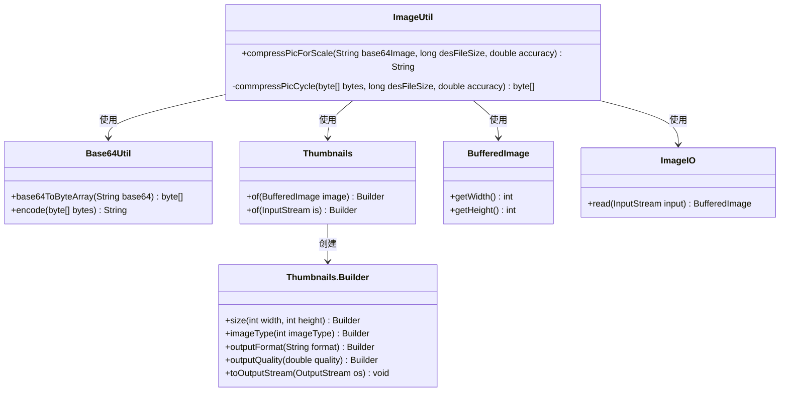
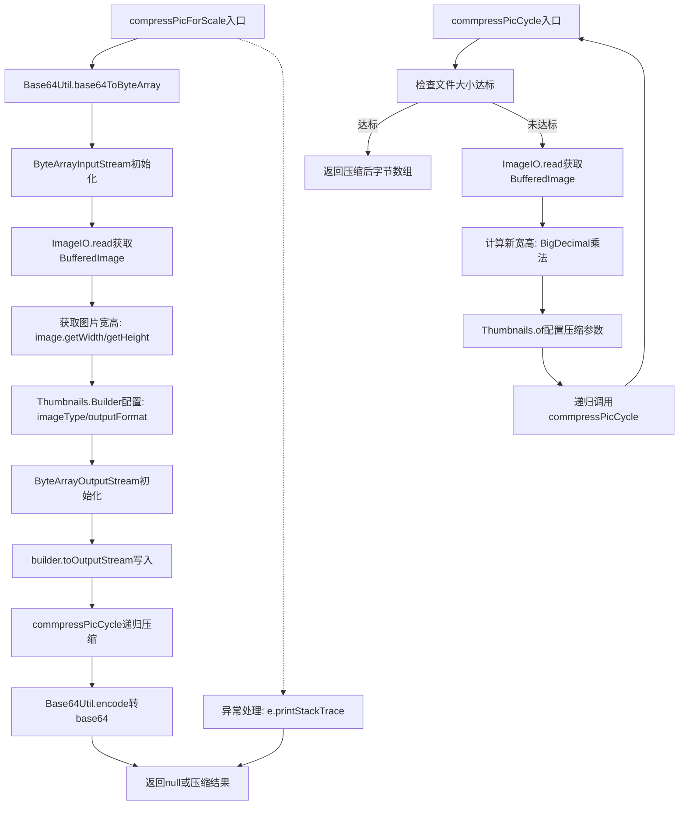

# 基础信息

|      |      |
|------|------|
| 名称 | ImageUtil |
| 编码语言 | .java |
| 代码路径 | WeFe/common/java/common-lang/src/main/java/com/welab/wefe/common/util/ImageUtil.java |
| 包名 | com.welab.wefe.common.util |
| 依赖项 | ['net.coobird.thumbnailator.Thumbnails', 'javax.imageio.ImageIO', 'java.awt.image.BufferedImage', 'java.io.ByteArrayInputStream', 'java.io.ByteArrayOutputStream', 'java.io.IOException', 'java.math.BigDecimal'] |
| 概述说明 | ImageUtil类提供图片压缩功能，将Base64图片按指定大小和精度递归压缩，支持PNG和JPG格式，返回压缩后的Base64字符串。 |

# 说明

ImageUtil类提供图像压缩功能，通过compressPicForScale方法将Base64格式图像压缩至指定大小。该方法先转换图像为PNG格式，获取原始宽高后调用递归压缩方法commpressPicCycle。递归方法根据精度参数逐步调整图像尺寸和质量，循环压缩直至达到目标文件大小（单位KB）或原始尺寸小于目标值时终止。异常时返回null，成功时返回压缩后的Base64字符串。

# 类列表 Class Summary

| 名称   | 类型  | 说明 |
|-------|------|-------------|
| ImageUtil | class | ImageUtil类提供图片压缩功能，将Base64图片按指定大小和精度递归压缩，支持PNG和JPG格式，返回压缩后的Base64字符串。 |

## 类 ImageUtil

|      |      |
|------|------|
| 访问范围 | public |
| 类型 | class |
| 名称 | ImageUtil |
| 说明 | ImageUtil类提供图片压缩功能，将Base64图片按指定大小和精度递归压缩，支持PNG和JPG格式，返回压缩后的Base64字符串。 |

### UML类图

类图描述：
该图展示了ImageUtil工具类的核心结构和依赖关系。ImageUtil提供图片压缩功能，主要依赖Base64Util进行Base64编解码，使用Thumbnails库进行图片尺寸调整和质量压缩，通过BufferedImage获取图片尺寸信息，并调用ImageIO读取图片数据。Thumbnails.Builder作为构建器模式实现，支持链式调用配置压缩参数。整个设计实现了递归压缩逻辑，直到达到目标文件大小为止。

### 内部方法调用关系图

流程图描述：该流程图展示了ImageUtil类中图片压缩处理的完整流程。主方法compressPicForScale首先将base64图像转为字节流，获取原始尺寸后通过Thumbnails进行PNG格式转换，随后进入递归压缩循环commpressPicCycle。递归方法会持续调整图片尺寸和质量参数，直到文件大小满足要求或达到最大压缩次数，最终返回压缩后的base64字符串。整个过程包含异常处理和多次格式转换环节。

### 字段列表 Field List

| 名称  | 类型  | 说明 |
|-------|-------|------|

### 方法列表

| 名称  | 类型  | 说明 |
|-------|-------|------|
| commpressPicCycle | byte[] | 该方法递归压缩图片至目标大小，若当前尺寸达标则返回原数据，否则按精度比例调整宽高并重新压缩，循环直至满足条件。 |
| compressPicForScale | String | 该方法将Base64图片压缩至目标大小，先转为PNG格式，再循环压缩至指定精度，返回压缩后的Base64字符串。 |

