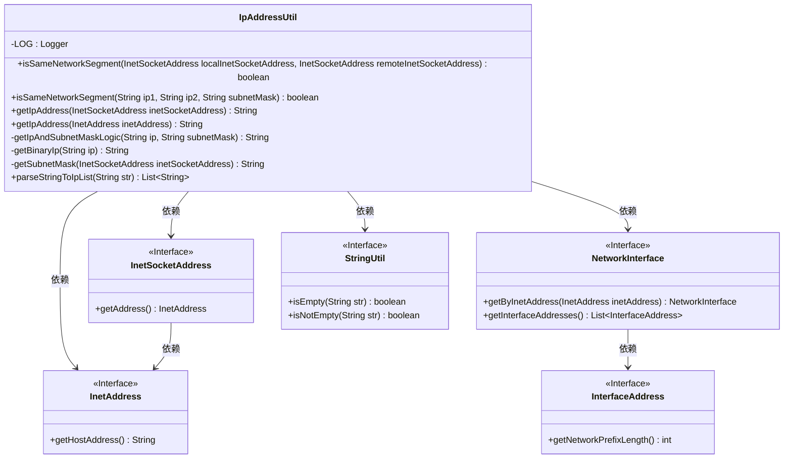
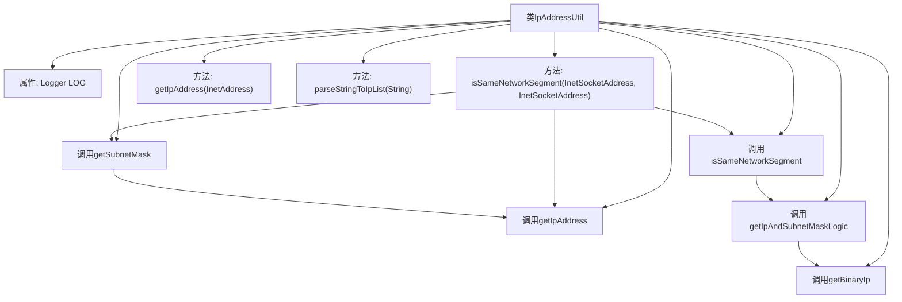

# 基础信息

|      |      |
|------|------|
| 名称 | IpAddressUtil |
| 编码语言 | .java |
| 代码路径 | WeFe/common/java/common-lang/src/main/java/com/welab/wefe/common/util/IpAddressUtil.java |
| 包名 | com.welab.wefe.common.util |
| 依赖项 | ['org.slf4j.Logger', 'org.slf4j.LoggerFactory', 'java.net', 'java.util.ArrayList', 'java.util.List'] |
| 概述说明 | IpAddressUtil类提供IP地址工具方法，包括检查IP是否同网段、获取IP地址、子网掩码及解析IP列表。核心方法isSameNetworkSegment通过二进制运算比较IP与子网掩码判断同网段。 |

# 说明

IpAddressUtil类提供IP地址和子网掩码相关功能。主要功能包括检查本地与远程IP是否同一网段，通过比较IP与子网掩码的逻辑与结果实现；获取IP地址和子网掩码；将IP地址转换为二进制字符串；从Socket地址对象提取子网掩码；解析IP地址白名单配置文本，支持注释和通配符处理。类中包含详细的错误处理和日志记录。

# 类列表 Class Summary

| 名称   | 类型  | 说明 |
|-------|------|-------------|
| IpAddressUtil | class | IpAddressUtil类提供IP地址工具方法，包括检查IP是否同网段、获取IP和子网掩码、解析IP列表等。核心方法isSameNetworkSegment通过比较IP与掩码逻辑与结果判断同网段，支持异常处理和日志记录。 |

## 类 IpAddressUtil

|      |      |
|------|------|
| 访问范围 | public |
| 类型 | class |
| 名称 | IpAddressUtil |
| 说明 | IpAddressUtil类提供IP地址工具方法，包括检查IP是否同网段、获取IP和子网掩码、解析IP列表等。核心方法isSameNetworkSegment通过比较IP与掩码逻辑与结果判断同网段，支持异常处理和日志记录。 |

### UML类图

该代码实现了一个IP地址工具类，主要用于判断两个IP地址是否属于同一网段。核心功能包括：通过InetSocketAddress获取IP地址和子网掩码、将IP地址与子网掩码进行逻辑与运算、解析IP地址白名单文本等。类图中展示了IpAddressUtil与Java网络接口类（如InetSocketAddress、InetAddress）的依赖关系，以及工具类StringUtil的调用关系。所有网络相关接口均用<<Interface>>标注，体现了对Java标准库接口的依赖。

### 内部方法调用关系图

这段代码是用于处理IP地址相关操作的实用工具类。主要功能包括检查两个IP地址是否在同一网段、获取IP地址、获取子网掩码、将IP地址转换为二进制字符串、解析IP地址列表等。核心方法通过调用关系实现功能，如isSameNetworkSegment方法会依次调用getIpAddress、getSubnetMask等方法获取必要信息，最终通过二进制逻辑与运算判断是否同网段。所有方法均为静态方法，便于直接调用。

### 字段列表 Field List

| 名称  | 类型  | 说明 |
|-------|-------|------|
| LOG = LoggerFactory.getLogger(IpAddressUtil.class) | Logger | IpAddressUtil类中定义了一个静态不可变的日志记录器LOG，用于记录日志信息。 |

### 方法列表

| 名称  | 类型  | 说明 |
|-------|-------|------|
| getBinaryIp | String | 将IP地址转换为8位二进制格式字符串，每段补零拼接。 |
| getSubnetMask | String | 该方法通过InetSocketAddress获取子网掩码，转换网络前缀长度为标准点分十进制格式，异常时记录日志并抛出。 |
| getIpAddress | String | 获取InetSocketAddress的IP地址，若为空返回空字符串，否则调用内部方法处理地址。 |
| getIpAndSubnetMaskLogic | String | 该方法将IP和子网掩码转换为二进制后逐位进行与运算，返回运算结果的字符串。 |
| isSameNetworkSegment | boolean | 该方法检查本地和远程地址是否在同一网段，获取IP和子网掩码后比较，记录结果，异常时返回false。 |
| isSameNetworkSegment | boolean | 该方法检查两个IP地址是否在同一网段，通过比较它们与子网掩码的逻辑与结果是否相同来实现。 |
| getIpAddress | String | 该方法接收InetAddress对象，返回其IP地址字符串。 |
| parseStringToIpList | List<String> | 解析字符串为IP列表，跳过空行和注释行，处理行内注释后返回有效IP列表。 |

