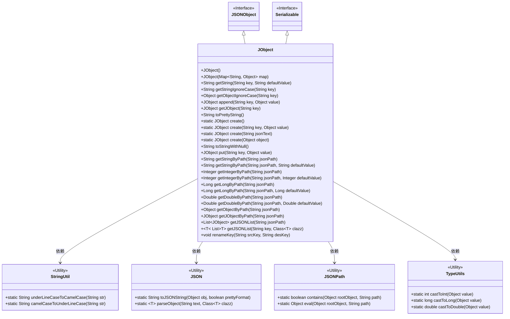

# 基础信息

|      |      |
|------|------|
| 名称 | JObject |
| 编码语言 | .java |
| 代码路径 | WeFe/common/java/common-lang/src/main/java/com/welab/wefe/common/util/JObject.java |
| 包名 | com.welab.wefe.common.util |
| 依赖项 | ['com.alibaba.fastjson.JSON', 'com.alibaba.fastjson.JSONArray', 'com.alibaba.fastjson.JSONObject', 'com.alibaba.fastjson.JSONPath', 'com.alibaba.fastjson.serializer.SerializerFeature', 'com.alibaba.fastjson.util.TypeUtils', 'org.apache.commons.lang3.StringUtils', 'java.io.Serializable', 'java.util.ArrayList', 'java.util.List', 'java.util.Map', 'java.util.stream.Collectors'] |
| 概述说明 | JObject是扩展JSONObject的类，支持序列化，提供键值操作、JSON路径查询、大小写忽略获取值、格式化输出及类型转换功能。 |

# 说明

JObject是一个扩展自JSONObject的可序列化类，提供多种JSON操作功能。支持构造空对象或基于Map初始化，包含获取字符串、忽略大小写获取值、追加键值对等方法。支持通过JSONPath获取不同类型数据，如字符串、整数、长整型、双精度浮点数等。提供格式化输出、空值处理、键重命名功能，并能创建JObject实例或从JSON文本转换。包含处理JSON数组和列表的方法，支持类型转换和流式操作。

# 类列表 Class Summary

| 名称   | 类型  | 说明 |
|-------|------|-------------|
| JObject | class | JObject是JSONObject的扩展类，支持序列化，提供多种构造方法和便捷操作，如键值获取、路径查询、类型转换、键名修改等，并支持忽略大小写和下划线驼峰转换。 |

## 类 JObject

|      |      |
|------|------|
| 访问范围 | public |
| 类型 | class |
| 名称 | JObject |
| 说明 | JObject是JSONObject的扩展类，支持序列化，提供多种构造方法和便捷操作，如键值获取、路径查询、类型转换、键名修改等，并支持忽略大小写和下划线驼峰转换。 |

### UML类图

这段代码定义了一个`JObject`类，它继承自`JSONObject`并实现了`Serializable`接口。`JObject`提供了丰富的JSON操作功能，包括键值获取（支持忽略大小写和下划线/驼峰转换）、JSON路径查询、类型转换、数据格式化和键名修改等。它通过组合多个工具类（`StringUtil`、`JSON`、`JSONPath`、`TypeUtils`）来实现这些功能，形成了一个功能强大且易用的JSON处理工具类。

### 内部方法调用关系图

```mermaid
graph TD
    A["类JObject"]
    B["继承: JSONObject"]
    C["实现: Serializable"]
    D["构造方法: JObject()"]
    E["构造方法: JObject(Map<String, Object>)"]
    F["方法: getString(key, defaultValue)"]
    G["方法: getStringIgnoreCase(key)"]
    H["方法: getObjectIgnoreCase(key)"]
    I["方法: append(key, value)"]
    J["方法: getJObject(key)"]
    K["方法: toPrettyString()"]
    L["静态方法: create()"]
    M["静态方法: create(key, value)"]
    N["静态方法: create(jsonText)"]
    O["静态方法: create(object)"]
    P["方法: toStringWithNull()"]
    Q["重写方法: put(key, value)"]
    R["JSONPath方法组"]
    S["方法: renameKey(srcKey, desKey)"]

    A --> B
    A --> C
    A --> D
    A --> E
    A --> F
    A --> G
    G --> H
    A --> I
    A --> J
    A --> K
    A --> L
    A --> M
    A --> N
    A --> O
    A --> P
    A --> Q
    A --> R
    R -->|包含| H
    R -->|包含| F
    A --> S
```

这段代码定义了一个JObject类，继承自JSONObject并实现了Serializable接口。主要功能包括：提供多种构造方法、增强的键值操作方法（包括大小写不敏感的查询）、JSONPath支持的数据提取、键名修改以及多种静态创建方法。特别值得注意的是其处理空值和格式化的能力，以及通过JSONPath实现的复杂数据查询功能，使得JSON操作更加灵活和健壮。

### 字段列表 Field List

| 名称  | 类型  | 说明 |
|-------|-------|------|

### 方法列表

| 名称  | 类型  | 说明 |
|-------|-------|------|
| toPrettyString | String | 该方法将当前对象转换为格式化的JSON字符串，便于阅读。 |
| getStringByPath | String | 该方法通过指定路径从JSON中获取字符串值，若路径不存在则返回默认值。 |
| create | JObject | 该方法接收JSON字符串，若为空则返回空JObject，否则解析为JObject并返回。 |
| append | JObject | Java方法：向JObject添加键值对，返回修改后的JObject实例。 |
| getDoubleByPath | Double | 该方法通过JSON路径获取值并转为Double类型，若值为空则返回默认值。 |
| getIntegerByPath | Integer | 方法getIntegerByPath通过jsonPath获取整数值，若无则返回null。 |
| getStringByPath | String | 获取指定JSON路径的字符串值，若无则返回null。 |
| getJObject | JObject | 方法getJObject接收字符串key，调用父类get方法获取对象obj。若obj为空返回null，否则调用create方法处理并返回结果。 |
| put | JObject | 覆盖put方法，调用父类方法后返回当前对象实例。 |
| getString | String | 该方法通过键获取字符串值，若未找到则返回默认值。 |
| getIntegerByPath | Integer | 从JSON路径获取整数值，若不存在则返回默认值。 |
| getLongByPath | Long | 方法通过JSON路径获取Long值，若路径对应值为空则返回默认值，否则将值转为Long类型。 |
| create | JObject | 静态方法create接收对象参数，若为空返回新JObject，否则将其转为JSON字符串再处理。 |
| create | JObject | 静态方法create接收键值对，创建并返回包含该键值对的JObject实例。 |
| getStringIgnoreCase | String | 方法getStringIgnoreCase通过key忽略大小写获取对象，若对象为空返回null，否则转为字符串返回。 |
| getDoubleByPath | Double | 获取JSON路径对应的Double值，默认返回null。 |
| toStringWithNull | String | 该方法将对象转为JSON字符串，包含null值字段，使用SerializerFeature.WriteMapNullValue特性。 |
| getObjectIgnoreCase | Object | 方法getObjectIgnoreCase通过三种方式获取key对应的值：原key、下划线转驼峰、驼峰转下划线，优先返回非空值。 |
| getLongByPath | Long | 方法getLongByPath通过jsonPath获取Long值，默认返回null。 |
| getObjectByPath | Object | 该方法通过JSON路径获取对象值，若路径不存在则返回null。 |
| getJObjectByPath | JObject | 该方法根据指定路径从JSON中获取对象，若对象不存在则返回空JObject，否则返回包含该对象的JObject。 |
| getJSONList | List<JObject> | 该方法从指定JSON路径获取对象，若对象是JSON数组则转换为JObject列表，否则返回空列表。 |
| getJSONList | List<T> | 该方法从JSON中提取指定键的数组，将其元素转换为指定类型的对象列表。若数组不存在则返回null。 |
| renameKey | void | 方法重命名键：检查目标键是否存在，若不存在则获取源键值，删除源键，将值赋给目标键。 |
| create | JObject | 静态方法create返回一个新的JObject实例。 |

