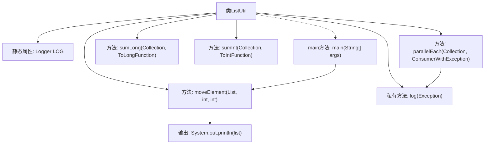

# 基础信息

|      |      |
|------|------|
| 名称 | ListUtil |
| 编码语言 | .java |
| 代码路径 | WeFe/common/java/common-lang/src/main/java/com/welab/wefe/common/util/ListUtil.java |
| 包名 | com.welab.wefe.common.util |
| 依赖项 | ['com.welab.wefe.common.function.ConsumerWithException', 'org.slf4j.Logger', 'org.slf4j.LoggerFactory', 'java.util.ArrayList', 'java.util.Arrays', 'java.util.Collection', 'java.util.List', 'java.util.concurrent.atomic.AtomicReference', 'java.util.function.ToIntFunction', 'java.util.function.ToLongFunction'] |
| 概述说明 | ListUtil类提供并行遍历列表、数值求和及元素移动功能。包含parallelEach并发处理、sumLong/sumInt求和及moveElement移动元素位置方法。 |

# 说明

ListUtil是一个工具类，提供集合操作功能。parallelEach方法通过并行流并发遍历集合，捕获异常并记录日志。sumLong和sumInt方法分别对集合元素进行长整型和整型求和，空集合返回0。moveElement方法移动列表中元素的位置，处理空列表和相同位置的情况。类中包含私有日志方法，main方法演示了moveElement的使用。

# 类列表 Class Summary

| 名称   | 类型  | 说明 |
|-------|------|-------------|
| ListUtil | class | ListUtil类提供并行遍历列表、数值求和及元素移动功能，包含异常处理和日志记录。 |


## 类 ListUtil

|      |      |
|------|------|
| 访问范围 | public |
| 类型 | class |
| 名称 | ListUtil |
| 说明 | ListUtil类提供并行遍历列表、数值求和及元素移动功能，包含异常处理和日志记录。 |


### UML类图

```mermaid
classDiagram
    class ListUtil {
        -Logger LOG
        +Exception parallelEach~T~(Collection~T~ list, ConsumerWithException~T~ consumer)
        +long sumLong~T~(Collection~T~ list, ToLongFunction~T~ toLongFunction)
        +int sumInt~T~(Collection~T~ list, ToIntFunction~T~ toIntFunction)
        +void moveElement~T~(List~T~ list, int from, int to)
        -void log(Exception e)
        +void main(String[] args)
    }

    <<Interface>> ConsumerWithException~T~ {
        +void accept(T t) throws Exception
    }

    ListUtil --> ConsumerWithException : 依赖
    ListUtil --> ToLongFunction : 依赖
    ListUtil --> ToIntFunction : 依赖
```

类图描述：
ListUtil是一个工具类，提供了对集合进行并行遍历、数值求和和元素移动的静态方法。它依赖于三个函数式接口：ConsumerWithException（带异常处理的消费者）、ToLongFunction（长整型转换函数）和ToIntFunction（整型转换函数）。其中parallelEach方法使用并行流处理集合元素，能捕获并记录异常；sumLong和sumInt分别计算集合元素的长整型和整型总和；moveElement方法用于调整列表中元素的位置。


### 内部方法调用关系图



流程图描述了ListUtil类的结构和方法调用关系。该类包含5个核心方法：parallelEach用于并发遍历列表并处理异常，sumLong/sumInt分别实现长整型和整型求和，moveElement用于移动列表元素位置。私有方法log用于记录异常日志。main方法演示了moveElement的调用过程，通过两次移动列表元素位置并打印结果。所有方法均通过静态方式调用，体现了工具类的设计特点。

### 字段列表 Field List

| 名称  | 类型  | 说明 |
|-------|-------|------|
| LOG = LoggerFactory.getLogger(ListUtil.class) | Logger | 声明一个私有静态不可变日志对象LOG，用于ListUtil类的日志记录。 |

### 方法列表

| 名称  | 类型  | 说明 |
|-------|-------|------|
| sumInt | int | 这是一个Java静态方法，用于计算集合中元素的整数值总和。方法接受一个集合和一个转换函数，通过流处理将元素转换为整数并求和。若集合为空则返回0。 |
| sumLong | long | 这是一个Java静态方法，用于计算集合中元素的长整型值总和。方法接收一个集合和一个长整型转换函数，若集合为空返回0，否则返回各元素转换后的总和。 |
| moveElement | void | 静态方法moveElement将列表中指定位置的元素移动到另一位置，处理空列表和相同位置的情况。 |
| parallelEach | Exception | 并行处理集合元素，捕获并记录异常，最后返回首个异常。 |
| log | void | 静态方法log用于记录异常信息，将异常类名和消息输出到日志系统，并包含完整异常堆栈。 |
| main | void | Java代码示例：创建整数列表，将元素3移到位置1，元素2移到位置0，并打印列表。 |


