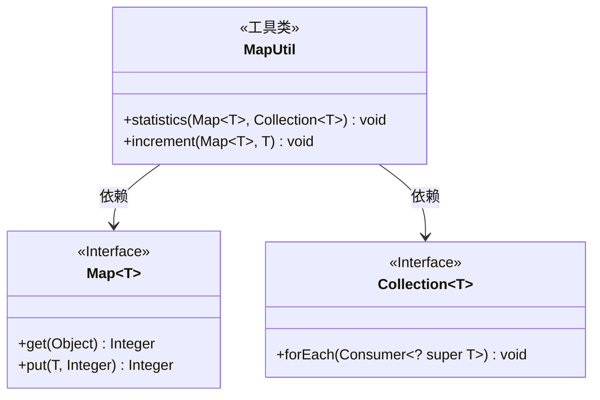
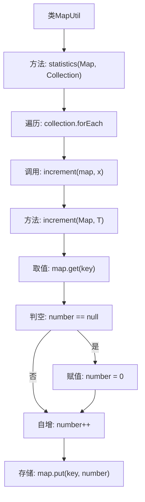

# 基础信息

|      |      |
|------|------|
| 名称 | MapUtil |
| 编码语言 | .java |
| 代码路径 | WeFe/common/java/common-lang/src/main/java/com/welab/wefe/common/util/MapUtil.java |
| 包名 | com.welab.wefe.common.util |
| 依赖项 | ['java.util.Collection', 'java.util.Map'] |
| 概述说明 | MapUtil类提供统计集合元素数量的方法，包含statistics统计整个集合和increment递增单个元素计数功能。 |

# 说明

MapUtil是一个工具类，提供两个静态泛型方法用于统计元素数量。statistics方法接收一个Map和Collection，遍历集合元素并调用increment方法逐个统计。increment方法接收Map和键，检查键是否存在，不存在则初始化为0，然后值加1并更新Map。两个方法均使用泛型支持任意类型。

# 类列表 Class Summary

| 名称   | 类型  | 说明 |
|-------|------|-------------|
| MapUtil | class | MapUtil类提供统计集合元素数量的方法：statistics遍历集合并调用increment方法递增Map中对应元素的计数值。increment方法处理键不存在的情况并更新计数。 |

## 类 MapUtil

|      |      |
|------|------|
| 访问范围 | public |
| 类型 | class |
| 名称 | MapUtil |
| 说明 | MapUtil类提供统计集合元素数量的方法：statistics遍历集合并调用increment方法递增Map中对应元素的计数值。increment方法处理键不存在的情况并更新计数。 |

### UML类图

这段代码展示了一个工具类MapUtil，包含两个静态泛型方法：statistics用于统计集合中各元素出现次数并存入Map，increment用于递增Map中指定键的计数值。类图清晰地反映了MapUtil与Map、Collection接口的依赖关系，其中Map和Collection作为泛型接口被标注为<<Interface>>。statistics方法通过forEach遍历集合，并调用increment方法更新计数，体现了工具类对集合操作的封装性。

### 内部方法调用关系图

这段代码流程图展示了MapUtil工具类的核心逻辑。statistics方法通过遍历输入集合，对每个元素调用increment方法进行计数。increment方法实现了完整的计数逻辑：先获取当前值，处理null值情况，然后自增并更新Map。该设计优雅地实现了元素频率统计功能，通过泛型支持多种数据类型，且线程不安全但效率较高，适合单线程环境使用。

### 字段列表 Field List

| 名称  | 类型  | 说明 |
|-------|-------|------|

### 方法列表

| 名称  | 类型  | 说明 |
|-------|-------|------|
| statistics | void | 统计集合元素出现次数并更新到Map中。 |
| increment | void | 静态方法`increment`接收一个Map和键，若键对应的值为null则初始化为0，然后自增1并更新Map。泛型支持任意键类型。 |

