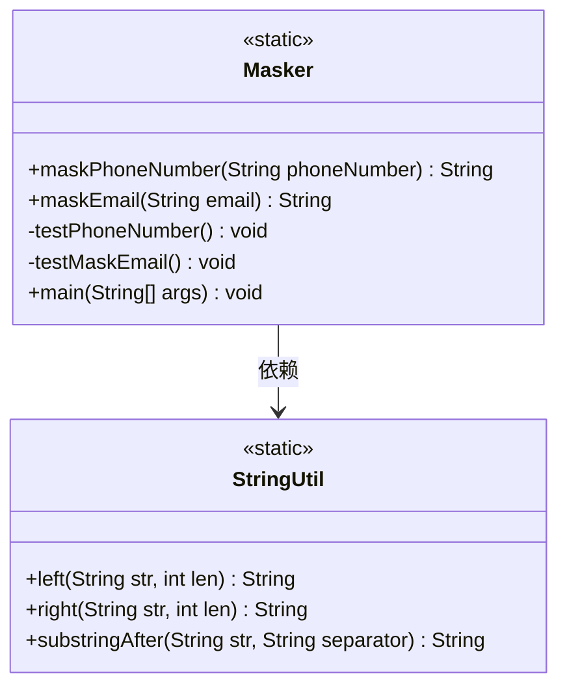
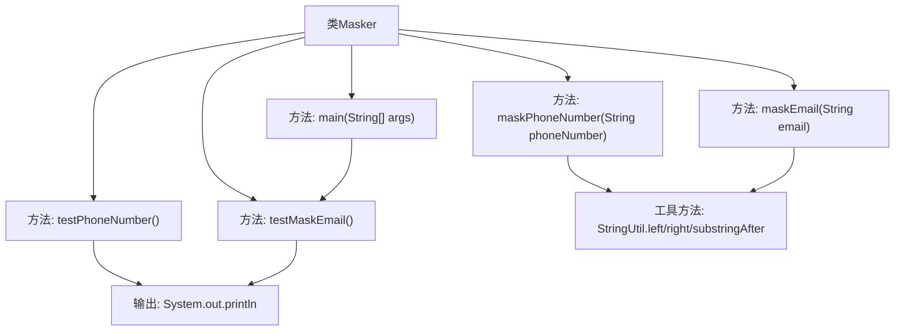
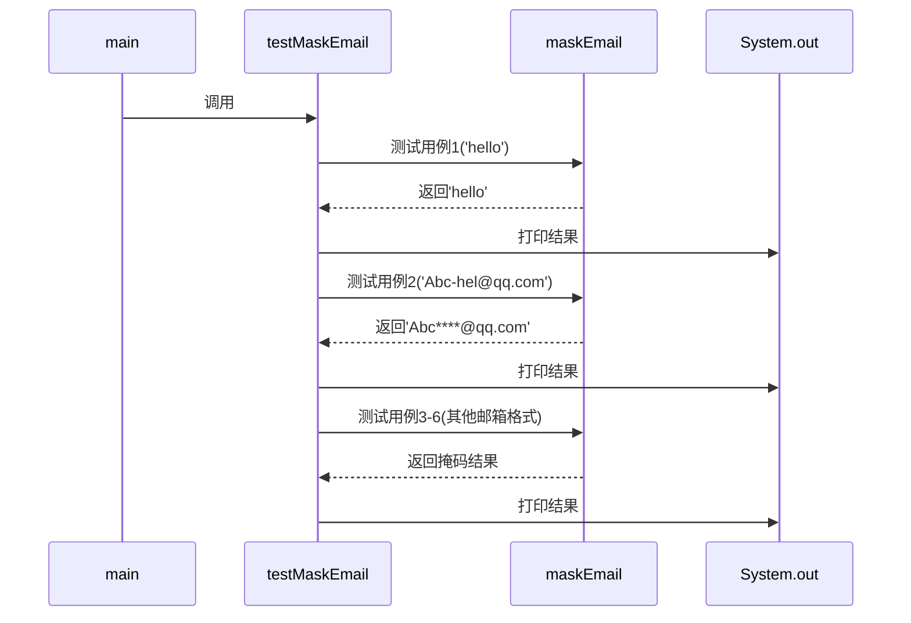

# 基础信息

|      |      |
|------|------|
| 名称 | Masker |
| 编码语言 | .java |
| 代码路径 | WeFe/common/java/common-lang/src/main/java/com/welab/wefe/common/util/Masker.java |
| 包名 | com.welab.wefe.common.util |
| 依赖项 | [] |
| 概述说明 | Masker类提供手机号和邮箱掩码功能。手机号保留前几位和后两位，中间用星号替换；邮箱保留@前部分字符，后接星号和域名。处理边界情况如短输入或无效格式。 |

# 说明

Masker类提供了手机号和邮箱的掩码处理方法。手机号掩码保留前几位和后两位，中间用星号替换，如13880000088变为1388*****88。邮箱掩码保留@符号前的部分字符，其余用星号替换，如Abc-hel@qq.com变为Abc****@qq.com。处理时考虑了各种边界情况，如输入为空、长度不足或格式不符等。测试方法验证了不同输入的处理结果。

# 类列表 Class Summary

| 名称   | 类型  | 说明 |
|-------|------|-------------|
| Masker | class | Masker类提供手机号和邮箱掩码功能。手机号保留前几位和后两位，中间用星号替换。邮箱保留@前部分字符，其余用星号替换，确保至少显示一个明文字符。 |

## 类 Masker

|      |      |
|------|------|
| 访问范围 | public |
| 类型 | class |
| 名称 | Masker |
| 说明 | Masker类提供手机号和邮箱掩码功能。手机号保留前几位和后两位，中间用星号替换。邮箱保留@前部分字符，其余用星号替换，确保至少显示一个明文字符。 |

### UML类图

类图描述：
Masker类提供了两个核心静态方法：maskPhoneNumber用于处理手机号掩码（保留前4位和后2位），maskEmail用于处理邮箱掩码（保留@符号前部分字符）。两个方法都包含对输入参数的校验逻辑，其中maskEmail还实现了动态掩码长度计算。StringUtil作为工具类被依赖，提供字符串截取功能。测试方法testPhoneNumber和testMaskEmail用于验证核心逻辑，main方法作为程序入口。

### 内部方法调用关系图

这段代码实现了一个数据掩码工具类，主要包含手机号和邮箱的掩码功能。流程图展示了类结构和方法调用关系，时序图详细描述了main方法调用testMaskEmail时的执行流程。maskPhoneNumber方法处理手机号掩码，保留前几位和最后两位；maskEmail方法处理邮箱掩码，在@符号前保留部分字符并用星号替换。两个方法都包含对异常情况的处理，如空值、过短字符串等。测试方法通过多种边界用例验证掩码逻辑的正确性。

### 字段列表 Field List

| 名称  | 类型  | 说明 |
|-------|-------|------|

### 方法列表

| 名称  | 类型  | 说明 |
|-------|-------|------|
| main | void | Java主方法调用测试函数testMaskEmail。 |
| testPhoneNumber | void | 测试电话号码脱敏功能，输入包括短号、国内手机号、国际格式手机号和超长数字，输出脱敏结果。 |
| maskPhoneNumber | String | 该方法用于隐藏手机号中间五位，保留前几位和后两位。若手机号为空或不足11位则直接返回。 |
| testMaskEmail | void | 测试maskEmail方法，输入包括普通字符串和不同长度的邮箱地址，输出各字符串处理结果。 |
| maskEmail | String | 该方法用于对邮箱地址进行掩码处理。若邮箱为空或格式无效则直接返回。默认对@符号前4位掩码，不足4位时按半数掩码，至少保留1位明文。最终返回掩码后的邮箱字符串。 |

