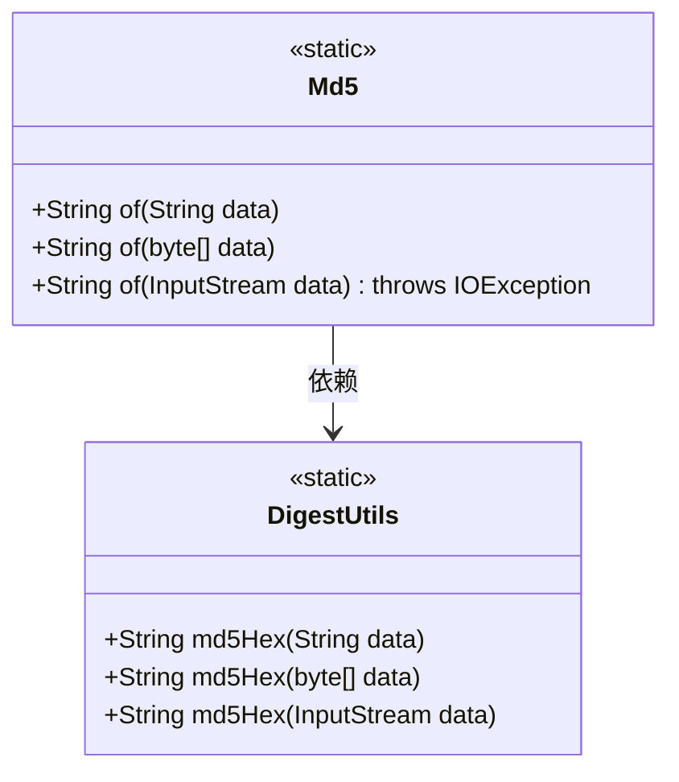
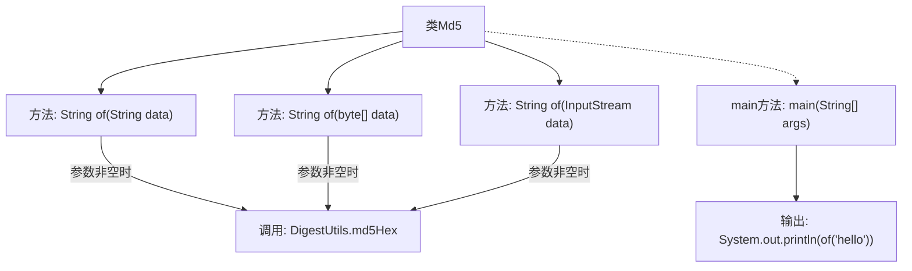

# 基础信息

|      |      |
|------|------|
| 名称 | Md5 |
| 编码语言 | .java |
| 代码路径 | WeFe/common/java/common-lang/src/main/java/com/welab/wefe/common/util/Md5.java |
| 包名 | com.welab.wefe.common.util |
| 依赖项 | ['org.apache.commons.codec.digest.DigestUtils', 'java.io.IOException', 'java.io.InputStream'] |
| 概述说明 | Md5类提供静态方法，支持字符串、字节数组和输入流的MD5哈希计算，空输入返回null。示例计算"hello"的哈希值。 |

# 说明

这是一个名为Md5的工具类，提供了三种静态方法来生成MD5哈希值。方法支持字符串、字节数组和输入流三种输入类型，输入为null时返回null。字符串方法直接处理文本，字节数组方法处理二进制数据，输入流方法会读取流内容并处理。类中包含一个main方法示例，展示如何对字符串"hello"生成MD5哈希并打印结果。所有方法都依赖DigestUtils.md5Hex实现核心哈希计算功能。

# 类列表 Class Summary

| 名称   | 类型  | 说明 |
|-------|------|-------------|
| Md5 | class | Md5类提供静态方法，支持字符串、字节数组和输入流生成MD5哈希值，空输入返回null。示例输出"hello"的MD5值。 |

## 类 Md5

|      |      |
|------|------|
| 访问范围 | public |
| 类型 | class |
| 名称 | Md5 |
| 说明 | Md5类提供静态方法，支持字符串、字节数组和输入流生成MD5哈希值，空输入返回null。示例输出"hello"的MD5值。 |

### UML类图

这段代码展示了一个Md5工具类，提供了三种静态方法用于计算不同输入类型（字符串、字节数组、输入流）的MD5哈希值。所有方法都通过调用Apache Commons Codec库的DigestUtils.md5Hex()方法实现核心功能，并统一处理了null输入的情况。类图清晰地显示了Md5类对DigestUtils工具类的依赖关系，以及所有方法的静态特性。

### 内部方法调用关系图

流程图描述：该流程图展示了Md5类的结构，包含三个重载的静态方法of，分别处理String、byte[]和InputStream类型的数据，并在参数非空时调用DigestUtils.md5Hex生成MD5哈希值。main方法演示了字符串"hello"的MD5计算流程。所有方法均遵循空值检查模式，确保空输入返回null。

### 字段列表 Field List

| 名称  | 类型  | 说明 |
|-------|-------|------|

### 方法列表

| 名称  | 类型  | 说明 |
|-------|-------|------|
| of | String | 该方法接收字符串参数，若为空则返回null，否则返回其MD5哈希值。 |
| of | String | 该方法接收字节数组，若为空则返回null，否则返回其MD5哈希值的十六进制字符串。 |
| of | String | 该方法接收输入流参数，若为空则返回null，否则计算并返回其MD5哈希值。可能抛出IOException异常。 |
| main | void | Java主方法打印"hello"字符串。 |

